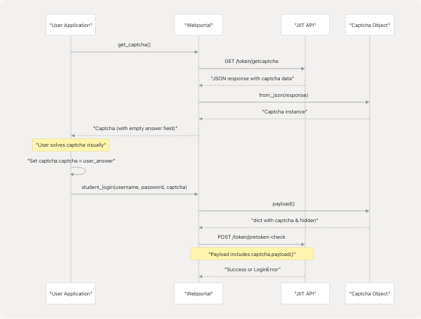
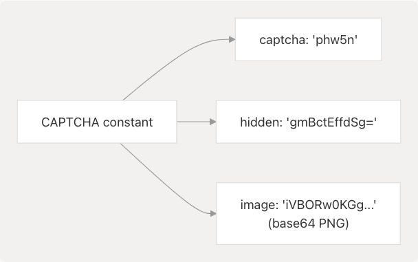

# Tokens and Captcha

> Source: https://deepwiki.com/codelif/pyjiit/3.3.4-tokens-and-captcha

# Tokens and Captcha

Relevant source files

* [pyjiit/default.py](https://github.com/codelif/pyjiit/blob/0fe02955/pyjiit/default.py)
* [pyjiit/exam.py](https://github.com/codelif/pyjiit/blob/0fe02955/pyjiit/exam.py)
* [pyjiit/registration.py](https://github.com/codelif/pyjiit/blob/0fe02955/pyjiit/registration.py)
* [pyjiit/tokens.py](https://github.com/codelif/pyjiit/blob/0fe02955/pyjiit/tokens.py)
* [pyjiit/wrapper.py](https://github.com/codelif/pyjiit/blob/0fe02955/pyjiit/wrapper.py)

## Purpose and Scope

This document describes the captcha-related data structures in pyjiit, specifically the `Captcha` class defined in [pyjiit/tokens.py](https://github.com/codelif/pyjiit/blob/0fe02955/pyjiit/tokens.py) The `Captcha` class encapsulates the captcha challenge and response data required during student authentication.

For information about the complete authentication flow, see [Authentication Flow](/codelif/pyjiit/2.3-authentication-flow). For session management after authentication, see [Session Management](/codelif/pyjiit/3.2-session-management).

---

## Captcha Class Overview

The `Captcha` class is a dataclass that represents a captcha challenge issued by the JIIT Webportal. It contains three components: the captcha answer text, a hidden identifier, and the captcha image encoded as base64.

**Sources:** [pyjiit/tokens.py1-29](https://github.com/codelif/pyjiit/blob/0fe02955/pyjiit/tokens.py#L1-L29)

---

## Class Structure


```

**Sources:** [pyjiit/tokens.py3-28](https://github.com/codelif/pyjiit/blob/0fe02955/pyjiit/tokens.py#L3-L28) [pyjiit/wrapper.py111-143](https://github.com/codelif/pyjiit/blob/0fe02955/pyjiit/wrapper.py#L111-L143) [pyjiit/wrapper.py145-154](https://github.com/codelif/pyjiit/blob/0fe02955/pyjiit/wrapper.py#L145-L154) [pyjiit/default.py1-8](https://github.com/codelif/pyjiit/blob/0fe02955/pyjiit/default.py#L1-L8)

---

## Field Descriptions

The `Captcha` dataclass contains the following fields:

| Field | Type | Description |
| --- | --- | --- |
| `captcha` | `str` | The captcha answer text. This is the text the user must recognize from the captcha image. |
| `hidden` | `str` | The captcha identifier. This is a base64-encoded value that uniquely identifies the captcha challenge on the server side. |
| `image` | `str` | The captcha image encoded as a base64 string. This is a PNG image containing the visual captcha challenge. |

**Sources:** [pyjiit/tokens.py4-10](https://github.com/codelif/pyjiit/blob/0fe02955/pyjiit/tokens.py#L4-L10)

---

## Methods

### payload()

```
```
def payload(self) -> dict
```
```

Converts the captcha data to a dictionary format suitable for API requests.

**Returns:** A dictionary containing only the `captcha` answer and `hidden` identifier fields. The `image` field is excluded as it is not needed in API payloads.

**Return Structure:**

```
```
{
    "captcha": str,  # The captcha answer text
    "hidden": str    # The captcha identifier
}
```
```

**Sources:** [pyjiit/tokens.py12-19](https://github.com/codelif/pyjiit/blob/0fe02955/pyjiit/tokens.py#L12-L19)

---

### from\_json()

```
```
@staticmethod
def from_json(resp: dict) -> 'Captcha'
```
```

Factory method that constructs a `Captcha` object from the API response JSON.

**Parameters:**

* `resp`: Dictionary containing the API response with nested captcha data

**Returns:** A new `Captcha` instance populated with data from the response

**Expected Response Structure:**

```
```
{
    "captcha": {
        "captcha": str,  # Captcha answer
        "hidden": str,   # Captcha identifier
        "image": str     # Base64-encoded PNG image
    }
}
```
```

**Sources:** [pyjiit/tokens.py21-27](https://github.com/codelif/pyjiit/blob/0fe02955/pyjiit/tokens.py#L21-L27)

---

## Usage in Authentication Flow

The `Captcha` class is used in the two-phase student login process. The following diagram illustrates how captcha data flows through the authentication system:

```

```

**Sources:** [pyjiit/wrapper.py111-143](https://github.com/codelif/pyjiit/blob/0fe02955/pyjiit/wrapper.py#L111-L143) [pyjiit/wrapper.py145-154](https://github.com/codelif/pyjiit/blob/0fe02955/pyjiit/wrapper.py#L145-L154)

---

## Webportal Methods Using Captcha

### get\_captcha()

The `Webportal.get_captcha()` method retrieves a new captcha challenge from the JIIT API.

**Location:** [pyjiit/wrapper.py145-154](https://github.com/codelif/pyjiit/blob/0fe02955/pyjiit/wrapper.py#L145-L154)

**Endpoint:** `GET /token/getcaptcha`

**Returns:** A `Captcha` object with the `captcha` field initially empty (to be filled by the user after solving the visual challenge)

**Raises:** `APIError` for generic API errors

---

### student\_login()

The `Webportal.student_login()` method accepts a solved `Captcha` object as one of its parameters.

**Location:** [pyjiit/wrapper.py111-143](https://github.com/codelif/pyjiit/blob/0fe02955/pyjiit/wrapper.py#L111-L143)

**Parameters:**

* `username`: Student username
* `password`: Student password
* `captcha`: `Captcha` object with the `captcha` field filled with the user's answer

**Process:** The method calls `captcha.payload()` to extract the necessary fields and includes them in the serialized payload sent to the `/token/pretoken-check` endpoint.

**Sources:** [pyjiit/wrapper.py111-143](https://github.com/codelif/pyjiit/blob/0fe02955/pyjiit/wrapper.py#L111-L143)

---

## Sample Captcha Data

The library provides a pre-populated `CAPTCHA` constant in [pyjiit/default.py](https://github.com/codelif/pyjiit/blob/0fe02955/pyjiit/default.py) for testing and demonstration purposes.

### CAPTCHA Constant

```


**Sample Values:**

| Field | Value |
| --- | --- |
| `captcha` | `"phw5n"` |
| `hidden` | `"gmBctEffdSg="` |
| `image` | `"iVBORw0KGgoAAAANSUhEUgAAATYAAAA8CAI..."` (truncated base64 PNG) |

**Note:** This is a static sample captcha and should not be used for actual authentication. It serves as an example of the data structure and can be used for initial testing or documentation purposes.

**Sources:** [pyjiit/default.py1-8](https://github.com/codelif/pyjiit/blob/0fe02955/pyjiit/default.py#L1-L8)

---

## Integration Example

The following table shows how `Captcha` integrates with other pyjiit components:

| Component | Relationship | Description |
| --- | --- | --- |
| `Webportal` | Producer | `get_captcha()` method creates `Captcha` instances from API responses |
| `Webportal` | Consumer | `student_login()` method accepts `Captcha` as a parameter |
| `serialize_payload()` | Indirect | The captcha payload dict is serialized along with other login data |
| `generate_local_name()` | Indirect | Both captcha retrieval and login require `LocalName` headers |

**Sources:** [pyjiit/wrapper.py6-7](https://github.com/codelif/pyjiit/blob/0fe02955/pyjiit/wrapper.py#L6-L7) [pyjiit/wrapper.py111-154](https://github.com/codelif/pyjiit/blob/0fe02955/pyjiit/wrapper.py#L111-L154)