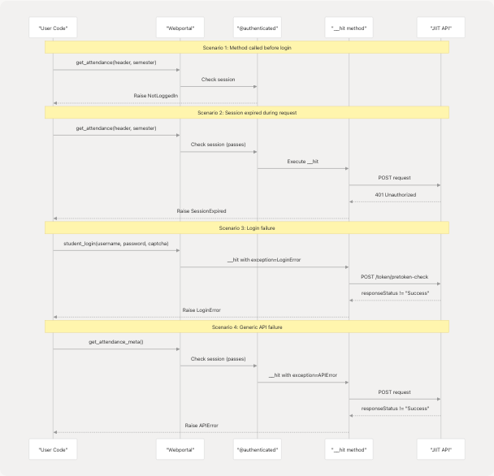

# Exception Handling

## Purpose and Scope

This document describes the custom exception hierarchy used throughout the pyjiit library to provide fine-grained error handling for different failure scenarios when interacting with the JIIT Webportal API. It covers the exception class definitions, when each exception is raised, and recommended handling patterns.

For information about session lifecycle and token expiration, see [Session Management](/codelif/pyjiit/3.2-session-management). For general API usage patterns, see [Webportal Class](/codelif/pyjiit/3.1-webportal-class).

---

## Exception Hierarchy

The pyjiit library defines a custom exception hierarchy rooted in Python's built-in `Exception` class. The hierarchy is designed to allow callers to catch exceptions at different levels of specificity.


```

**Sources:** [pyjiit/exceptions.py1-18](https://github.com/codelif/pyjiit/blob/0fe02955/pyjiit/exceptions.py#L1-L18)

---

## Exception Types

### APIError

**Definition:** [pyjiit/exceptions.py1-2](https://github.com/codelif/pyjiit/blob/0fe02955/pyjiit/exceptions.py#L1-L2)

The base exception class for general API failures. This is raised when the JIIT Webportal API returns a response with `responseStatus` not equal to `"Success"`, indicating that the API operation failed.

**Typical Causes:**

* Invalid request parameters
* Server-side validation failures
* Unexpected API response format

**Usage in Code:** Most `Webportal` methods raise `APIError` by default when API calls fail, unless a more specific exception type is specified.

---

### LoginError

**Definition:** [pyjiit/exceptions.py4-5](https://github.com/codelif/pyjiit/blob/0fe02955/pyjiit/exceptions.py#L4-L5)

A specialized `APIError` for authentication-related failures during the login process.

**Typical Causes:**

* Invalid username or password
* Incorrect captcha
* Account locked or disabled
* Authentication endpoint failures

**Usage in Code:** Raised by the `student_login` method [pyjiit/wrapper.py111-143](https://github.com/codelif/pyjiit/blob/0fe02955/pyjiit/wrapper.py#L111-L143) when either the pretoken-check or token generation phases fail.

---

### SessionError

**Definition:** [pyjiit/exceptions.py7-8](https://github.com/codelif/pyjiit/blob/0fe02955/pyjiit/exceptions.py#L7-L8)

The base exception class for session-related issues, independent from API call failures.

**Typical Causes:**

* Attempting operations before login
* Session invalidation
* Token expiration

**Subclasses:** `SessionExpired`, `NotLoggedIn`

---

### SessionExpired

**Definition:** [pyjiit/exceptions.py10-11](https://github.com/codelif/pyjiit/blob/0fe02955/pyjiit/exceptions.py#L10-L11)

A specialized `SessionError` indicating that the current session has expired or been invalidated by the server.

**Typical Causes:**

* HTTP 401 status code returned from API
* JWT token expiration
* Server-side session timeout

**Usage in Code:** Raised by the internal `__hit` method [pyjiit/wrapper.py102-103](https://github.com/codelif/pyjiit/blob/0fe02955/pyjiit/wrapper.py#L102-L103) when the API returns a status code of 401.

---

### NotLoggedIn

**Definition:** [pyjiit/exceptions.py13-14](https://github.com/codelif/pyjiit/blob/0fe02955/pyjiit/exceptions.py#L13-L14)

A specialized `SessionError` indicating that an operation requiring authentication was attempted before calling `student_login`.

**Typical Causes:**

* Calling authenticated methods before login
* Attempting operations on a `Webportal` instance with `session = None`

**Usage in Code:** Raised by the `@authenticated` decorator [pyjiit/wrapper.py19-36](https://github.com/codelif/pyjiit/blob/0fe02955/pyjiit/wrapper.py#L19-L36) which guards all methods requiring an active session.

---

### AccountAPIError

**Definition:** [pyjiit/exceptions.py16-17](https://github.com/codelif/pyjiit/blob/0fe02955/pyjiit/exceptions.py#L16-L17)

A specialized exception for account management operations like password changes.

**Typical Causes:**

* Old password mismatch
* New password validation failures
* Password policy violations

**Usage in Code:** Raised by the `set_password` method [pyjiit/wrapper.py214-230](https://github.com/codelif/pyjiit/blob/0fe02955/pyjiit/wrapper.py#L214-L230) when password change operations fail.

**Sources:** [pyjiit/exceptions.py1-18](https://github.com/codelif/pyjiit/blob/0fe02955/pyjiit/exceptions.py#L1-L18)

---

## Exception Raising Patterns

### The @authenticated Decorator

The `@authenticated` decorator [pyjiit/wrapper.py19-36](https://github.com/codelif/pyjiit/blob/0fe02955/pyjiit/wrapper.py#L19-L36) wraps methods that require an active session. It performs a pre-flight check before executing the wrapped method.


**Example Methods Using @authenticated:**

* `get_attendance_meta` [pyjiit/wrapper.py173-188](https://github.com/codelif/pyjiit/blob/0fe02955/pyjiit/wrapper.py#L173-L188)
* `get_attendance` [pyjiit/wrapper.py191-211](https://github.com/codelif/pyjiit/blob/0fe02955/pyjiit/wrapper.py#L191-L211)
* `get_registered_semesters` [pyjiit/wrapper.py233-249](https://github.com/codelif/pyjiit/blob/0fe02955/pyjiit/wrapper.py#L233-L249)
* `get_exam_events` [pyjiit/wrapper.py292-308](https://github.com/codelif/pyjiit/blob/0fe02955/pyjiit/wrapper.py#L292-L308)

**Sources:** [pyjiit/wrapper.py19-36](https://github.com/codelif/pyjiit/blob/0fe02955/pyjiit/wrapper.py#L19-L36)

---

### The \_\_hit Internal Method

The `__hit` method [pyjiit/wrapper.py82-108](https://github.com/codelif/pyjiit/blob/0fe02955/pyjiit/wrapper.py#L82-L108) centralizes all HTTP request handling and exception raising logic. It accepts an optional `exception` parameter to customize which exception type is raised.


**Exception Type Customization:**

| Method | Exception Passed | Line Reference |
| --- | --- | --- |
| `student_login` | `LoginError` | [pyjiit/wrapper.py130](https://github.com/codelif/pyjiit/blob/0fe02955/pyjiit/wrapper.py#L130-L130) [pyjiit/wrapper.py139](https://github.com/codelif/pyjiit/blob/0fe02955/pyjiit/wrapper.py#L139-L139) |
| `set_password` | `AccountAPIError` | [pyjiit/wrapper.py229](https://github.com/codelif/pyjiit/blob/0fe02955/pyjiit/wrapper.py#L229-L229) |
| All other methods | `APIError` (default) | [pyjiit/wrapper.py83](https://github.com/codelif/pyjiit/blob/0fe02955/pyjiit/wrapper.py#L83-L83) |

**Sources:** [pyjiit/wrapper.py82-108](https://github.com/codelif/pyjiit/blob/0fe02955/pyjiit/wrapper.py#L82-L108)

---

## Exception Propagation Flow

This diagram shows how exceptions propagate from the API layer through the Webportal class to user code.



**Sources:** [pyjiit/wrapper.py19-36](https://github.com/codelif/pyjiit/blob/0fe02955/pyjiit/wrapper.py#L19-L36) [pyjiit/wrapper.py82-108](https://github.com/codelif/pyjiit/blob/0fe02955/pyjiit/wrapper.py#L82-L108)

---

## Exception Handling Best Practices

### Basic Try-Except Pattern

The simplest approach is to catch specific exceptions where expected:

```
from pyjiit import Webportal
from pyjiit.exceptions import NotLoggedIn, SessionExpired, LoginError
from pyjiit.default import CAPTCHA

w = Webportal()

try:
    w.student_login("username", "password", CAPTCHA)
except LoginError as e:
    print(f"Login failed: {e}")
    # Handle invalid credentials
```

**Sources:** [docs/usage.rst138-142](https://github.com/codelif/pyjiit/blob/0fe02955/docs/usage.rst#L138-L142)

---

### Comprehensive Exception Handling

For production code, handle all exception types appropriately:

```
from pyjiit import Webportal
from pyjiit.exceptions import (
    NotLoggedIn, 
    SessionExpired, 
    LoginError, 
    APIError,
    AccountAPIError
)
from pyjiit.default import CAPTCHA

w = Webportal()

try:
    # Login
    try:
        w.student_login("username", "password", CAPTCHA)
    except LoginError:
        # Handle authentication failure
        # Could retry with different credentials
        raise

    # Fetch data
    try:
        meta = w.get_attendance_meta()
        header = meta.latest_header()
        sem = meta.latest_semester()
        attendance = w.get_attendance(header, sem)
    except NotLoggedIn:
        # Session was cleared or never established
        # Re-login required
        raise
    except SessionExpired:
        # Token expired, re-authenticate
        w.student_login("username", "password", CAPTCHA)
        # Retry operation
        attendance = w.get_attendance(header, sem)
    except APIError as e:
        # Generic API failure
        # Log error and potentially retry
        print(f"API error: {e}")

except Exception as e:
    # Catch-all for unexpected errors
    print(f"Unexpected error: {e}")
```

---

### Exception Hierarchy Catching

Because of the inheritance hierarchy, you can catch at different levels of specificity:

```
from pyjiit.exceptions import SessionError, APIError

# Catch all session-related issues (NotLoggedIn + SessionExpired)
try:
    w.get_attendance(header, sem)
except SessionError:
    # Handle any session issue
    w.student_login("username", "password", CAPTCHA)

# Catch all API-related issues (APIError + LoginError)
try:
    w.student_login("username", "password", CAPTCHA)
except APIError:
    # Handle any API failure including login
    pass
```

---

### Exception Message Format

When exceptions are raised by the `__hit` method [pyjiit/wrapper.py105-106](https://github.com/codelif/pyjiit/blob/0fe02955/pyjiit/wrapper.py#L105-L106) the error message includes a formatted dump of the response status:

```
status:
{'responseCode': 'STUDENT001',
 'responseMessage': 'Invalid credentials',
 'responseStatus': 'Failure'}
```

This allows detailed error inspection for debugging purposes.

**Sources:** [pyjiit/wrapper.py82-108](https://github.com/codelif/pyjiit/blob/0fe02955/pyjiit/wrapper.py#L82-L108)

---

## Exception Mapping Table

This table summarizes which exceptions are raised by which methods:

| Exception | Raised By | Condition | Line Reference |
| --- | --- | --- | --- |
| `NotLoggedIn` | `@authenticated` decorator | `self.session is None` | [pyjiit/wrapper.py26-27](https://github.com/codelif/pyjiit/blob/0fe02955/pyjiit/wrapper.py#L26-L27) |
| `SessionExpired` | `__hit` method | HTTP 401 status or `resp["status"] == 401` | [pyjiit/wrapper.py102-103](https://github.com/codelif/pyjiit/blob/0fe02955/pyjiit/wrapper.py#L102-L103) |
| `LoginError` | `student_login` | Authentication failure during pretoken or token generation | [pyjiit/wrapper.py130](https://github.com/codelif/pyjiit/blob/0fe02955/pyjiit/wrapper.py#L130-L130) [pyjiit/wrapper.py139](https://github.com/codelif/pyjiit/blob/0fe02955/pyjiit/wrapper.py#L139-L139) |
| `AccountAPIError` | `set_password` | Password change operation failure | [pyjiit/wrapper.py229](https://github.com/codelif/pyjiit/blob/0fe02955/pyjiit/wrapper.py#L229-L229) |
| `APIError` | All other authenticated methods | `responseStatus != "Success"` | [pyjiit/wrapper.py105-106](https://github.com/codelif/pyjiit/blob/0fe02955/pyjiit/wrapper.py#L105-L106) |

**Sources:** [pyjiit/wrapper.py1-489](https://github.com/codelif/pyjiit/blob/0fe02955/pyjiit/wrapper.py#L1-L489) [pyjiit/exceptions.py1-18](https://github.com/codelif/pyjiit/blob/0fe02955/pyjiit/exceptions.py#L1-L18)

---

## Error Response Status Structure

When the API returns an error, the response typically includes a `status` object with this structure:

```
{
    "status": {
        "responseStatus": "Failure",  # "Success" or "Failure"
        "responseCode": "ERROR_CODE",
        "responseMessage": "Human-readable error description"
    },
    "response": {...}  # May be empty or contain partial data
}
```
```

The `__hit` method checks `resp["status"]["responseStatus"]` at [pyjiit/wrapper.py105](https://github.com/codelif/pyjiit/blob/0fe02955/pyjiit/wrapper.py#L105-L105) to determine if an exception should be raised.

**Sources:** [pyjiit/wrapper.py82-108](https://github.com/codelif/pyjiit/blob/0fe02955/pyjiit/wrapper.py#L82-L108)
