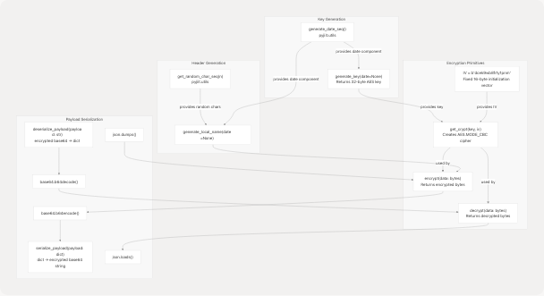
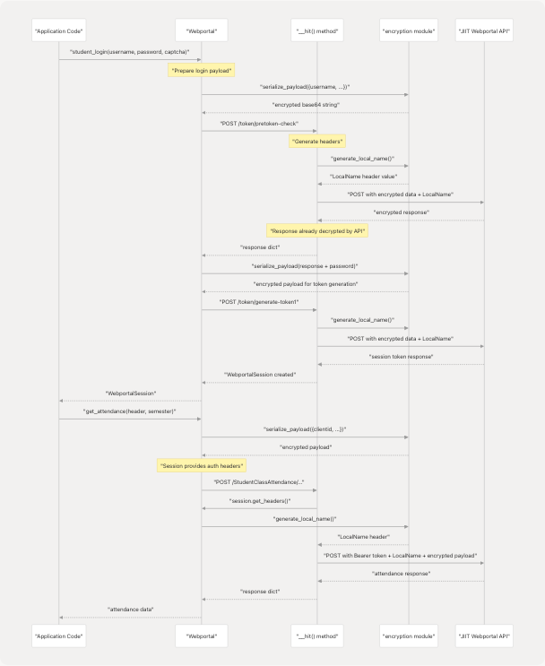
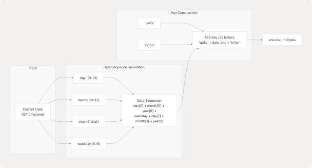
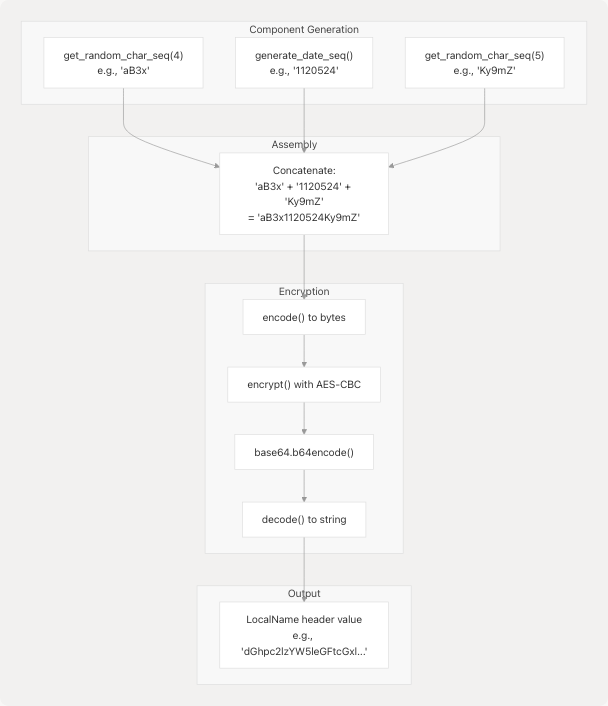

# Security and Encryption

## Purpose and Scope

This page provides an overview of the security and encryption mechanisms used in pyjiit to communicate securely with the JIIT Webportal API. It covers the encryption module architecture, how encryption is integrated into API requests, and the daily key rotation system.

For detailed information about the encryption implementation, see [Encryption System](4.1-encryption-system). For security implications and considerations, see [Security Considerations](4.2-security-considerations).

---

## Security Model Overview

The pyjiit library implements a custom encryption scheme that was reverse-engineered from the JIIT Webportal. All communication with the API uses HTTPS transport security, with an additional application-layer encryption scheme for sensitive payloads.

The security model has two primary components:

| Component | Purpose | Implementation |
| --- | --- | --- |
| **Payload Encryption** | Encrypts request/response data containing credentials and sensitive information | AES-CBC with daily rotating keys |
| **LocalName Header** | Per-request authentication token sent in HTTP headers | Encrypted random sequence with date component |

Both components rely on a shared secret encryption key that rotates daily at 00:00 IST. The encryption is asymmetric in nature: pyjiit encrypts outgoing payloads and decrypts incoming responses, but does not implement the server-side key generation logic.

**Sources:** [pyjiit/encryption.py1-50](https://github.com/codelif/pyjiit/blob/0fe02955/pyjiit/encryption.py#L1-L50) [pyjiit/wrapper.py3](https://github.com/codelif/pyjiit/blob/0fe02955/pyjiit/wrapper.py#L3-L3) [pyjiit/wrapper.py61-68](https://github.com/codelif/pyjiit/blob/0fe02955/pyjiit/wrapper.py#L61-L68)

---

## Encryption Module Architecture

The encryption functionality is centralized in the `pyjiit.encryption` module, which provides functions for encrypting, decrypting, and transforming payloads between JSON and encrypted base64 formats.

### Encryption Module Components



**Sources:** [pyjiit/encryption.py7-45](https://github.com/codelif/pyjiit/blob/0fe02955/pyjiit/encryption.py#L7-L45) [pyjiit/utils.py5-19](https://github.com/codelif/pyjiit/blob/0fe02955/pyjiit/utils.py#L5-L19)

### Function Reference

| Function | Input | Output | Purpose |
| --- | --- | --- | --- |
| `generate_key(date=None)` | Optional date object | 32-byte AES key | Generates time-based encryption key |
| `generate_local_name(date=None)` | Optional date object | Base64 string | Generates LocalName header value |
| `encrypt(data)` | Raw bytes | Encrypted bytes | AES-CBC encryption with padding |
| `decrypt(data)` | Encrypted bytes | Raw bytes | AES-CBC decryption with unpadding |
| `serialize_payload(payload)` | Dictionary | Base64 string | JSON → encrypted → base64 |
| `deserialize_payload(payload)` | Base64 string | Dictionary | Base64 → decrypted → JSON |

**Sources:** [pyjiit/encryption.py9-44](https://github.com/codelif/pyjiit/blob/0fe02955/pyjiit/encryption.py#L9-L44)

---

## Integration with API Client

The `Webportal` class in `pyjiit.wrapper` uses the encryption module at multiple points in the request lifecycle. Not all API requests require encrypted payloads, but all requests require the `LocalName` header.

### Encryption Usage in Webportal



**Sources:** [pyjiit/wrapper.py111-143](https://github.com/codelif/pyjiit/blob/0fe02955/pyjiit/wrapper.py#L111-L143) [pyjiit/wrapper.py82-108](https://github.com/codelif/pyjiit/blob/0fe02955/pyjiit/wrapper.py#L82-L108) [pyjiit/wrapper.py61-68](https://github.com/codelif/pyjiit/blob/0fe02955/pyjiit/wrapper.py#L61-L68)

### Encrypted vs Unencrypted Payloads

The following table shows which API methods require payload encryption:

| Method | Payload Encryption | LocalName Header | Notes |
| --- | --- | --- | --- |
| `student_login()` | **Required** | **Required** | Encrypts credentials in both phases |
| `get_captcha()` | Not used | **Required** | GET request, no payload |
| `get_attendance_meta()` | No | **Required** | Plain JSON payload |
| `get_attendance()` | **Required** | **Required** | Encrypts attendance query params |
| `get_registered_semesters()` | **Required** | **Required** | Encrypts semester query |
| `get_registered_subjects_and_faculties()` | **Required** | **Required** | Encrypts subject query |
| `get_exam_events()` | **Required** | **Required** | Encrypts exam query |
| `get_exam_schedule()` | **Required** | **Required** | Encrypts schedule query |
| `get_semesters_for_marks()` | **Required** | **Required** | Encrypts marks query |
| `get_semesters_for_grade_card()` | **Required** | **Required** | Encrypts grade card query |
| `get_grade_card()` | **Required** | **Required** | Encrypts grade card request |
| `get_sgpa_cgpa()` | **Required** | **Required** | Encrypts CGPA query |
| `set_password()` | No | **Required** | Plain JSON, but authenticated |
| `get_student_bank_info()` | No | **Required** | Plain JSON, authenticated |

**Sources:** [pyjiit/wrapper.py111-489](https://github.com/codelif/pyjiit/blob/0fe02955/pyjiit/wrapper.py#L111-L489)

---

## Daily Key Rotation Mechanism

The encryption key is derived from the current date in IST timezone and rotates automatically at midnight. This provides a time-based security boundary where encrypted payloads are only valid for the day they were created.

### Key Generation Algorithm



**Example:** For December 15, 2024 (Sunday, weekday=0):

* Date components: day=15, month=12, year=24, weekday=0
* Date sequence: `1` + `1` + `2` + `0` + `5` + `2` + `4` = `"1120524"`
* Final key: `"qa8y1120524ty1pn"` (32 characters = 32 bytes when encoded)

**Sources:** [pyjiit/encryption.py9-11](https://github.com/codelif/pyjiit/blob/0fe02955/pyjiit/encryption.py#L9-L11) [pyjiit/utils.py5-13](https://github.com/codelif/pyjiit/blob/0fe02955/pyjiit/utils.py#L5-L13)

### Key Rotation Timeline


**Security Implications:**

* Encrypted data from Day 1 cannot be decrypted using Day 2's key
* Payloads encrypted on one day are invalid the next day
* Key compromise on one day does not affect other days
* The fixed prefix (`qa8y`) and suffix (`ty1pn`) are constant across all days

**Sources:** [pyjiit/encryption.py9-11](https://github.com/codelif/pyjiit/blob/0fe02955/pyjiit/encryption.py#L9-L11) [pyjiit/utils.py5-13](https://github.com/codelif/pyjiit/blob/0fe02955/pyjiit/utils.py#L5-L13)

---

## LocalName Header Generation

Every API request to the JIIT Webportal requires a `LocalName` header, regardless of whether the payload is encrypted. This header contains an encrypted random sequence with a date component.

### LocalName Construction

The `generate_local_name()` function creates the header value using:

1. **Random prefix:** 4 random alphanumeric characters
2. **Date sequence:** 7-character date-based string (same as key generation)
3. **Random suffix:** 5 random alphanumeric characters
4. **Encryption:** The combined string is encrypted and base64-encoded



**Sources:** [pyjiit/encryption.py13-17](https://github.com/codelif/pyjiit/blob/0fe02955/pyjiit/encryption.py#L13-L17) [pyjiit/utils.py16-19](https://github.com/codelif/pyjiit/blob/0fe02955/pyjiit/utils.py#L16-L19)

### Usage in HTTP Requests

The `LocalName` header is injected into every request by the `__hit()` method:

**Authenticated requests:** [pyjiit/wrapper.py89-91](https://github.com/codelif/pyjiit/blob/0fe02955/pyjiit/wrapper.py#L89-L91)

```
header = self.session.get_headers()  # Returns both Authorization and LocalName
```

**Unauthenticated requests:** [pyjiit/wrapper.py92-93](https://github.com/codelif/pyjiit/blob/0fe02955/pyjiit/wrapper.py#L92-L93)
```
header = {"LocalName": generate_local_name()}
```

The `WebportalSession.get_headers()` method at [pyjiit/wrapper.py61-68](https://github.com/codelif/pyjiit/blob/0fe02955/pyjiit/wrapper.py#L61-L68) generates a fresh `LocalName` for each authenticated request:

```
def get_headers(self):
    return {
        "Authorization": f"Bearer {self.token}",
        "LocalName": generate_local_name()
    }
```

**Sources:** [pyjiit/wrapper.py61-68](https://github.com/codelif/pyjiit/blob/0fe02955/pyjiit/wrapper.py#L61-L68) [pyjiit/wrapper.py82-99](https://github.com/codelif/pyjiit/blob/0fe02955/pyjiit/wrapper.py#L82-L99)

---

## Cryptographic Constants

The encryption module uses fixed cryptographic constants defined at the module level:

| Constant | Value | Purpose | Location |
| --- | --- | --- | --- |
| `IV` | `b"dcek9wb8frty1pnm"` | AES initialization vector (16 bytes) | [pyjiit/encryption.py7](https://github.com/codelif/pyjiit/blob/0fe02955/pyjiit/encryption.py#L7-L7) |
| Key prefix | `"qa8y"` | Static prefix for AES key | [pyjiit/encryption.py11](https://github.com/codelif/pyjiit/blob/0fe02955/pyjiit/encryption.py#L11-L11) |
| Key suffix | `"ty1pn"` | Static suffix for AES key | [pyjiit/encryption.py11](https://github.com/codelif/pyjiit/blob/0fe02955/pyjiit/encryption.py#L11-L11) |

The **fixed IV** is used for all encryption operations. While this is generally considered a security weakness in AES-CBC mode, it is mitigated by:

1. Daily key rotation limiting exposure windows
2. The `LocalName` header providing per-request uniqueness
3. This being the scheme implemented by the JIIT Webportal itself

**Sources:** [pyjiit/encryption.py7](https://github.com/codelif/pyjiit/blob/0fe02955/pyjiit/encryption.py#L7-L7) [pyjiit/encryption.py11](https://github.com/codelif/pyjiit/blob/0fe02955/pyjiit/encryption.py#L11-L11)

---

## Encryption Dependencies

The encryption module depends on the `pycryptodome` library for AES implementation:

```
from Crypto.Cipher import AES
from Crypto.Util.Padding import pad, unpad
```

**Key functions used:**

* `AES.new(key, AES.MODE_CBC, iv)` - Creates cipher instance [pyjiit/encryption.py21](https://github.com/codelif/pyjiit/blob/0fe02955/pyjiit/encryption.py#L21-L21)
* `pad(data, 16)` - PKCS7 padding to 16-byte blocks [pyjiit/encryption.py29](https://github.com/codelif/pyjiit/blob/0fe02955/pyjiit/encryption.py#L29-L29)
* `unpad(data, 16)` - Removes PKCS7 padding [pyjiit/encryption.py25](https://github.com/codelif/pyjiit/blob/0fe02955/pyjiit/encryption.py#L25-L25)

**Sources:** [pyjiit/encryption.py1-2](https://github.com/codelif/pyjiit/blob/0fe02955/pyjiit/encryption.py#L1-L2) [pyjiit/encryption.py20-29](https://github.com/codelif/pyjiit/blob/0fe02955/pyjiit/encryption.py#L20-L29)
