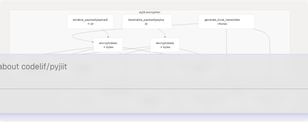
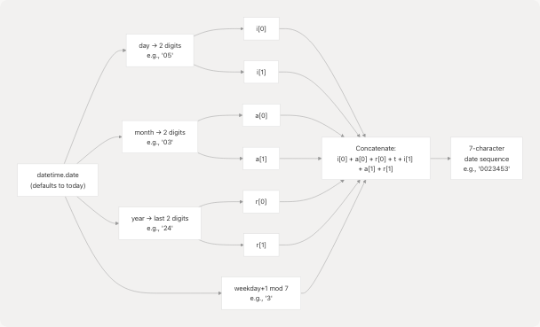
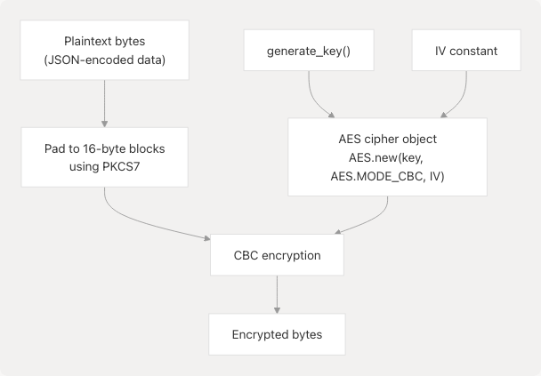
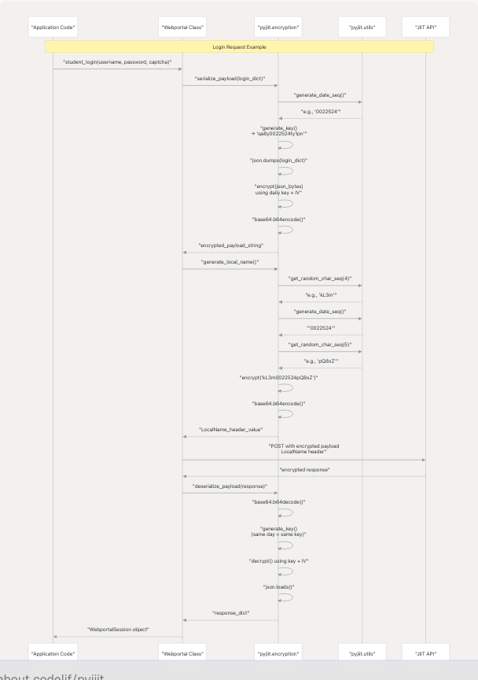

# Encryption System

## Purpose and Scope

This document details the encryption system used by `pyjiit` to secure all communication with the JIIT Webportal API. The encryption module implements **AES-CBC encryption** with **daily key rotation**, payload serialization/deserialization, and secure header generation. This system was reverse-engineered from the JIIT webportal and is critical for successful API authentication and data exchange.

For security implications and best practices related to this system, see [Security Considerations](4.2-security-considerations). For how this encryption is used within API calls, see [Webportal Class](3.1-webportal-class).

**Sources:** [pyjiit/encryption.py1-50](https://github.com/codelif/pyjiit/blob/0fe02955/pyjiit/encryption.py#L1-L50)

---

## Architecture Overview

The encryption system consists of three primary components:

| Component | Module | Purpose |
| --- | --- | --- |
| **Key Generation** | `pyjiit.encryption` | Generates daily-rotating AES keys based on IST date |
| **Encryption/Decryption** | `pyjiit.encryption` | AES-CBC mode operations with padding |
| **Serialization** | `pyjiit.encryption` | Transforms payloads between dict, JSON, encrypted bytes, and base64 |
| **Utility Functions** | `pyjiit.utils` | Date sequence generation and random character sequences |

### Encryption Module Components



**Sources:** [pyjiit/encryption.py1-50](https://github.com/codelif/pyjiit/blob/0fe02955/pyjiit/encryption.py#L1-L50) [pyjiit/utils.py1-24](https://github.com/codelif/pyjiit/blob/0fe02955/pyjiit/utils.py#L1-L24)

---

## Constants and Configuration

### Fixed Initialization Vector

The encryption system uses a **fixed 16-byte IV** that never changes:

```
IV = b"dcek9wb8frty1pnm"
```

This constant is defined at [pyjiit/encryption.py7](https://github.com/codelif/pyjiit/blob/0fe02955/pyjiit/encryption.py#L7-L7) and is used for all AES-CBC operations. The IV is combined with the daily-rotating key to provide encryption.

**Note:** The use of a fixed IV is a design tradeoff specific to this reverse-engineered implementation. The security impact is mitigated by the daily key rotation mechanism. See [Security Considerations](4.2-security-considerations) for detailed discussion.

**Sources:** [pyjiit/encryption.py7](https://github.com/codelif/pyjiit/blob/0fe02955/pyjiit/encryption.py#L7-L7)

---

## Key Generation and Daily Rotation

### Date Sequence Algorithm

The key generation system relies on a date-based sequence generated by `generate_date_seq()`:



The algorithm is implemented in [pyjiit/utils.py5-13](https://github.com/codelif/pyjiit/blob/0fe02955/pyjiit/utils.py#L5-L13):

1. Extract day, month, year (last 2 digits), and weekday
2. Convert weekday to 0-6 range (Sunday=0)
3. Interleave digits: `day[0] + month[0] + year[0] + weekday + day[1] + month[1] + year[1]`

**Example:** For March 5, 2024 (Tuesday):

* Day: `05` → `i[0]=0, i[1]=5`
* Month: `03` → `a[0]=0, a[1]=3`
* Year: `24` → `r[0]=2, r[1]=4`
* Weekday: Tuesday = 1+1 mod 7 = `2`
* Result: `0022524` (0 + 0 + 2 + 2 + 5 + 3 + 4)

**Sources:** [pyjiit/utils.py5-13](https://github.com/codelif/pyjiit/blob/0fe02955/pyjiit/utils.py#L5-L13)

### AES Key Construction

The `generate_key()` function constructs a 32-byte AES-256 key:

```
'qa8y' + generate_date_seq(date) + 'ty1pn'
```

This formula is defined at [pyjiit/encryption.py9-11](https://github.com/codelif/pyjiit/blob/0fe02955/pyjiit/encryption.py#L9-L11) The key structure is:

* Prefix: `qa8y` (4 characters)
* Middle: Date sequence (7 characters)
* Suffix: `ty1pn` (5 characters)
* Total: 16 characters → 16 bytes when encoded

**Example keys:**

| Date | Date Sequence | Full Key |
| --- | --- | --- |
| 2024-03-05 | `0022524` | `qa8y0022524ty1pn` |
| 2024-03-06 | `0323525` | `qa8y0323525ty1pn` |
| 2024-12-31 | `3121361` | `qa8y3121361ty1pn` |

### Rotation Mechanism

The key **automatically rotates at 00:00 IST** each day because:

1. `generate_key()` defaults to `datetime.date.today()` when `date=None`
2. `datetime.date.today()` returns the current date in the system's timezone (expected to be IST)
3. Different dates produce different date sequences, therefore different keys

This means:

* All API calls made on 2024-03-05 use key `qa8y0022524ty1pn`
* All API calls made on 2024-03-06 use key `qa8y0323525ty1pn`
* Encrypted data from one day cannot be decrypted using another day's key

**Sources:** [pyjiit/encryption.py9-11](https://github.com/codelif/pyjiit/blob/0fe02955/pyjiit/encryption.py#L9-L11) [pyjiit/utils.py5-13](https://github.com/codelif/pyjiit/blob/0fe02955/pyjiit/utils.py#L5-L13)

---

## AES-CBC Encryption and Decryption

### Cipher Initialization

The `get_crypt()` function at [pyjiit/encryption.py20-21](https://github.com/codelif/pyjiit/blob/0fe02955/pyjiit/encryption.py#L20-L21) creates an AES cipher in CBC mode:

```
AES.new(key, AES.MODE_CBC, iv)
```

This cipher is used for all encryption/decryption operations with:

* **Key**: 32-byte daily-rotating key from `generate_key()`
* **Mode**: CBC (Cipher Block Chaining)
* **IV**: Fixed 16-byte initialization vector

### Encryption Flow



The `encrypt()` function at [pyjiit/encryption.py27-29](https://github.com/codelif/pyjiit/blob/0fe02955/pyjiit/encryption.py#L27-L29):

1. Generates the current day's AES key
2. Creates cipher with key and fixed IV
3. Pads input data to 16-byte boundary using PKCS7
4. Encrypts padded data in CBC mode
5. Returns raw encrypted bytes

### Decryption Flow


The `decrypt()` function at [pyjiit/encryption.py23-25](https://github.com/codelif/pyjiit/blob/0fe02955/pyjiit/encryption.py#L23-L25):

1. Generates the current day's AES key
2. Creates cipher with key and fixed IV
3. Decrypts ciphertext in CBC mode
4. Removes PKCS7 padding from result
5. Returns original plaintext bytes

**Sources:** [pyjiit/encryption.py20-29](https://github.com/codelif/pyjiit/blob/0fe02955/pyjiit/encryption.py#L20-L29)

---

## Payload Serialization

Payload serialization transforms Python dictionaries into encrypted base64 strings suitable for HTTP transmission.

### Serialization Process (Dict → Encrypted Base64)


The `serialize_payload()` function at [pyjiit/encryption.py39-44](https://github.com/codelif/pyjiit/blob/0fe02955/pyjiit/encryption.py#L39-L44) performs this transformation:

1. **JSON encoding**: `json.dumps(payload, separators=(',', ':'))` creates compact JSON without spaces
2. **Byte encoding**: Convert JSON string to bytes using default UTF-8 encoding
3. **Encryption**: Apply AES-CBC encryption with current day's key
4. **Base64 encoding**: Encode encrypted bytes to base64 for safe HTTP transmission
5. **String conversion**: Convert base64 bytes to string

**Example:**

```
payload = {"username": "19103999", "usertype": "S"}
# After JSON: b'{"username":"19103999","usertype":"S"}'
# After encryption: b'\x8a\x3f\x12...' (encrypted bytes)
# After base64: "ij8S..." (transmittable string)
```

### Deserialization Process (Encrypted Base64 → Dict)


The `deserialize_payload()` function at [pyjiit/encryption.py31-36](https://github.com/codelif/pyjiit/blob/0fe02955/pyjiit/encryption.py#L31-L36) reverses the serialization:

1. **Base64 decoding**: Convert base64 string to encrypted bytes
2. **Decryption**: Apply AES-CBC decryption with current day's key
3. **JSON parsing**: Parse decrypted bytes as JSON to reconstruct dictionary

**Sources:** [pyjiit/encryption.py31-44](https://github.com/codelif/pyjiit/blob/0fe02955/pyjiit/encryption.py#L31-L44)

---

## LocalName Header Generation

The `LocalName` header is required for every HTTP request to the JIIT API. It provides per-request uniqueness while incorporating the date sequence.

### Generation Algorithm


The `generate_local_name()` function at [pyjiit/encryption.py13-17](https://github.com/codelif/pyjiit/blob/0fe02955/pyjiit/encryption.py#L13-L17) creates the header:

1. **Random prefix**: Generate 4 random alphanumeric characters
2. **Date sequence**: Insert 7-character date sequence
3. **Random suffix**: Generate 5 random alphanumeric characters
4. **Total**: 16-character string (e.g., `a3Xz0022524Kp9mN`)
5. **Encrypt**: Apply AES-CBC encryption
6. **Encode**: Convert to base64 string

**Characteristics:**

* **Length**: Always 16 characters before encryption (same as AES block size)
* **Uniqueness**: Random prefix/suffix ensure each request has different header
* **Date-bound**: Contains date sequence for temporal validation
* **Encrypted**: Obscured using same AES key as payload encryption

**Example LocalName values** (for 2024-03-05):

```
Request 1: "kL3m0022524pQ8xZ" → encrypted → "YzR2eWg3..." (base64)
Request 2: "9Xt10022524aB5cD" → encrypted → "mN7pQ2x9..." (base64)
```

**Sources:** [pyjiit/encryption.py13-17](https://github.com/codelif/pyjiit/blob/0fe02955/pyjiit/encryption.py#L13-L17) [pyjiit/utils.py16-19](https://github.com/codelif/pyjiit/blob/0fe02955/pyjiit/utils.py#L16-L19)

---

## Complete Encryption Lifecycle

This diagram shows how encryption components work together during a typical API request:



**Sources:** [pyjiit/encryption.py1-50](https://github.com/codelif/pyjiit/blob/0fe02955/pyjiit/encryption.py#L1-L50) [test\_signin.py1-52](https://github.com/codelif/pyjiit/blob/0fe02955/test_signin.py#L1-L52)

---

## Usage Example

The encryption system is transparent to end users but can be used directly for debugging. Here's how it's employed in the authentication flow:

```
# From test_signin.py showing direct usage

from pyjiit.encryption import serialize_payload, deserialize_payload, generate_local_name

# 1. Create login payload
payload = {
    "username": "19103999",
    "usertype": "S",
    "captcha": {
        "captcha": "cfmab",
        "hidden": "gMWqdbxEjE8="
    }
}

# 2. Encrypt payload for transmission
enc_payload = serialize_payload(payload)
# Result: base64 string like "Y3R2eWg3bW5waDh2MTJrbTRmNGg..."

# 3. Generate LocalName header
headers = {
    "LocalName": generate_local_name()
}
# Result: {"LocalName": "mN7pQ2x9cT5z..."}

# 4. Send to API
response = requests.post(API_URL, data=enc_payload, headers=headers)

# 5. Decrypt response
decrypted_data = deserialize_payload(response.text)
# Result: Python dict with API response
```

**Command-line decryption utility:**

The module includes a CLI tool at [pyjiit/encryption.py47-49](https://github.com/codelif/pyjiit/blob/0fe02955/pyjiit/encryption.py#L47-L49) for decrypting payloads:

```
python -m pyjiit.encryption "Y3R2eWg3bW5waDh2MTJrbTRmNGg..."
# Outputs decrypted JSON dictionary
```

**Sources:** [test\_signin.py1-52](https://github.com/codelif/pyjiit/blob/0fe02955/test_signin.py#L1-L52) [pyjiit/encryption.py47-49](https://github.com/codelif/pyjiit/blob/0fe02955/pyjiit/encryption.py#L47-L49)

---

## Function Reference

### `generate_key(date=None) -> bytes`

Generates the AES-256 encryption key for the specified date.

**Parameters:**

* `date` (optional): `datetime.date` object. Defaults to `datetime.date.today()`.

**Returns:** 16-byte AES key as `bytes`

**Location:** [pyjiit/encryption.py9-11](https://github.com/codelif/pyjiit/blob/0fe02955/pyjiit/encryption.py#L9-L11)

---

### `generate_local_name(date=None) -> str`

Generates the `LocalName` header value required for HTTP requests.

**Parameters:**

* `date` (optional): `datetime.date` object. Defaults to `datetime.date.today()`.

**Returns:** Base64-encoded encrypted string

**Location:** [pyjiit/encryption.py13-17](https://github.com/codelif/pyjiit/blob/0fe02955/pyjiit/encryption.py#L13-L17)

---

### `encrypt(data: bytes) -> bytes`

Encrypts data using AES-CBC with the current day's key.

**Parameters:**

* `data`: Raw bytes to encrypt

**Returns:** Encrypted bytes (padded to 16-byte blocks)

**Location:** [pyjiit/encryption.py27-29](https://github.com/codelif/pyjiit/blob/0fe02955/pyjiit/encryption.py#L27-L29)

---

### `decrypt(data: bytes) -> bytes`

Decrypts AES-CBC encrypted data using the current day's key.

**Parameters:**

* `data`: Encrypted bytes

**Returns:** Decrypted plaintext bytes (padding removed)

**Location:** [pyjiit/encryption.py23-25](https://github.com/codelif/pyjiit/blob/0fe02955/pyjiit/encryption.py#L23-L25)

---

### `serialize_payload(payload: dict) -> str`

Converts a dictionary to an encrypted base64 string for HTTP transmission.

**Parameters:**

* `payload`: Python dictionary to encrypt

**Returns:** Base64-encoded encrypted string

**Location:** [pyjiit/encryption.py39-44](https://github.com/codelif/pyjiit/blob/0fe02955/pyjiit/encryption.py#L39-L44)

---

### `deserialize_payload(payload: str) -> dict`

Decrypts a base64-encoded encrypted string back to a dictionary.

**Parameters:**

* `payload`: Base64-encoded encrypted string from API

**Returns:** Decrypted Python dictionary

**Location:** [pyjiit/encryption.py31-36](https://github.com/codelif/pyjiit/blob/0fe02955/pyjiit/encryption.py#L31-L36)

---

### `get_crypt(key: bytes, iv: bytes)`

Internal function that creates an AES cipher object.

**Parameters:**

* `key`: AES key (16, 24, or 32 bytes)
* `iv`: Initialization vector (16 bytes)

**Returns:** `Crypto.Cipher.AES` cipher object in CBC mode

**Location:** [pyjiit/encryption.py20-21](https://github.com/codelif/pyjiit/blob/0fe02955/pyjiit/encryption.py#L20-L21)

---

## Dependencies

The encryption module depends on:

| Dependency | Purpose | Import Location |
| --- | --- | --- |
| `pycryptodome` | AES encryption/decryption, padding | [pyjiit/encryption.py1-2](https://github.com/codelif/pyjiit/blob/0fe02955/pyjiit/encryption.py#L1-L2) |
| `json` | JSON serialization/deserialization | [pyjiit/encryption.py3](https://github.com/codelif/pyjiit/blob/0fe02955/pyjiit/encryption.py#L3-L3) |
| `base64` | Base64 encoding/decoding | [pyjiit/encryption.py4](https://github.com/codelif/pyjiit/blob/0fe02955/pyjiit/encryption.py#L4-L4) |
| `pyjiit.utils` | Date sequence and random character generation | [pyjiit/encryption.py5](https://github.com/codelif/pyjiit/blob/0fe02955/pyjiit/encryption.py#L5-L5) |

**Sources:** [pyjiit/encryption.py1-5](https://github.com/codelif/pyjiit/blob/0fe02955/pyjiit/encryption.py#L1-L5)
