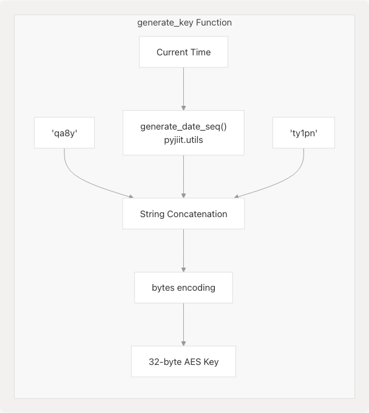
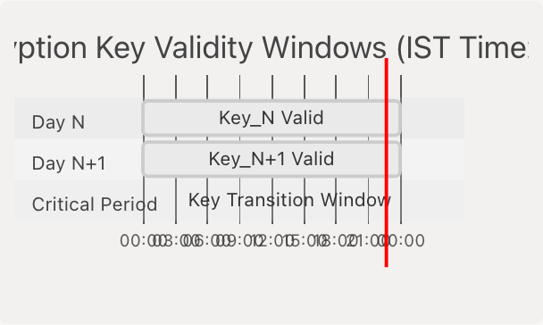
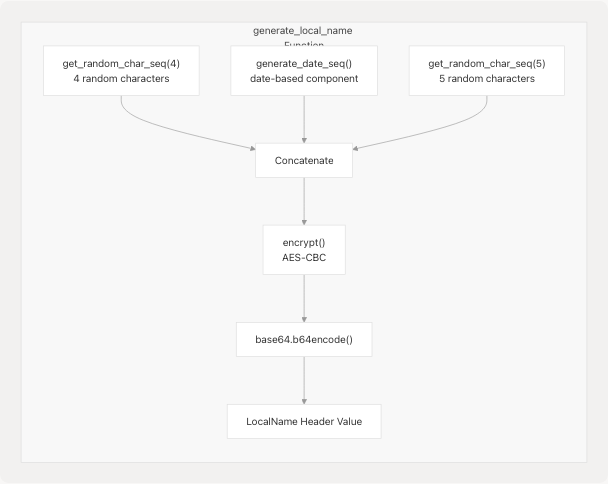
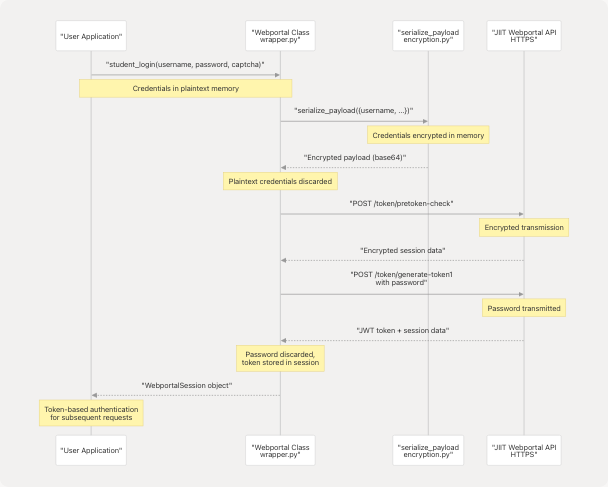
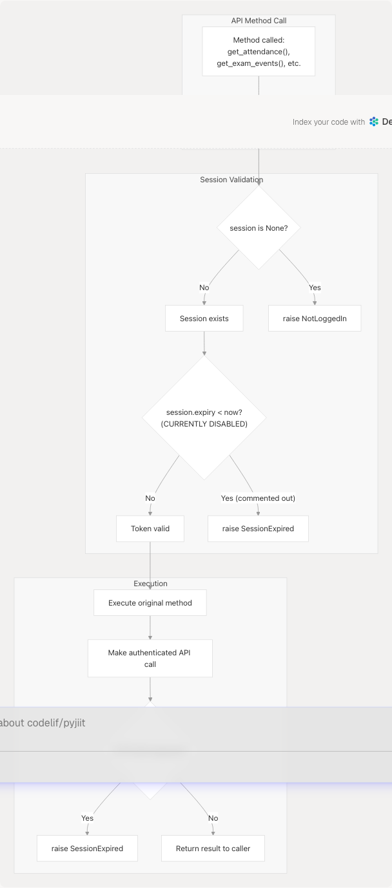
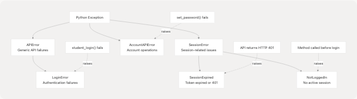
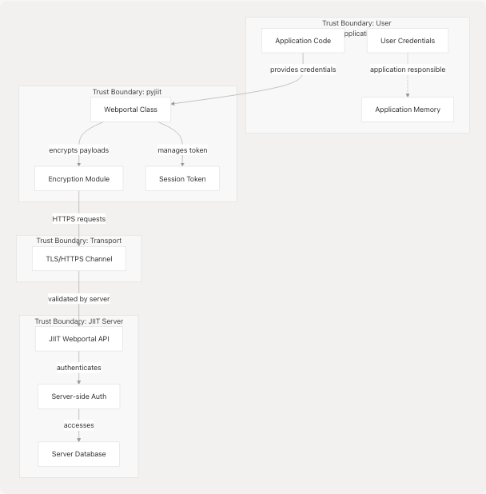

# Security Considerations

> Source: https://deepwiki.com/codelif/pyjiit/4.2-security-considerations

# Security Considerations

Relevant source files

* [pyjiit/encryption.py](https://github.com/codelif/pyjiit/blob/0fe02955/pyjiit/encryption.py)
* [pyjiit/exam.py](https://github.com/codelif/pyjiit/blob/0fe02955/pyjiit/exam.py)
* [pyjiit/registration.py](https://github.com/codelif/pyjiit/blob/0fe02955/pyjiit/registration.py)
* [pyjiit/wrapper.py](https://github.com/codelif/pyjiit/blob/0fe02955/pyjiit/wrapper.py)

This document discusses the security implications, limitations, and best practices related to the pyjiit library's encryption and authentication systems. It focuses on what developers and users need to understand about the security posture of this library when integrating it into applications or contributing to the codebase.

For technical implementation details of the encryption algorithms and methods, see [Encryption System](/codelif/pyjiit/4.1-encryption-system). For session management implementation, see [Session Management](/codelif/pyjiit/3.2-session-management).

## Purpose and Scope

This page covers:

* Security implications of the encryption design choices
* Temporal validity windows and key rotation policy
* Credential handling and storage recommendations
* Session security and token management
* Transport layer security requirements
* Known limitations and threat model
* Developer responsibilities when using this library

---

## Encryption Design and Fixed IV Considerations

The encryption system uses **AES-256-CBC** with a **fixed initialization vector (IV)**, which is a non-standard security practice that requires careful consideration.

### Fixed IV Analysis

The IV is hardcoded at [pyjiit/encryption.py7](https://github.com/codelif/pyjiit/blob/0fe02955/pyjiit/encryption.py#L7-L7):

```
IV = b"dcek9wb8frty1pnm"
```

This fixed value is used in all encryption and decryption operations [pyjiit/encryption.py20-29](https://github.com/codelif/pyjiit/blob/0fe02955/pyjiit/encryption.py#L20-L29) In standard cryptographic practice, IVs should be randomly generated for each encryption operation to prevent pattern analysis attacks.

| Security Aspect | Impact | Mitigation |
| --- | --- | --- |
| **Pattern Visibility** | Identical plaintexts encrypted at the same time produce identical ciphertexts | Daily key rotation changes encryption key every 24 hours |
| **Replay Attack Surface** | Encrypted payloads could theoretically be replayed | LocalName header includes random components per request |
| **Long-term Key Exposure** | If key is compromised, all messages encrypted with that key are vulnerable | 24-hour key validity window limits exposure |

### Why This Design Exists

This encryption scheme was **reverse-engineered from the JIIT Webportal API** [pyjiit/wrapper.py17](https://github.com/codelif/pyjiit/blob/0fe02955/pyjiit/wrapper.py#L17-L17) which implements this non-standard approach. The library must match the server's expectations exactly to communicate successfully. This is a constraint imposed by the upstream API, not a design choice of this library.

**Sources:** [pyjiit/encryption.py7-29](https://github.com/codelif/pyjiit/blob/0fe02955/pyjiit/encryption.py#L7-L29)

---

## Daily Key Rotation Policy

The encryption key rotates automatically at **00:00 hours IST** every day, providing temporal isolation between encryption periods.

### Key Generation Mechanism


```

**Diagram: AES Key Generation from Time-Based Components**

The key generation at [pyjiit/encryption.py9-11](https://github.com/codelif/pyjiit/blob/0fe02955/pyjiit/encryption.py#L9-L11) combines:

* Static prefix: `"qa8y"`
* Date sequence: `generate_date_seq()` - converts current IST date to a specific format
* Static suffix: `"ty1pn"`

### Temporal Validity Windows

```

```

**Diagram: 24-Hour Key Rotation Cycle**

| Time Period | Security Implication |
| --- | --- |
| **00:00:00 - 23:59:59 IST** | All requests use same daily key |
| **23:59 - 00:01 IST** | Transition window - requests immediately before/after midnight use different keys |
| **After 24 hours** | Encrypted payloads from previous days cannot be decrypted with current key |

### Data Exposure Window

If an attacker obtains the encryption key for a given day:

* They can decrypt **all payloads encrypted that day**
* They **cannot** decrypt payloads from other days
* The exposure window is limited to **24 hours maximum**

This is significantly better than using a static key indefinitely, providing time-bounded security.

**Sources:** [pyjiit/encryption.py9-11](https://github.com/codelif/pyjiit/blob/0fe02955/pyjiit/encryption.py#L9-L11) [pyjiit/utils.py](https://github.com/codelif/pyjiit/blob/0fe02955/pyjiit/utils.py)

---

## LocalName Header Security

Every HTTP request to the JIIT Webportal API requires a `LocalName` header [pyjiit/wrapper.py67](https://github.com/codelif/pyjiit/blob/0fe02955/pyjiit/wrapper.py#L67-L67) [pyjiit/wrapper.py93](https://github.com/codelif/pyjiit/blob/0fe02955/pyjiit/wrapper.py#L93-L93) This header provides request-level uniqueness beyond the daily key rotation.

### LocalName Structure

```

```

**Diagram: LocalName Generation Process**

The `generate_local_name()` function at [pyjiit/encryption.py13-17](https://github.com/codelif/pyjiit/blob/0fe02955/pyjiit/encryption.py#L13-L17) creates unique headers by:

1. Generating random characters (4 chars + 5 chars)
2. Including the date sequence (same as used in key generation)
3. Encrypting the combined string with daily key
4. Base64-encoding the result

This ensures that even if two requests have identical payloads, their `LocalName` headers differ due to random components, making replay attacks more difficult to execute.

**Sources:** [pyjiit/encryption.py13-17](https://github.com/codelif/pyjiit/blob/0fe02955/pyjiit/encryption.py#L13-L17) [pyjiit/wrapper.py61-68](https://github.com/codelif/pyjiit/blob/0fe02955/pyjiit/wrapper.py#L61-L68) [pyjiit/wrapper.py93](https://github.com/codelif/pyjiit/blob/0fe02955/pyjiit/wrapper.py#L93-L93)

---

## Credential Handling and Storage

The library handles sensitive credentials during authentication but does **not** store them persistently.

### Authentication Flow Security

```

```

**Diagram: Credential Flow in Authentication Process**

### Security Recommendations for Applications

| Practice | Recommendation | Rationale |
| --- | --- | --- |
| **Password Storage** | Never store passwords in application code or persistent storage | Library does not require password after initial login |
| **Session Token Storage** | Store `WebportalSession.token` securely if persistence needed | JWT token enables re-authentication without password |
| **Memory Handling** | Clear password variables after `student_login()` returns | Minimize credential exposure time in application memory |
| **Environment Variables** | Use environment variables or secure vaults for credentials | Avoid hardcoding in source code |
| **Token Expiry** | Check `WebportalSession.expiry` before making requests | Token expiration is extracted from JWT at [pyjiit/wrapper.py54-55](https://github.com/codelif/pyjiit/blob/0fe02955/pyjiit/wrapper.py#L54-L55) |

### What the Library Does NOT Do

The library intentionally does **not**:

* Store passwords after authentication completes
* Implement password hashing (this is the server's responsibility)
* Provide credential encryption for application-level storage
* Manage refresh tokens or automatic re-authentication

Applications using this library are responsible for credential management at the application level.

**Sources:** [pyjiit/wrapper.py111-143](https://github.com/codelif/pyjiit/blob/0fe02955/pyjiit/wrapper.py#L111-L143) [pyjiit/wrapper.py42-59](https://github.com/codelif/pyjiit/blob/0fe02955/pyjiit/wrapper.py#L42-L59)

---

## Session Token Security

The `WebportalSession` class manages JWT-based authentication tokens after successful login.

### Session Token Structure

The token at [pyjiit/wrapper.py53](https://github.com/codelif/pyjiit/blob/0fe02955/pyjiit/wrapper.py#L53-L53) is a standard JWT with three components:

* Header (algorithm and token type)
* Payload (claims including expiry timestamp)
* Signature (validation signature)

```

```

**Diagram: Session Token Lifecycle and Usage**

### Token Security Properties

| Property | Implementation | Security Implication |
| --- | --- | --- |
| **Expiry Checking** | Extracted from JWT payload at [pyjiit/wrapper.py54-55](https://github.com/codelif/pyjiit/blob/0fe02955/pyjiit/wrapper.py#L54-L55) | Prevents use of expired tokens (though currently disabled due to API bug) |
| **Bearer Authentication** | Token sent in `Authorization` header [pyjiit/wrapper.py66](https://github.com/codelif/pyjiit/blob/0fe02955/pyjiit/wrapper.py#L66-L66) | Standard OAuth 2.0 Bearer token pattern |
| **Server-Side Validation** | JIIT API validates token signature | Tokens cannot be forged client-side |
| **No Refresh Mechanism** | Library does not implement token refresh | Must re-authenticate when token expires |

### Session Expiry Handling (Currently Disabled)

The `@authenticated` decorator at [pyjiit/wrapper.py19-36](https://github.com/codelif/pyjiit/blob/0fe02955/pyjiit/wrapper.py#L19-L36) includes logic to check session expiry, but it is **currently commented out** [pyjiit/wrapper.py29-32](https://github.com/codelif/pyjiit/blob/0fe02955/pyjiit/wrapper.py#L29-L32):

```
```
# Commenting this because rn the webportal api is bugged,
# and returns wrong expiry time for perfectly valid cookies
# if self.session.expiry < datetime.now():
#     raise SessionExpired
```
```

This means:

* Applications cannot rely on client-side expiry checking
* Server will respond with `HTTP 401` when token expires [pyjiit/wrapper.py102-103](https://github.com/codelif/pyjiit/blob/0fe02955/pyjiit/wrapper.py#L102-L103)
* Applications must catch `SessionExpired` exceptions to handle expired tokens

**Sources:** [pyjiit/wrapper.py38-68](https://github.com/codelif/pyjiit/blob/0fe02955/pyjiit/wrapper.py#L38-L68) [pyjiit/wrapper.py19-36](https://github.com/codelif/pyjiit/blob/0fe02955/pyjiit/wrapper.py#L19-L36)

---

## Transport Layer Security

The library communicates with the JIIT Webportal API exclusively over **HTTPS**.

### HTTPS Enforcement

The base API URL is hardcoded at [pyjiit/wrapper.py17](https://github.com/codelif/pyjiit/blob/0fe02955/pyjiit/wrapper.py#L17-L17):

```
```
API = "https://webportal.jiit.ac.in:6011/StudentPortalAPI"
```
```

| Security Layer | Details |
| --- | --- |
| **Protocol** | HTTPS (TLS/SSL) |
| **Port** | 6011 (non-standard port) |
| **Certificate Validation** | Handled by Python `requests` library (validates by default) |
| **No HTTP Fallback** | Library does not support unencrypted HTTP connections |

### Transport Security Model

```

```

**Diagram: Layered Security Model**

### Defense in Depth

The system implements **two layers of encryption**:

1. **Application Layer (AES-CBC)**: Payloads encrypted with daily rotating keys
   * Protects data even if TLS is compromised
   * Required by JIIT API protocol
2. **Transport Layer (TLS)**: HTTPS channel encryption
   * Protects against network eavesdropping
   * Validates server identity via certificates

This defense-in-depth approach means that an attacker would need to compromise **both** TLS and the daily encryption key to decrypt traffic.

**Sources:** [pyjiit/wrapper.py17](https://github.com/codelif/pyjiit/blob/0fe02955/pyjiit/wrapper.py#L17-L17) [pyjiit/wrapper.py82-108](https://github.com/codelif/pyjiit/blob/0fe02955/pyjiit/wrapper.py#L82-L108)

---

## Authentication Decorator and Access Control

The `@authenticated` decorator enforces session requirements before allowing access to protected API methods.

### Decorator Security Flow

```

```

**Diagram: Authenticated Decorator Security Checks**

### Protected Methods

All methods that require authentication are decorated with `@authenticated` [pyjiit/wrapper.py19-36](https://github.com/codelif/pyjiit/blob/0fe02955/pyjiit/wrapper.py#L19-L36) Examples include:

| Method | File Location | Protection |
| --- | --- | --- |
| `get_attendance_meta()` | [pyjiit/wrapper.py173](https://github.com/codelif/pyjiit/blob/0fe02955/pyjiit/wrapper.py#L173-L173) | Requires active session |
| `get_attendance()` | [pyjiit/wrapper.py191](https://github.com/codelif/pyjiit/blob/0fe02955/pyjiit/wrapper.py#L191-L191) | Requires active session |
| `get_exam_events()` | [pyjiit/wrapper.py292](https://github.com/codelif/pyjiit/blob/0fe02955/pyjiit/wrapper.py#L292-L292) | Requires active session |
| `set_password()` | [pyjiit/wrapper.py214](https://github.com/codelif/pyjiit/blob/0fe02955/pyjiit/wrapper.py#L214-L214) | Requires active session |
| `get_registered_subjects_and_faculties()` | [pyjiit/wrapper.py252](https://github.com/codelif/pyjiit/blob/0fe02955/pyjiit/wrapper.py#L252-L252) | Requires active session |

### Session State Validation

The decorator performs a simple but critical check at [pyjiit/wrapper.py26-27](https://github.com/codelif/pyjiit/blob/0fe02955/pyjiit/wrapper.py#L26-L27):

```
```
if self.session is None:
    raise NotLoggedIn
```
```

This prevents:

* Calling protected methods without authentication
* Null pointer exceptions from missing session data
* Sending unauthenticated requests to the API

**Sources:** [pyjiit/wrapper.py19-36](https://github.com/codelif/pyjiit/blob/0fe02955/pyjiit/wrapper.py#L19-L36) [pyjiit/wrapper.py156-489](https://github.com/codelif/pyjiit/blob/0fe02955/pyjiit/wrapper.py#L156-L489)

---

## Exception-Based Security Signaling

The library uses specific exception types to signal different security-related failures.

### Security Exception Hierarchy

```

```

**Diagram: Security Exception Types and Their Triggers**

### Security-Relevant Exceptions

| Exception | Raised When | File Location | Security Implication |
| --- | --- | --- | --- |
| `NotLoggedIn` | Method called without valid session | [pyjiit/wrapper.py27](https://github.com/codelif/pyjiit/blob/0fe02955/pyjiit/wrapper.py#L27-L27) | Prevents unauthorized API access |
| `SessionExpired` | HTTP 401 or token expired | [pyjiit/wrapper.py103](https://github.com/codelif/pyjiit/blob/0fe02955/pyjiit/wrapper.py#L103-L103) | Token no longer valid, re-authentication required |
| `LoginError` | Authentication fails | [pyjiit/wrapper.py130](https://github.com/codelif/pyjiit/blob/0fe02955/pyjiit/wrapper.py#L130-L130) [pyjiit/wrapper.py139](https://github.com/codelif/pyjiit/blob/0fe02955/pyjiit/wrapper.py#L139-L139) | Invalid credentials or captcha |
| `AccountAPIError` | Account operations fail | [pyjiit/wrapper.py229](https://github.com/codelif/pyjiit/blob/0fe02955/pyjiit/wrapper.py#L229-L229) | Password change or account operations denied |

### Exception Handling Best Practices

Applications should handle these exceptions to provide appropriate security responses:

```
```
try:
    session = wp.student_login(username, password, captcha)
except LoginError:
    # Handle invalid credentials - limit retry attempts
    # Consider implementing rate limiting

try:
    data = wp.get_attendance(header, semester)
except NotLoggedIn:
    # Redirect to login flow
except SessionExpired:
    # Re-authenticate with stored credentials (if available)
    # Or prompt user to log in again
```
```

**Sources:** [pyjiit/exceptions.py](https://github.com/codelif/pyjiit/blob/0fe02955/pyjiit/exceptions.py) [pyjiit/wrapper.py8](https://github.com/codelif/pyjiit/blob/0fe02955/pyjiit/wrapper.py#L8-L8) [pyjiit/wrapper.py82-108](https://github.com/codelif/pyjiit/blob/0fe02955/pyjiit/wrapper.py#L82-L108)

---

## Known Limitations and Threat Model

### Reverse-Engineered Protocol Constraints

The encryption and authentication schemes are **reverse-engineered from the JIIT Webportal API**. This imposes several constraints:

| Limitation | Impact | Mitigation Available |
| --- | --- | --- |
| **Fixed IV** | Same plaintexts at same time produce same ciphertexts | Daily key rotation provides time-bounded mitigation |
| **No IV Randomization** | Cannot implement per-message IVs without breaking server compatibility | None - server dictates protocol |
| **Hardcoded Key Components** | Key generation algorithm is public knowledge | Daily rotation limits exposure window |
| **No Perfect Forward Secrecy** | Compromising daily key compromises all that day's traffic | 24-hour exposure window vs. indefinite with static key |

### Threat Model

The library's security model assumes:

**Trusted:**

* The JIIT Webportal server (webportal.jiit.ac.in)
* The client application using this library
* The TLS certificate infrastructure

**Protected Against:**

* Network eavesdropping (via TLS + AES encryption)
* Unauthorized API access (via session tokens)
* Credential exposure in transit (via encrypted payloads)
* Replay attacks within same day (via random LocalName components)

**NOT Protected Against:**

* Compromise of the daily encryption key
* Man-in-the-middle attacks if TLS is compromised
* Malicious client applications that have valid credentials
* Server-side vulnerabilities in JIIT Webportal API
* Cross-day replay attacks (different days use different keys, so not applicable)

### Security Boundaries

```


**Diagram: Security Trust Boundaries**

**Sources:** [pyjiit/encryption.py7-45](https://github.com/codelif/pyjiit/blob/0fe02955/pyjiit/encryption.py#L7-L45) [pyjiit/wrapper.py17](https://github.com/codelif/pyjiit/blob/0fe02955/pyjiit/wrapper.py#L17-L17)

---

## Client Application Responsibilities

Applications using this library must implement their own security controls:

### Required Security Measures

| Responsibility | Description | Example |
| --- | --- | --- |
| **Credential Storage** | Securely store credentials if needed | Use OS keychain, encrypted storage, or environment variables |
| **Session Persistence** | Securely persist session tokens if required | Encrypt tokens before storing, clear on logout |
| **Rate Limiting** | Implement login attempt limits | Prevent brute-force attacks on user accounts |
| **Input Validation** | Validate user inputs before passing to library | Prevent injection attacks in application layer |
| **Error Handling** | Handle security exceptions appropriately | Don't expose sensitive error details to end users |
| **Audit Logging** | Log authentication events and security errors | Track suspicious activity patterns |
| **Token Refresh** | Re-authenticate when tokens expire | Handle `SessionExpired` exceptions gracefully |

### What the Library Does NOT Protect

The library **cannot** protect against:

* Compromised client applications
* Malware on the client system
* Social engineering attacks
* Credential theft through application vulnerabilities
* Session hijacking within the client application
* Database compromise at the JIIT server level

Security is a shared responsibility between this library, the application using it, and the JIIT Webportal server.

**Sources:** [pyjiit/wrapper.py70-489](https://github.com/codelif/pyjiit/blob/0fe02955/pyjiit/wrapper.py#L70-L489)

---

## Cryptographic Dependencies

The library depends on the **pycryptodome** package for AES encryption functionality.

### Dependency Security

| Aspect | Details |
| --- | --- |
| **Package** | `pycryptodome` |
| **Usage** | AES cipher implementation [pyjiit/encryption.py1](https://github.com/codelif/pyjiit/blob/0fe02955/pyjiit/encryption.py#L1-L1) |
| **Algorithms** | AES-256-CBC mode |
| **Version Management** | Managed via Poetry in pyproject.toml |
| **Security Updates** | Applications should regularly update dependencies |

The `Crypto.Cipher.AES` module is imported at [pyjiit/encryption.py1](https://github.com/codelif/pyjiit/blob/0fe02955/pyjiit/encryption.py#L1-L1) and used for:

* Creating AES cipher objects in CBC mode [pyjiit/encryption.py20-21](https://github.com/codelif/pyjiit/blob/0fe02955/pyjiit/encryption.py#L20-L21)
* Encryption operations [pyjiit/encryption.py27-29](https://github.com/codelif/pyjiit/blob/0fe02955/pyjiit/encryption.py#L27-L29)
* Decryption operations [pyjiit/encryption.py23-25](https://github.com/codelif/pyjiit/blob/0fe02955/pyjiit/encryption.py#L23-L25)

Applications should monitor pycryptodome for security updates and update their dependencies accordingly.

**Sources:** [pyjiit/encryption.py1-29](https://github.com/codelif/pyjiit/blob/0fe02955/pyjiit/encryption.py#L1-L29)

---

## Summary: Security Posture

### Strengths

✓ **Layered encryption** (TLS + AES-CBC) provides defense in depth  
✓ **Daily key rotation** limits exposure windows to 24 hours  
✓ **Token-based authentication** avoids repeated credential transmission  
✓ **Request-level uniqueness** via LocalName header mitigates some replay attacks  
✓ **Clear exception signaling** for security-relevant errors  
✓ **HTTPS-only** communication with no fallback to insecure protocols

### Weaknesses and Mitigations

⚠ **Fixed IV usage** - Mitigated by daily key rotation and required by upstream API  
⚠ **Reverse-engineered protocol** - Constraints imposed by JIIT API, not library design  
⚠ **No perfect forward secrecy** - 24-hour exposure window vs. indefinite with static key  
⚠ **Disabled expiry checking** - Due to API bug; server still validates tokens  
⚠ **Public key algorithm** - Mitigated by daily rotation and random LocalName components

### Operational Recommendations

1. **Use in secure environments** - Deploy on trusted systems only
2. **Rotate daily** - Understand that encryption keys change daily at 00:00 IST
3. **Monitor sessions** - Catch and handle `SessionExpired` exceptions
4. **Protect credentials** - Never store passwords; use secure session token storage if needed
5. **Update dependencies** - Keep pycryptodome and other dependencies current
6. **Validate inputs** - Implement application-level validation and rate limiting
7. **Audit logging** - Log security events for monitoring and forensics

**Sources:** [pyjiit/encryption.py1-50](https://github.com/codelif/pyjiit/blob/0fe02955/pyjiit/encryption.py#L1-L50) [pyjiit/wrapper.py1-489](https://github.com/codelif/pyjiit/blob/0fe02955/pyjiit/wrapper.py#L1-L489)