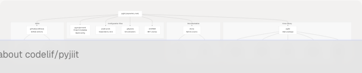
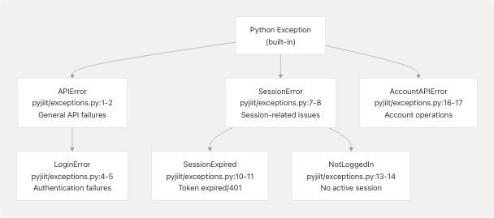
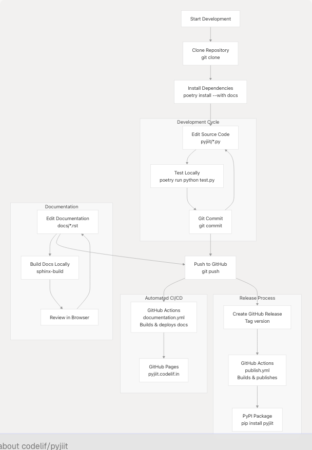

# Development Guide

Relevant source files

* [.gitignore](https://github.com/codelif/pyjiit/blob/0fe02955/.gitignore)
* [LICENSE](https://github.com/codelif/pyjiit/blob/0fe02955/LICENSE)
* [poetry.lock](https://github.com/codelif/pyjiit/blob/0fe02955/poetry.lock)
* [pyjiit/exceptions.py](https://github.com/codelif/pyjiit/blob/0fe02955/pyjiit/exceptions.py)
* [pyproject.toml](https://github.com/codelif/pyjiit/blob/0fe02955/pyproject.toml)

This guide is intended for developers who want to contribute to pyjiit or understand its internal implementation. It covers the development environment setup, project structure, build system, and development workflows.

For information about using pyjiit as a library, see [Getting Started](/codelif/pyjiit/2-getting-started). For details about the documentation system, see [Documentation System](/codelif/pyjiit/6-documentation-system). For CI/CD workflows, see [Deployment and CI/CD](/codelif/pyjiit/7-deployment-and-cicd).

---

## Prerequisites and Requirements

pyjiit development requires the following tools and environment:

| Requirement | Version | Purpose |
| --- | --- | --- |
| Python | >=3.9 | Runtime environment |
| Poetry | Latest | Dependency management and builds |
| Git | Latest | Version control |

The project uses **Poetry** as its primary build and dependency management tool. All dependencies are declared in [pyproject.toml9-11](https://github.com/codelif/pyjiit/blob/0fe02955/pyproject.toml#L9-L11) for runtime and [pyproject.toml19-21](https://github.com/codelif/pyjiit/blob/0fe02955/pyproject.toml#L19-L21) for documentation builds.

**Sources:** [pyproject.toml1-28](https://github.com/codelif/pyjiit/blob/0fe02955/pyproject.toml#L1-L28)

---

## Development Environment Setup

### Installing Poetry

Poetry must be installed before setting up the development environment:

```
```
pip install poetry
```
```

### Cloning and Setting Up the Repository

```
```
# Clone the repository
git clone https://github.com/codelif/pyjiit
cd pyjiit

# Install all dependencies including documentation tools
poetry install --with docs

# Activate the virtual environment
poetry shell
```
```

The `poetry install` command reads [pyproject.toml1-28](https://github.com/codelif/pyjiit/blob/0fe02955/pyproject.toml#L1-L28) and [poetry.lock1-1054](https://github.com/codelif/pyjiit/blob/0fe02955/poetry.lock#L1-L1054) to create a reproducible development environment with exact dependency versions locked.

### Verifying the Installation

```
```
# Check Python environment
poetry run python --version

# Import the library
poetry run python -c "from pyjiit import Webportal; print('Success')"
```
```

**Sources:** [pyproject.toml1-28](https://github.com/codelif/pyjiit/blob/0fe02955/pyproject.toml#L1-L28) [poetry.lock1-1054](https://github.com/codelif/pyjiit/blob/0fe02955/poetry.lock#L1-L1054)

---

## Development Environment Architecture

The following diagram shows how different components of the development environment interact:


```

**Sources:** [pyproject.toml1-28](https://github.com/codelif/pyjiit/blob/0fe02955/pyproject.toml#L1-L28) [poetry.lock1-1054](https://github.com/codelif/pyjiit/blob/0fe02955/poetry.lock#L1-L1054) [.gitignore1-166](https://github.com/codelif/pyjiit/blob/0fe02955/.gitignore#L1-L166)

---

## Project File Structure Overview

```

```

For detailed information about each directory and file, see [Project Structure](/codelif/pyjiit/5.1-project-structure).

**Sources:** [pyproject.toml1-28](https://github.com/codelif/pyjiit/blob/0fe02955/pyproject.toml#L1-L28) [.gitignore1-166](https://github.com/codelif/pyjiit/blob/0fe02955/.gitignore#L1-L166) [LICENSE1-22](https://github.com/codelif/pyjiit/blob/0fe02955/LICENSE#L1-L22)

---

## Key Development Files and Their Purposes

| File | Purpose | When to Modify |
| --- | --- | --- |
| `pyproject.toml` | Project metadata, dependencies, build configuration | Adding/updating dependencies, version bumps |
| `poetry.lock` | Locked dependency versions for reproducibility | Auto-updated by Poetry commands |
| `pyjiit/*.py` | Core library source code | Implementing features, bug fixes |
| `pyjiit/exceptions.py` | Custom exception hierarchy | Adding new error types |
| `docs/*.rst` | Documentation source files | Updating user-facing documentation |
| `.github/workflows/*.yml` | CI/CD automation | Modifying build/deploy processes |
| `.gitignore` | Version control exclusions | Adding new temporary files/directories |

**Sources:** [pyproject.toml1-28](https://github.com/codelif/pyjiit/blob/0fe02955/pyproject.toml#L1-L28) [poetry.lock1-1054](https://github.com/codelif/pyjiit/blob/0fe02955/poetry.lock#L1-L1054) [pyjiit/exceptions.py1-19](https://github.com/codelif/pyjiit/blob/0fe02955/pyjiit/exceptions.py#L1-L19) [.gitignore1-166](https://github.com/codelif/pyjiit/blob/0fe02955/.gitignore#L1-L166)

---

## Understanding the Exception Hierarchy

The pyjiit library defines a custom exception hierarchy for fine-grained error handling:

```

```

**Exception Usage Patterns:**

* `APIError` - Raised by general API methods when server returns error responses
* `LoginError` - Raised by `student_login()` when credentials are invalid
* `SessionExpired` - Raised when HTTP 401 detected or token validity expires
* `NotLoggedIn` - Raised by `@authenticated` decorator when methods called before login
* `AccountAPIError` - Raised by account management methods like `set_password()`

**Sources:** [pyjiit/exceptions.py1-19](https://github.com/codelif/pyjiit/blob/0fe02955/pyjiit/exceptions.py#L1-L19)

---

## Dependency Management with Poetry

### Understanding pyproject.toml

The [pyproject.toml1-28](https://github.com/codelif/pyjiit/blob/0fe02955/pyproject.toml#L1-L28) file serves multiple purposes:

1. **Project Metadata** ([pyproject.toml1-17](https://github.com/codelif/pyjiit/blob/0fe02955/pyproject.toml#L1-L17)):

   * Package name, version, description
   * Author information
   * License and README
   * Python version requirement (>=3.9)
   * Project URLs
2. **Runtime Dependencies** ([pyproject.toml9-12](https://github.com/codelif/pyjiit/blob/0fe02955/pyproject.toml#L9-L12)):

   * `requests` - HTTP client for API calls
   * `pycryptodome` - AES encryption implementation
3. **Documentation Dependencies** ([pyproject.toml19-21](https://github.com/codelif/pyjiit/blob/0fe02955/pyproject.toml#L19-L21)):

   * `sphinx` - Documentation generator
   * `furo` - Modern documentation theme
   * Separated into `docs` group for optional installation
4. **Build System** ([pyproject.toml23-25](https://github.com/codelif/pyjiit/blob/0fe02955/pyproject.toml#L23-L25)):

   * Uses `poetry-core` as the build backend
   * Complies with PEP 517/518 standards

### Understanding poetry.lock

The [poetry.lock1-1054](https://github.com/codelif/pyjiit/blob/0fe02955/poetry.lock#L1-L1054) file contains:

* **Exact versions** of all dependencies and their transitive dependencies
* **File hashes** for verification ([poetry.lock10-13](https://github.com/codelif/pyjiit/blob/0fe02955/poetry.lock#L10-L13))
* **Platform markers** for conditional dependencies ([poetry.lock172](https://github.com/codelif/pyjiit/blob/0fe02955/poetry.lock#L172-L172))
* **Dependency groups** separating main and docs dependencies

This ensures **reproducible builds** across different environments and time periods.

For detailed dependency management workflows, see [Build System and Dependencies](/codelif/pyjiit/5.2-build-system-and-dependencies).

**Sources:** [pyproject.toml1-28](https://github.com/codelif/pyjiit/blob/0fe02955/pyproject.toml#L1-L28) [poetry.lock1-1054](https://github.com/codelif/pyjiit/blob/0fe02955/poetry.lock#L1-L1054)

---

## Common Development Tasks

### Adding a New Dependency

```
```
# Add runtime dependency
poetry add package-name

# Add development/documentation dependency
poetry add --group docs package-name

# Update poetry.lock after manual pyproject.toml edits
poetry lock
```
```

### Running Code Locally

```
```
# Activate Poetry shell
poetry shell

# Run Python scripts
python your_script.py

# Or run without activating shell
poetry run python your_script.py
```
```

### Building the Package

```
```
# Build distribution packages (wheel and sdist)
poetry build

# Output will be in dist/ directory
# - pyjiit-0.1.0a8-py3-none-any.whl
# - pyjiit-0.1.0a8.tar.gz
```
```

### Version Management

The version is defined in [pyproject.toml3](https://github.com/codelif/pyjiit/blob/0fe02955/pyproject.toml#L3-L3):

```
```
version = "0.1.0a8"
```
```

To bump the version:

```
```
# Update version in pyproject.toml
poetry version patch   # 0.1.0a8 -> 0.1.0a9
poetry version minor   # 0.1.0 -> 0.2.0
poetry version major   # 0.1.0 -> 1.0.0
```
```

**Sources:** [pyproject.toml1-28](https://github.com/codelif/pyjiit/blob/0fe02955/pyproject.toml#L1-L28)

---

## Development Workflow Lifecycle

```


For detailed testing workflows, see [Testing and Development Workflow](/codelif/pyjiit/5.3-testing-and-development-workflow). For CI/CD details, see [GitHub Actions Workflows](/codelif/pyjiit/7.2-github-actions-workflows).

**Sources:** [pyproject.toml1-28](https://github.com/codelif/pyjiit/blob/0fe02955/pyproject.toml#L1-L28) [.gitignore1-166](https://github.com/codelif/pyjiit/blob/0fe02955/.gitignore#L1-L166)

---

## Code Quality Standards

### File Exclusions

The [.gitignore1-166](https://github.com/codelif/pyjiit/blob/0fe02955/.gitignore#L1-L166) file excludes:

* **Build artifacts**: `dist/`, `build/`, `*.egg-info/` ([.gitignore9-27](https://github.com/codelif/pyjiit/blob/0fe02955/.gitignore#L9-L27))
* **Python cache**: `__pycache__/`, `*.pyc` ([.gitignore1-4](https://github.com/codelif/pyjiit/blob/0fe02955/.gitignore#L1-L4))
* **Virtual environments**: `.venv/`, `venv/` ([.gitignore124-131](https://github.com/codelif/pyjiit/blob/0fe02955/.gitignore#L124-L131))
* **Documentation builds**: `docs/_build/` ([.gitignore71-72](https://github.com/codelif/pyjiit/blob/0fe02955/.gitignore#L71-L72))
* **IDE files**: `.idea/` ([.gitignore162](https://github.com/codelif/pyjiit/blob/0fe02955/.gitignore#L162-L162))
* **Test files**: `test.py` ([.gitignore165](https://github.com/codelif/pyjiit/blob/0fe02955/.gitignore#L165-L165))

### Module Organization Principles

1. **Separation of Concerns**:

   * `wrapper.py` - API orchestration
   * `encryption.py` - Security operations
   * `utils.py` - Generic utilities
   * Data models in separate files
2. **Exception Hierarchy**:

   * Specific exceptions for different error categories ([pyjiit/exceptions.py1-19](https://github.com/codelif/pyjiit/blob/0fe02955/pyjiit/exceptions.py#L1-L19))
   * Allows precise error handling in client code
3. **Minimal Public API**:

   * Only `Webportal` class exported from `pyjiit/__init__.py`
   * Internal modules remain private

**Sources:** [.gitignore1-166](https://github.com/codelif/pyjiit/blob/0fe02955/.gitignore#L1-L166) [pyjiit/exceptions.py1-19](https://github.com/codelif/pyjiit/blob/0fe02955/pyjiit/exceptions.py#L1-L19)

---

## Next Steps

* **[Project Structure](/codelif/pyjiit/5.1-project-structure)** - Detailed directory layout and module organization
* **[Build System and Dependencies](/codelif/pyjiit/5.2-build-system-and-dependencies)** - Deep dive into Poetry usage and dependency management
* **[Testing and Development Workflow](/codelif/pyjiit/5.3-testing-and-development-workflow)** - How to test, debug, and contribute new features

For setting up documentation builds locally, see [Building Documentation](/codelif/pyjiit/6.1-building-documentation). For understanding how releases are published, see [Publishing to PyPI](/codelif/pyjiit/7.1-publishing-to-pypi).

**Sources:** [pyproject.toml1-28](https://github.com/codelif/pyjiit/blob/0fe02955/pyproject.toml#L1-L28) [poetry.lock1-1054](https://github.com/codelif/pyjiit/blob/0fe02955/poetry.lock#L1-L1054) [pyjiit/exceptions.py1-19](https://github.com/codelif/pyjiit/blob/0fe02955/pyjiit/exceptions.py#L1-L19) [.gitignore1-166](https://github.com/codelif/pyjiit/blob/0fe02955/.gitignore#L1-L166)