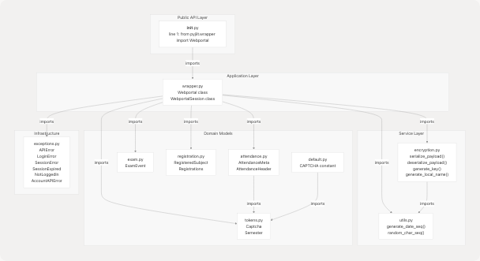
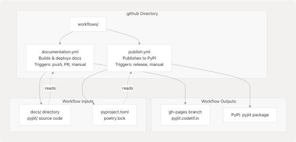

# Project Structure

Relevant source files

* [.gitignore](https://github.com/codelif/pyjiit/blob/0fe02955/.gitignore)
* [LICENSE](https://github.com/codelif/pyjiit/blob/0fe02955/LICENSE)
* [pyjiit/\_\_init\_\_.py](https://github.com/codelif/pyjiit/blob/0fe02955/pyjiit/__init__.py)
* [pyjiit/exceptions.py](https://github.com/codelif/pyjiit/blob/0fe02955/pyjiit/exceptions.py)
* [pyproject.toml](https://github.com/codelif/pyjiit/blob/0fe02955/pyproject.toml)

This document describes the directory layout, module organization, and key configuration files in the pyjiit repository. It provides a structural overview of where different components are located and how they are organized on disk.

For information about how to use the build system and manage dependencies, see [Build System and Dependencies](/codelif/pyjiit/5.2-build-system-and-dependencies). For details about the documentation build process, see [Building Documentation](/codelif/pyjiit/6.1-building-documentation).

## Purpose and Scope

This page maps the physical file structure of the pyjiit codebase to its logical components. It explains what each directory and major file contains, and how the modules are organized to implement the functionality described in the system architecture.

## Repository Structure Overview

The pyjiit repository follows a standard Python package structure with clearly separated concerns: source code in `pyjiit/`, documentation in `docs/`, and configuration at the root level.


```

**Directory Structure**

| Directory/File | Purpose |
| --- | --- |
| `pyjiit/` | Main source package containing all Python modules |
| `docs/` | Sphinx documentation source files and build output |
| `.github/workflows/` | GitHub Actions CI/CD workflow definitions |
| `pyproject.toml` | Poetry configuration, package metadata, dependencies |
| `poetry.lock` | Locked dependency versions for reproducible builds |
| `.gitignore` | Files and directories excluded from version control |
| `LICENSE` | MIT License text |
| `README.rst` | Package description in reStructuredText format |

**Sources:** [pyproject.toml1-28](https://github.com/codelif/pyjiit/blob/0fe02955/pyproject.toml#L1-L28) [.gitignore1-166](https://github.com/codelif/pyjiit/blob/0fe02955/.gitignore#L1-L166) [pyjiit/\_\_init\_\_.py1-4](https://github.com/codelif/pyjiit/blob/0fe02955/pyjiit/__init__.py#L1-L4)

## Root-Level Configuration Files

The repository root contains several critical configuration files that control the build system, dependency management, and project metadata.

### pyproject.toml

The [pyproject.toml1-28](https://github.com/codelif/pyjiit/blob/0fe02955/pyproject.toml#L1-L28) file serves as the primary project configuration, following the PEP 518/621 standards. It defines:

| Section | Content | Lines |
| --- | --- | --- |
| `[project]` | Package metadata: name, version, authors, license, Python version requirement | [pyproject.toml1-12](https://github.com/codelif/pyjiit/blob/0fe02955/pyproject.toml#L1-L12) |
| `[project.urls]` | Homepage and issue tracker URLs | [pyproject.toml14-16](https://github.com/codelif/pyjiit/blob/0fe02955/pyproject.toml#L14-L16) |
| `[project.dependencies]` | Runtime dependencies: `requests` and `pycryptodome` | [pyproject.toml9-12](https://github.com/codelif/pyjiit/blob/0fe02955/pyproject.toml#L9-L12) |
| `[tool.poetry.group.docs.dependencies]` | Documentation build dependencies: `sphinx` and `furo` theme | [pyproject.toml19-21](https://github.com/codelif/pyjiit/blob/0fe02955/pyproject.toml#L19-L21) |
| `[build-system]` | Build backend configuration using `poetry-core` | [pyproject.toml23-25](https://github.com/codelif/pyjiit/blob/0fe02955/pyproject.toml#L23-L25) |

**Key Configuration Details:**

* **Package name:** `pyjiit` [pyproject.toml2](https://github.com/codelif/pyjiit/blob/0fe02955/pyproject.toml#L2-L2)
* **Version:** `0.1.0a8` (alpha release) [pyproject.toml3](https://github.com/codelif/pyjiit/blob/0fe02955/pyproject.toml#L3-L3)
* **Python requirement:** `>=3.9` [pyproject.toml8](https://github.com/codelif/pyjiit/blob/0fe02955/pyproject.toml#L8-L8)
* **Runtime dependencies:** Only `requests` and `pycryptodome` - minimal footprint [pyproject.toml9-12](https://github.com/codelif/pyjiit/blob/0fe02955/pyproject.toml#L9-L12)
* **Documentation dependencies:** Isolated in `docs` group to avoid bloating production installs [pyproject.toml19-21](https://github.com/codelif/pyjiit/blob/0fe02955/pyproject.toml#L19-L21)

### .gitignore

The [.gitignore1-166](https://github.com/codelif/pyjiit/blob/0fe02955/.gitignore#L1-L166) follows Python community standards, excluding:

* **Build artifacts:** `build/`, `dist/`, `*.egg-info/` [.gitignore11-27](https://github.com/codelif/pyjiit/blob/0fe02955/.gitignore#L11-L27)
* **Python bytecode:** `__pycache__/`, `*.pyc` [.gitignore1-4](https://github.com/codelif/pyjiit/blob/0fe02955/.gitignore#L1-L4)
* **Documentation builds:** `docs/_build/` [.gitignore72](https://github.com/codelif/pyjiit/blob/0fe02955/.gitignore#L72-L72)
* **Virtual environments:** `.venv`, `venv/`, `env/` [.gitignore124-131](https://github.com/codelif/pyjiit/blob/0fe02955/.gitignore#L124-L131)
* **Test artifacts:** `test.py` [.gitignore165](https://github.com/codelif/pyjiit/blob/0fe02955/.gitignore#L165-L165)

Notably, `poetry.lock` is **not** ignored (line 102 is commented out), ensuring reproducible builds across environments.

### LICENSE

The [LICENSE1-22](https://github.com/codelif/pyjiit/blob/0fe02955/LICENSE#L1-L22) file contains the MIT License text, granting broad usage permissions with attribution requirement. Copyright holder is Harsh Sharma (2024).

**Sources:** [pyproject.toml1-28](https://github.com/codelif/pyjiit/blob/0fe02955/pyproject.toml#L1-L28) [.gitignore1-166](https://github.com/codelif/pyjiit/blob/0fe02955/.gitignore#L1-L166) [LICENSE1-22](https://github.com/codelif/pyjiit/blob/0fe02955/LICENSE#L1-L22)

## Source Package Organization (pyjiit/)

The `pyjiit/` directory contains all source code, organized into core modules and data model modules. The package follows a flat structure with no nested sub-packages.

```

```

### Package Entry Point: **init**.py

The [pyjiit/\_\_init\_\_.py1-4](https://github.com/codelif/pyjiit/blob/0fe02955/pyjiit/__init__.py#L1-L4) file serves as the package's public API surface. It contains a single import statement:

```
```
from pyjiit.wrapper import Webportal
```
```

This design pattern provides a **clean facade**: users can `from pyjiit import Webportal` without needing to know the internal module structure. All other classes and functions remain internal unless explicitly imported by the user.

### Core Modules

| Module | Primary Classes/Functions | Responsibility |
| --- | --- | --- |
| `wrapper.py` | `Webportal`, `WebportalSession` | Main API client, session management, HTTP requests |
| `encryption.py` | `serialize_payload()`, `deserialize_payload()`, `generate_key()`, `generate_local_name()` | AES-CBC encryption, daily key rotation, payload serialization |
| `utils.py` | `generate_date_seq()`, `random_char_seq()` | Date-based sequences for key generation, random string utilities |
| `exceptions.py` | `APIError`, `LoginError`, `SessionError`, `SessionExpired`, `NotLoggedIn`, `AccountAPIError` | Exception hierarchy for error handling |

**Module Interactions:**

* `wrapper.py` orchestrates all operations, depending on encryption, utilities, and data models
* `encryption.py` is self-contained except for its dependency on `utils.py`
* `exceptions.py` has no dependencies and is imported by `wrapper.py`

### Data Model Modules

| Module | Primary Classes | Purpose |
| --- | --- | --- |
| `tokens.py` | `Captcha`, `Semester` | Token and captcha representation |
| `attendance.py` | `AttendanceMeta`, `AttendanceHeader` | Structured attendance data |
| `exam.py` | `ExamEvent` | Exam schedule and information |
| `registration.py` | `RegisteredSubject`, `Registrations` | Course registration data |
| `default.py` | Default `Captcha` instances | Sample captcha data |

These modules define dataclasses or similar structures that provide typed, structured access to API responses. They are **returned by** `Webportal` methods rather than used internally for logic.

**Sources:** [pyjiit/\_\_init\_\_.py1-4](https://github.com/codelif/pyjiit/blob/0fe02955/pyjiit/__init__.py#L1-L4) [pyjiit/exceptions.py1-19](https://github.com/codelif/pyjiit/blob/0fe02955/pyjiit/exceptions.py#L1-L19)

## Module Dependency Map

This diagram maps the concrete dependencies between modules using actual import relationships:

```

```

**Dependency Characteristics:**

* **Acyclic:** No circular dependencies exist
* **Layered:** Clear separation between application logic, services, and models
* **Minimal coupling:** Most modules have 0-2 dependencies
* **Single entry point:** Only `Webportal` is exposed via `__init__.py`

**Sources:** [pyjiit/\_\_init\_\_.py1-4](https://github.com/codelif/pyjiit/blob/0fe02955/pyjiit/__init__.py#L1-L4) Based on high-level architecture diagrams

## Documentation Structure (docs/)

The `docs/` directory contains all Sphinx documentation source files and build outputs. This directory is managed separately from the source code.

| File/Directory | Purpose |
| --- | --- |
| `conf.py` | Sphinx configuration: project metadata, extensions, theme settings |
| `*.rst` | reStructuredText documentation content files |
| `_build/` | Generated HTML output (excluded from version control) |
| `_static/` | Static assets like CSS, images (if present) |
| `_templates/` | Custom Sphinx templates (if present) |

**Sphinx Configuration:**

* **Theme:** Furo (modern, responsive theme)
* **Extensions:** `autodoc` for extracting docstrings, `napoleon` for Google/NumPy style docstrings
* **Custom domain:** `pyjiit.codelif.in` configured via CNAME file during deployment

**Build Process:**

```
```
sphinx-build -b html docs docs/_build/html
```
```

This command is executed by GitHub Actions during documentation deployment, as described in [Documentation Deployment](/codelif/pyjiit/6.2-documentation-deployment).

**Sources:** [.gitignore72](https://github.com/codelif/pyjiit/blob/0fe02955/.gitignore#L72-L72) [pyproject.toml19-21](https://github.com/codelif/pyjiit/blob/0fe02955/pyproject.toml#L19-L21) Based on documentation system diagrams

## CI/CD Configuration (.github/)

The `.github/` directory contains GitHub Actions workflow definitions that automate documentation builds and package publishing.

```


**Workflow Files:**

| Workflow | Trigger | Purpose | Key Steps |
| --- | --- | --- | --- |
| `documentation.yml` | Push to any branch, PRs, manual dispatch | Build documentation, deploy to GitHub Pages (main only) | Checkout → Setup Python → Install Poetry → Install deps → Sphinx build → Deploy |
| `publish.yml` | GitHub release, manual dispatch | Build and publish package to PyPI | Checkout → Setup Python → Install Poetry → Configure PyPI token → Publish |

**Secrets Required:**

* `GITHUB_TOKEN` (automatic) for documentation deployment
* PyPI token stored in GitHub secrets for package publishing

**Sources:** Based on CI/CD system diagrams

## Version Control Strategy

The repository uses specific version control patterns that affect the project structure:

**Tracked Files:**

* `poetry.lock` - **Included** for reproducible builds across all environments
* All source code in `pyjiit/`
* All documentation source in `docs/`
* CI/CD workflow YAML files

**Ignored Files (from .gitignore):**

* Build artifacts: `build/`, `dist/`, `*.egg-info/`
* Documentation builds: `docs/_build/`
* Python bytecode: `__pycache__/`, `*.pyc`
* Virtual environments: `.venv`, `venv/`
* IDE files: `.idea/`, `.vscode/`
* Test files: `test.py`

**Branch Strategy:**

* `main` - Production branch, triggers PyPI publishing on releases
* `gh-pages` - Auto-generated documentation branch (not manually edited)

**Sources:** [.gitignore1-166](https://github.com/codelif/pyjiit/blob/0fe02955/.gitignore#L1-L166) Based on deployment system diagrams

## File Organization Summary

The pyjiit repository follows a **flat, simple structure** optimized for a small library:

```
pyjiit/
├── .github/
│   └── workflows/           # CI/CD automation
├── docs/                    # Documentation source and builds
├── pyjiit/                  # Source package (flat, no sub-packages)
│   ├── __init__.py         # Public API exports
│   ├── wrapper.py          # Core: Webportal + WebportalSession
│   ├── encryption.py       # Core: AES encryption logic
│   ├── utils.py            # Core: Helper functions
│   ├── exceptions.py       # Core: Exception classes
│   ├── tokens.py           # Models: Captcha, Semester
│   ├── attendance.py       # Models: Attendance structures
│   ├── exam.py             # Models: Exam structures
│   ├── registration.py     # Models: Registration structures
│   └── default.py          # Models: Default data
├── pyproject.toml          # Project configuration
├── poetry.lock             # Locked dependencies
├── .gitignore              # VCS exclusions
├── LICENSE                 # MIT License
└── README.rst              # Package description
```

**Design Principles:**

1. **Separation of concerns:** Core logic, models, configuration, and documentation are clearly separated
2. **Minimal nesting:** Flat package structure makes navigation easy
3. **Explicit exports:** Only `Webportal` is publicly exported via `__init__.py`
4. **Standard conventions:** Follows Python packaging best practices (PEP 518, PEP 621)

**Sources:** [pyproject.toml1-28](https://github.com/codelif/pyjiit/blob/0fe02955/pyproject.toml#L1-L28) [pyjiit/\_\_init\_\_.py1-4](https://github.com/codelif/pyjiit/blob/0fe02955/pyjiit/__init__.py#L1-L4) [.gitignore1-166](https://github.com/codelif/pyjiit/blob/0fe02955/.gitignore#L1-L166)