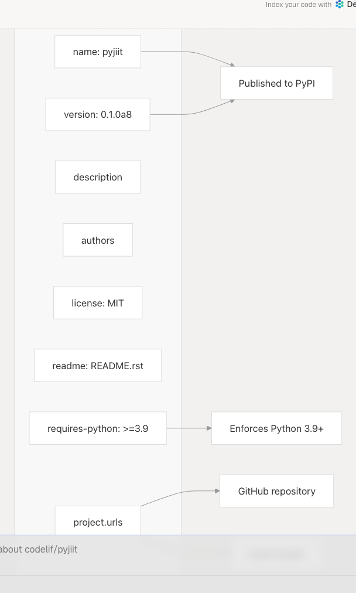
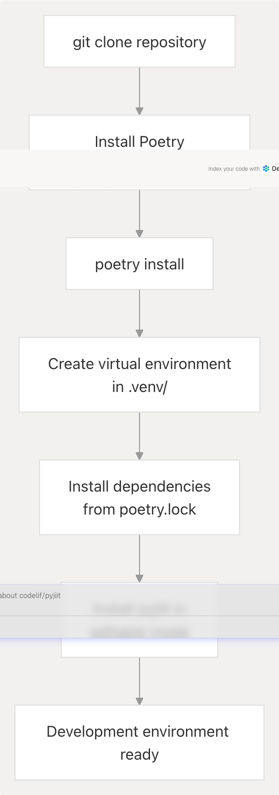

# Build System and Dependencies

## Purpose and Scope

This document explains the build system and dependency management for pyjiit. The project uses **Poetry** as its build tool, package manager, and dependency resolver. This page covers the structure of [pyproject.toml1-28](https://github.com/codelif/pyjiit/blob/0fe02955/pyproject.toml#L1-L28) the role of [poetry.lock1-714](https://github.com/codelif/pyjiit/blob/0fe02955/poetry.lock#L1-L714) and how dependencies are organized and managed.

For information about the project directory structure, see [Project Structure](/codelif/pyjiit/5.1-project-structure). For details on automated publishing to PyPI, see [Publishing to PyPI](/codelif/pyjiit/7.1-publishing-to-pypi).

---

## Build System Overview

pyjiit uses **Poetry** for all build and dependency management operations. Poetry replaces traditional `setup.py` and `requirements.txt` files with a single [pyproject.toml1-28](https://github.com/codelif/pyjiit/blob/0fe02955/pyproject.toml#L1-L28) configuration file.

### Poetry Build Backend

The build backend is configured in [pyproject.toml23-25](https://github.com/codelif/pyjiit/blob/0fe02955/pyproject.toml#L23-L25):

```
[build-system]
requires = ["poetry-core"]
build-backend = "poetry.core.masonry.api"
```

This declares that the project uses `poetry-core` as its build backend, making it a PEP 517-compliant Python package.

**Sources:** [pyproject.toml23-25](https://github.com/codelif/pyjiit/blob/0fe02955/pyproject.toml#L23-L25)

---

## pyproject.toml Structure

The [pyproject.toml1-28](https://github.com/codelif/pyjiit/blob/0fe02955/pyproject.toml#L1-L28) file defines all project metadata, dependencies, and build configuration. It follows the PEP 621 standard for project metadata.

### Project Metadata


```

**Sources:** [pyproject.toml1-17](https://github.com/codelif/pyjiit/blob/0fe02955/pyproject.toml#L1-L17)

### Metadata Fields

| Field | Value | Purpose |
| --- | --- | --- |
| `name` | `pyjiit` | Package name on PyPI |
| `version` | `0.1.0a8` | Semantic version (alpha release) |
| `description` | `Python wrapper for JIIT webportal` | Short package description |
| `authors` | `Harsh Sharma <harsh@codelif.in>` | Package maintainer |
| `license` | `MIT License` | Software license |
| `readme` | `README.rst` | Long description file (reStructuredText) |
| `requires-python` | `>=3.9` | Minimum Python version |
| `project.urls` | Homepage, Issues | Repository and issue tracker links |

**Sources:** [pyproject.toml1-17](https://github.com/codelif/pyjiit/blob/0fe02955/pyproject.toml#L1-L17)

---

## Dependency Management

Dependencies are declared in two categories: **runtime dependencies** (required for library functionality) and **documentation dependencies** (required only for building docs).

### Dependency Declaration Structure


**Sources:** [pyproject.toml9-12](https://github.com/codelif/pyjiit/blob/0fe02955/pyproject.toml#L9-L12) [pyproject.toml19-21](https://github.com/codelif/pyjiit/blob/0fe02955/pyproject.toml#L19-L21)

### Runtime Dependencies

The library has exactly **2 runtime dependencies** defined in [pyproject.toml9-12](https://github.com/codelif/pyjiit/blob/0fe02955/pyproject.toml#L9-L12):

| Package | Version Constraint | Purpose |
| --- | --- | --- |
| `requests` | `>=2.32.3,<3.0.0` | HTTP client for making API requests to JIIT webportal |
| `pycryptodome` | `>=3.22.0,<4.0.0` | AES-CBC encryption implementation for payload encryption |

These dependencies are installed automatically when users run `pip install pyjiit`.

**Sources:** [pyproject.toml9-12](https://github.com/codelif/pyjiit/blob/0fe02955/pyproject.toml#L9-L12)

### Documentation Dependencies

Documentation dependencies are in a separate `docs` group defined in [pyproject.toml19-21](https://github.com/codelif/pyjiit/blob/0fe02955/pyproject.toml#L19-L21):

| Package | Version Constraint | Purpose |
| --- | --- | --- |
| `sphinx` | `>=7.4.7` | Documentation generator |
| `furo` | `^2024.8.6` | Modern Sphinx theme |

These are not installed by default and must be explicitly requested with `poetry install --with docs`.

**Sources:** [pyproject.toml19-21](https://github.com/codelif/pyjiit/blob/0fe02955/pyproject.toml#L19-L21)

---

## poetry.lock and Reproducible Builds

The [poetry.lock1-714](https://github.com/codelif/pyjiit/blob/0fe02955/poetry.lock#L1-L714) file ensures **reproducible builds** by pinning exact versions of all dependencies and their transitive dependencies.

### Lock File Statistics


**Sources:** [poetry.lock1-714](https://github.com/codelif/pyjiit/blob/0fe02955/poetry.lock#L1-L714)

### Lock File Structure

Each package entry in [poetry.lock1-714](https://github.com/codelif/pyjiit/blob/0fe02955/poetry.lock#L1-L714) contains:

* **Exact version**: e.g., `requests = "2.32.3"`
* **Description**: Package purpose
* **Python version constraints**: e.g., `python-versions = ">=3.8"`
* **Dependency groups**: `main`, `docs`
* **File hashes**: SHA256 hashes for all distribution files
* **Transitive dependencies**: Dependencies of dependencies

### Example Lock Entry

```
[[package]]
name = "requests"
version = "2.32.3"
description = "Python HTTP for Humans."
optional = false
python-versions = ">=3.8"
groups = ["main", "docs"]

[package.dependencies]
certifi = ">=2017.4.17"
charset-normalizer = ">=2,<4"
idna = ">=2.5,<4"
urllib3 = ">=1.21.1,<3"
```

**Sources:** [poetry.lock416-435](https://github.com/codelif/pyjiit/blob/0fe02955/poetry.lock#L416-L435)

### Lock File Metadata

The lock file metadata in [poetry.lock710-714](https://github.com/codelif/pyjiit/blob/0fe02955/poetry.lock#L710-L714) records:

```
[metadata]
lock-version = "2.1"
python-versions = ">=3.9"
content-hash = "865fe5dd83e2564122da693bd872c7b97c467409a8dd895d6d9b995f30f6d870"
```

The `content-hash` ensures integrity - any change to [pyproject.toml1-28](https://github.com/codelif/pyjiit/blob/0fe02955/pyproject.toml#L1-L28) invalidates the lock file, requiring `poetry lock --no-update` or `poetry update`.

**Sources:** [poetry.lock710-714](https://github.com/codelif/pyjiit/blob/0fe02955/poetry.lock#L710-L714)

---

## Dependency Groups

Poetry organizes dependencies into **groups** to control which dependencies are installed in different contexts.

### Group Organization


**Sources:** [pyproject.toml9-21](https://github.com/codelif/pyjiit/blob/0fe02955/pyproject.toml#L9-L21) [poetry.lock1-714](https://github.com/codelif/pyjiit/blob/0fe02955/poetry.lock#L1-L714)

### Group Characteristics

| Group | Defined In | Installation Command | Included In PyPI Package |
| --- | --- | --- | --- |
| `main` | `[project] dependencies` | Default with `pip install pyjiit` | ✅ Yes |
| `docs` | `[tool.poetry.group.docs]` | `poetry install --with docs` | ❌ No |

The `docs` group is **optional** and only needed for contributors building documentation locally. End users who install via PyPI never see these dependencies.

**Sources:** [pyproject.toml9-12](https://github.com/codelif/pyjiit/blob/0fe02955/pyproject.toml#L9-L12) [pyproject.toml19-21](https://github.com/codelif/pyjiit/blob/0fe02955/pyproject.toml#L19-L21)

---

## Poetry Workflow

### Development Setup



**Sources:** [pyproject.toml1-28](https://github.com/codelif/pyjiit/blob/0fe02955/pyproject.toml#L1-L28) [poetry.lock1-714](https://github.com/codelif/pyjiit/blob/0fe02955/poetry.lock#L1-L714)

### Common Poetry Commands

| Command | Purpose |
| --- | --- |
| `poetry install` | Install all dependencies from `poetry.lock` |
| `poetry install --with docs` | Install with documentation dependencies |
| `poetry add <package>` | Add new dependency to `pyproject.toml` |
| `poetry update` | Update dependencies and regenerate `poetry.lock` |
| `poetry lock --no-update` | Regenerate `poetry.lock` without updating versions |
| `poetry build` | Build source distribution and wheel |
| `poetry publish` | Publish package to PyPI |
| `poetry shell` | Activate virtual environment |
| `poetry run <command>` | Run command in Poetry's virtual environment |

### Dependency Update Workflow


**Sources:** [pyproject.toml1-28](https://github.com/codelif/pyjiit/blob/0fe02955/pyproject.toml#L1-L28) [poetry.lock1-714](https://github.com/codelif/pyjiit/blob/0fe02955/poetry.lock#L1-L714)

---

## Build System Integration

### How Poetry Builds Packages

**Sources:** [pyproject.toml23-25](https://github.com/codelif/pyjiit/blob/0fe02955/pyproject.toml#L23-L25)

The `poetry.core.masonry.api` build backend:

1. Reads metadata from [pyproject.toml1-17](https://github.com/codelif/pyjiit/blob/0fe02955/pyproject.toml#L1-L17)
2. Includes only `main` group dependencies in package metadata
3. Creates `.whl` (wheel) and `.tar.gz` (sdist) distributions
4. Packages Python files from `pyjiit/` directory
5. Includes `README.rst` and `LICENSE` files

**Sources:** [pyproject.toml1-28](https://github.com/codelif/pyjiit/blob/0fe02955/pyproject.toml#L1-L28)

---

## Dependency Version Constraints

### Constraint Syntax

pyjiit uses different version constraint syntaxes for different purposes:

| Syntax | Example | Meaning |
| --- | --- | --- |
| `>=X.Y.Z,<N.0.0` | `>=2.32.3,<3.0.0` | Allow any version from X.Y.Z up to (but not including) N.0.0 |
| `^X.Y.Z` | `^2024.8.6` | Compatible with X.Y.Z, following semantic versioning |
| `>=X.Y.Z` | `>=7.4.7` | Any version X.Y.Z or higher |

### Runtime Dependency Constraints

[pyproject.toml9-12](https://github.com/codelif/pyjiit/blob/0fe02955/pyproject.toml#L9-L12) uses **range constraints** for runtime dependencies:

```
dependencies = [
  "requests (>=2.32.3,<3.0.0)",
  "pycryptodome (>=3.22.0,<4.0.0)"
]
```

This allows:

* **Minor and patch updates**: e.g., `requests 2.33.0`, `pycryptodome 3.23.1`
* **Excludes major version bumps**: Prevents breaking changes from `requests 3.x` or `pycryptodome 4.x`

### Documentation Dependency Constraints

[pyproject.toml19-21](https://github.com/codelif/pyjiit/blob/0fe02955/pyproject.toml#L19-L21) uses mixed constraints:

```
[tool.poetry.group.docs.dependencies]
sphinx = ">=7.4.7"
furo = "^2024.8.6"
```

* `sphinx` allows any version `7.4.7` or higher (including `8.x`, `9.x`)
* `furo` uses caret notation: allows `2024.8.7`, `2024.9.0`, but not `2025.x.x`

**Sources:** [pyproject.toml9-12](https://github.com/codelif/pyjiit/blob/0fe02955/pyproject.toml#L9-L12) [pyproject.toml19-21](https://github.com/codelif/pyjiit/blob/0fe02955/pyproject.toml#L19-L21)

---

## Transitive Dependency Tree

### Complete Dependency Graph

```


**Sources:** [poetry.lock1-714](https://github.com/codelif/pyjiit/blob/0fe02955/poetry.lock#L1-L714)

### Shared Dependencies

Several packages appear in both `main` and `docs` groups because they're transitive dependencies of both:

* `certifi`: Used by `requests` (main) and `sphinx` (docs)
* `charset-normalizer`: Used by `requests` (main) and `sphinx` (docs)
* `idna`: Used by `requests` (main) and `sphinx` (docs)
* `urllib3`: Used by `requests` (main) and `sphinx` (docs)

Poetry automatically deduplicates these when installing both groups.

**Sources:** [poetry.lock54-63](https://github.com/codelif/pyjiit/blob/0fe02955/poetry.lock#L54-L63) [poetry.lock66-71](https://github.com/codelif/pyjiit/blob/0fe02955/poetry.lock#L66-L71) [poetry.lock209-218](https://github.com/codelif/pyjiit/blob/0fe02955/poetry.lock#L209-L218) [poetry.lock672-681](https://github.com/codelif/pyjiit/blob/0fe02955/poetry.lock#L672-L681)

---

## Summary

The pyjiit build system is characterized by:

1. **Minimal Runtime Dependencies**: Only 2 direct dependencies (`requests`, `pycryptodome`)
2. **Isolated Documentation Dependencies**: Documentation tools separated via Poetry groups
3. **Reproducible Builds**: `poetry.lock` pins all 30+ packages with SHA256 hashes
4. **PEP 517 Compliance**: Uses `poetry.core.masonry.api` as build backend
5. **Version Constraints**: Careful constraint syntax prevents breaking changes
6. **Python 3.9+ Requirement**: Minimum Python version enforced in metadata

**Sources:** [pyproject.toml1-28](https://github.com/codelif/pyjiit/blob/0fe02955/pyproject.toml#L1-L28) [poetry.lock1-714](https://github.com/codelif/pyjiit/blob/0fe02955/poetry.lock#L1-L714)
