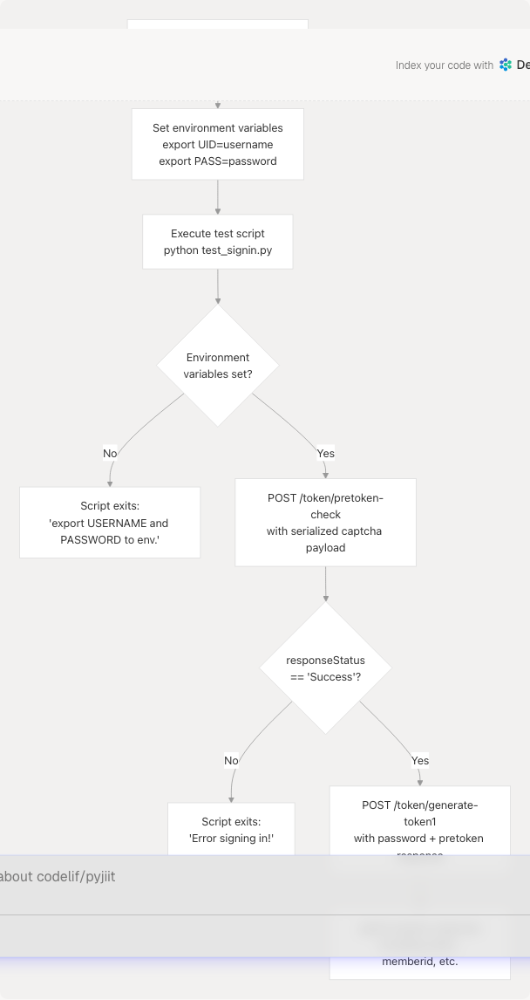
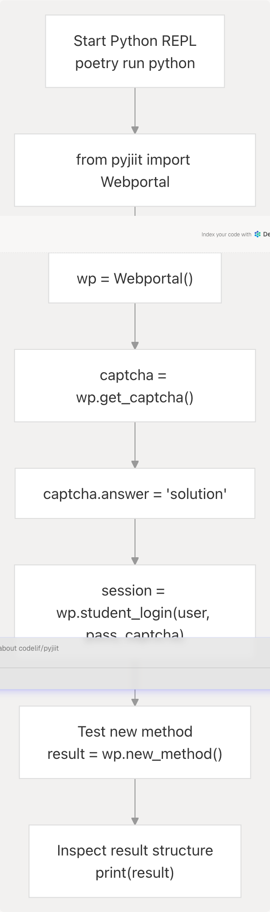
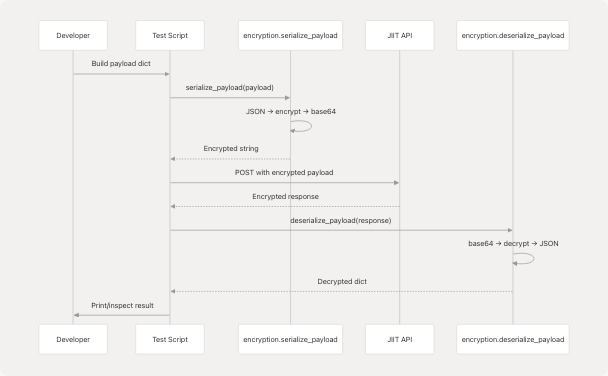
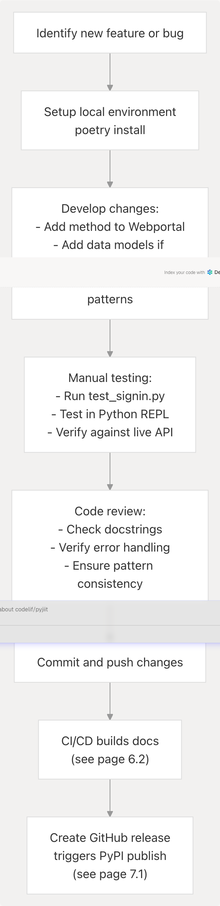

# Testing and Development Workflow

> Source: https://deepwiki.com/codelif/pyjiit/5.3-testing-and-development-workflow

# Testing and Development Workflow

Relevant source files

* [pyjiit/exam.py](https://github.com/codelif/pyjiit/blob/0fe02955/pyjiit/exam.py)
* [pyjiit/registration.py](https://github.com/codelif/pyjiit/blob/0fe02955/pyjiit/registration.py)
* [pyjiit/utils.py](https://github.com/codelif/pyjiit/blob/0fe02955/pyjiit/utils.py)
* [pyjiit/wrapper.py](https://github.com/codelif/pyjiit/blob/0fe02955/pyjiit/wrapper.py)
* [pyproject.toml](https://github.com/codelif/pyjiit/blob/0fe02955/pyproject.toml)
* [test\_signin.py](https://github.com/codelif/pyjiit/blob/0fe02955/test_signin.py)

## Purpose and Scope

This document describes the testing and development workflow for pyjiit library contributors and maintainers. It covers manual testing procedures, development patterns for adding new features, local testing strategies, and debugging approaches.

For information about the project structure and module organization, see [Project Structure](/codelif/pyjiit/5.1-project-structure). For details about Poetry and dependency management, see [Build System and Dependencies](/codelif/pyjiit/5.2-build-system-and-dependencies).

---

## Current Testing Approach

The pyjiit library currently employs **manual testing** rather than an automated test suite. The primary testing mechanism is a standalone test script that validates the core authentication flow against the live JIIT Webportal API.

### Test Script Architecture

The main test script is located at [test\_signin.py1-52](https://github.com/codelif/pyjiit/blob/0fe02955/test_signin.py#L1-L52) This script demonstrates the two-phase authentication process by directly calling encryption and HTTP utilities:

| Component | Purpose | Implementation |
| --- | --- | --- |
| Environment Variables | Stores test credentials | `USERNAME` and `PASSWORD` from environment via `os.getenv()` |
| Payload Serialization | Encrypts login data | Uses `serialize_payload()` from encryption module |
| LocalName Header | Generates request headers | Uses `generate_local_name()` for each request |
| Two-Phase Auth | Tests complete login flow | Executes pretoken-check followed by generate-token1 |

**Sources:** [test\_signin.py1-52](https://github.com/codelif/pyjiit/blob/0fe02955/test_signin.py#L1-L52)

---

## Manual Testing Workflow


```

**Diagram: Manual Testing Flow for Authentication**

**Sources:** [test\_signin.py8-51](https://github.com/codelif/pyjiit/blob/0fe02955/test_signin.py#L8-L51)

### Running the Test Script

1. **Set Credentials:**

   ```
   ```
   export UID="your_enrollment_number"
   export PASS="your_password"
   ```
   ```
2. **Execute Test:**

   ```
   ```
   python test_signin.py
   ```
   ```
3. **Expected Output:**
   The script prints the complete session response including:

   * Session token (JWT format)
   * Member ID
   * Institute information
   * Registration data

**Sources:** [test\_signin.py8-12](https://github.com/codelif/pyjiit/blob/0fe02955/test_signin.py#L8-L12) [test\_signin.py49-51](https://github.com/codelif/pyjiit/blob/0fe02955/test_signin.py#L49-L51)

---

## Development Workflow for New Features

### Adding New API Methods

When adding a new API endpoint to the `Webportal` class, follow the established patterns in [pyjiit/wrapper.py1-489](https://github.com/codelif/pyjiit/blob/0fe02955/pyjiit/wrapper.py#L1-L489)

```

```

**Diagram: Standard Pattern for API Methods**

**Sources:** [pyjiit/wrapper.py173-188](https://github.com/codelif/pyjiit/blob/0fe02955/pyjiit/wrapper.py#L173-L188) [pyjiit/wrapper.py191-211](https://github.com/codelif/pyjiit/blob/0fe02955/pyjiit/wrapper.py#L191-L211)

### Method Implementation Checklist

| Step | Action | Example Reference |
| --- | --- | --- |
| 1. Determine authentication | Add `@authenticated` if session required | [pyjiit/wrapper.py156](https://github.com/codelif/pyjiit/blob/0fe02955/pyjiit/wrapper.py#L156-L156) |
| 2. Define method signature | Include typed parameters and docstring | [pyjiit/wrapper.py191-197](https://github.com/codelif/pyjiit/blob/0fe02955/pyjiit/wrapper.py#L191-L197) |
| 3. Set ENDPOINT constant | Define the API path string | [pyjiit/wrapper.py198](https://github.com/codelif/pyjiit/blob/0fe02955/pyjiit/wrapper.py#L198-L198) |
| 4. Build payload | Use `self.session` attributes as needed | [pyjiit/wrapper.py200-206](https://github.com/codelif/pyjiit/blob/0fe02955/pyjiit/wrapper.py#L200-L206) |
| 5. Serialize if needed | Call `serialize_payload()` for encrypted APIs | [pyjiit/wrapper.py207](https://github.com/codelif/pyjiit/blob/0fe02955/pyjiit/wrapper.py#L207-L207) |
| 6. Call `__hit()` | Include authenticated=True and exception type | [pyjiit/wrapper.py209](https://github.com/codelif/pyjiit/blob/0fe02955/pyjiit/wrapper.py#L209-L209) |
| 7. Transform response | Convert to data model or return dict | [pyjiit/wrapper.py211](https://github.com/codelif/pyjiit/blob/0fe02955/pyjiit/wrapper.py#L211-L211) |

**Sources:** [pyjiit/wrapper.py156-211](https://github.com/codelif/pyjiit/blob/0fe02955/pyjiit/wrapper.py#L156-L211)

### Example: Anatomy of an API Method

The `get_attendance()` method demonstrates all key patterns:

```
```
@authenticated
def get_attendance(self, header: AttendanceHeader, semester: Semester):
    ENDPOINT = "/StudentClassAttendance/getstudentattendancedetail"

    payload = {
        "clientid": self.session.clientid,
        "instituteid": self.session.instituteid,
        "registrationcode": semester.registration_code,
        "registrationid": semester.registration_id,
        "stynumber": header.stynumber
    }
    payload = serialize_payload(payload)

    resp = self.__hit("POST", API+ENDPOINT, json=payload, authenticated=True)

    return resp["response"]
```
```

**Key Elements:**

* Uses `@authenticated` decorator ([pyjiit/wrapper.py19-36](https://github.com/codelif/pyjiit/blob/0fe02955/pyjiit/wrapper.py#L19-L36))
* Accesses session via `self.session` ([pyjiit/wrapper.py202-203](https://github.com/codelif/pyjiit/blob/0fe02955/pyjiit/wrapper.py#L202-L203))
* Serializes payload for encryption ([pyjiit/wrapper.py207](https://github.com/codelif/pyjiit/blob/0fe02955/pyjiit/wrapper.py#L207-L207))
* Passes `authenticated=True` to `__hit()` ([pyjiit/wrapper.py209](https://github.com/codelif/pyjiit/blob/0fe02955/pyjiit/wrapper.py#L209-L209))

**Sources:** [pyjiit/wrapper.py190-211](https://github.com/codelif/pyjiit/blob/0fe02955/pyjiit/wrapper.py#L190-L211)

---

## Local Development Setup

### Setting Up Development Environment

1. **Clone Repository:**

   ```
   ```
   git clone https://github.com/codelif/pyjiit
   cd pyjiit
   ```
   ```
2. **Install Poetry:**

   ```
   ```
   pip install poetry
   ```
   ```
3. **Install Dependencies:**

   ```
   ```
   poetry install
   ```
   ```
4. **Activate Virtual Environment:**

   ```
   ```
   poetry shell
   ```
   ```

**Sources:** [pyproject.toml23-25](https://github.com/codelif/pyjiit/blob/0fe02955/pyproject.toml#L23-L25)

### Interactive Testing

For exploratory testing of new methods or debugging:

```

```

**Diagram: Interactive Testing Session**

**Sources:** [pyjiit/\_\_init\_\_.py](https://github.com/codelif/pyjiit/blob/0fe02955/pyjiit/__init__.py) [pyjiit/wrapper.py70-77](https://github.com/codelif/pyjiit/blob/0fe02955/pyjiit/wrapper.py#L70-L77)

### Testing Individual Methods

```
```
# Example interactive testing session
from pyjiit import Webportal

wp = Webportal()

# Get and solve captcha
captcha = wp.get_captcha()
# Manually solve the captcha image
captcha.answer = "cfmab"  # Your solved captcha

# Login
session = wp.student_login("enrollment_number", "password", captcha)

# Test a specific method
attendance_meta = wp.get_attendance_meta()
print(attendance_meta.headers)
print(attendance_meta.semesters)

# Test with parameters
header = attendance_meta.headers[0]
semester = attendance_meta.semesters[0]
attendance = wp.get_attendance(header, semester)
```
```

**Sources:** [pyjiit/wrapper.py111-143](https://github.com/codelif/pyjiit/blob/0fe02955/pyjiit/wrapper.py#L111-L143) [pyjiit/wrapper.py145-154](https://github.com/codelif/pyjiit/blob/0fe02955/pyjiit/wrapper.py#L145-L154) [pyjiit/wrapper.py173-188](https://github.com/codelif/pyjiit/blob/0fe02955/pyjiit/wrapper.py#L173-L188)

---

## Understanding the `__hit()` Internal Method

The `__hit()` method ([pyjiit/wrapper.py82-108](https://github.com/codelif/pyjiit/blob/0fe02955/pyjiit/wrapper.py#L82-L108)) is the central HTTP request handler. Understanding its behavior is crucial for debugging:

```

```

**Diagram: \_\_hit() Method Error Handling Flow**

**Sources:** [pyjiit/wrapper.py82-108](https://github.com/codelif/pyjiit/blob/0fe02955/pyjiit/wrapper.py#L82-L108)

### Custom Exception Types

The `__hit()` method supports custom exceptions via the `exception` kwarg:

| Method | Exception Type | Usage Example |
| --- | --- | --- |
| `student_login()` | `LoginError` | `exception=LoginError` passed to `__hit()` |
| `set_password()` | `AccountAPIError` | `exception=AccountAPIError` passed to `__hit()` |
| Most others | `APIError` (default) | No exception kwarg needed |

**Sources:** [pyjiit/wrapper.py83-87](https://github.com/codelif/pyjiit/blob/0fe02955/pyjiit/wrapper.py#L83-L87) [pyjiit/wrapper.py130](https://github.com/codelif/pyjiit/blob/0fe02955/pyjiit/wrapper.py#L130-L130) [pyjiit/wrapper.py229](https://github.com/codelif/pyjiit/blob/0fe02955/pyjiit/wrapper.py#L229-L229)

---

## Debugging Common Issues

### Session Expiration

The `@authenticated` decorator ([pyjiit/wrapper.py19-36](https://github.com/codelif/pyjiit/blob/0fe02955/pyjiit/wrapper.py#L19-L36)) checks for session validity:

```
```
@authenticated
def some_method(self):
    # This code only runs if self.session is not None
```
```

**Note:** Lines 29-32 show commented-out expiry time checking due to API bugs. Current implementation only checks for `None`.

**Sources:** [pyjiit/wrapper.py19-36](https://github.com/codelif/pyjiit/blob/0fe02955/pyjiit/wrapper.py#L19-L36)

### Payload Serialization Errors

Not all endpoints require encrypted payloads. Compare these patterns:

| Endpoint Type | Serialization | Example |
| --- | --- | --- |
| Encrypted | Uses `serialize_payload()` | `get_attendance()` at [pyjiit/wrapper.py207](https://github.com/codelif/pyjiit/blob/0fe02955/pyjiit/wrapper.py#L207-L207) |
| Plain JSON | Direct dict in `json=` | `get_student_bank_info()` at [pyjiit/wrapper.py168](https://github.com/codelif/pyjiit/blob/0fe02955/pyjiit/wrapper.py#L168-L168) |

**Sources:** [pyjiit/wrapper.py157-170](https://github.com/codelif/pyjiit/blob/0fe02955/pyjiit/wrapper.py#L157-L170) [pyjiit/wrapper.py190-211](https://github.com/codelif/pyjiit/blob/0fe02955/pyjiit/wrapper.py#L190-L211)

### LocalName Header Generation

Every request requires a `LocalName` header:

* **Authenticated requests:** Generated automatically by `session.get_headers()` ([pyjiit/wrapper.py61-68](https://github.com/codelif/pyjiit/blob/0fe02955/pyjiit/wrapper.py#L61-L68))
* **Unauthenticated requests:** Generated directly by `__hit()` ([pyjiit/wrapper.py93](https://github.com/codelif/pyjiit/blob/0fe02955/pyjiit/wrapper.py#L93-L93))

The header is regenerated for each request using `generate_local_name()` from the encryption module.

**Sources:** [pyjiit/wrapper.py61-68](https://github.com/codelif/pyjiit/blob/0fe02955/pyjiit/wrapper.py#L61-L68) [pyjiit/wrapper.py89-98](https://github.com/codelif/pyjiit/blob/0fe02955/pyjiit/wrapper.py#L89-L98)

---

## Testing New Encryption-Required Endpoints

Some endpoints require payload encryption. To test these:

```

```

**Diagram: Testing Encrypted Endpoint Flow**

**Sources:** [test\_signin.py15-23](https://github.com/codelif/pyjiit/blob/0fe02955/test_signin.py#L15-L23) [test\_signin.py37-42](https://github.com/codelif/pyjiit/blob/0fe02955/test_signin.py#L37-L42)

### Example: Testing Encrypted Endpoint

Following the pattern from `test_signin.py`:

```
```
from pyjiit.encryption import serialize_payload, generate_local_name
import requests

# Build payload
payload = {
    "instituteid": "your_institute_id",
    "studentid": "your_student_id",
    # ... other fields
}

# Encrypt payload
enc_payload = serialize_payload(payload)

# Make request
headers = {"LocalName": generate_local_name()}
url = "https://webportal.jiit.ac.in:6011/StudentPortalAPI/your/endpoint"
resp = requests.post(url, json=enc_payload, headers=headers)

# Inspect response
print(resp.json())
```
```

**Sources:** [test\_signin.py15-30](https://github.com/codelif/pyjiit/blob/0fe02955/test_signin.py#L15-L30)

---

## Adding Data Models

When API responses have structured data, create data model classes in the appropriate module:

| Module | Purpose | Example Classes |
| --- | --- | --- |
| `pyjiit/attendance.py` | Attendance-related data | `AttendanceMeta`, `AttendanceHeader`, `Semester` |
| `pyjiit/exam.py` | Exam-related data | `ExamEvent` |
| `pyjiit/registration.py` | Registration data | `RegisteredSubject`, `Registrations` |
| `pyjiit/tokens.py` | Token and captcha data | `Captcha`, `Semester` |

### Data Model Pattern

All data models follow this pattern ([pyjiit/exam.py4-20](https://github.com/codelif/pyjiit/blob/0fe02955/pyjiit/exam.py#L4-L20)):

```
```
from dataclasses import dataclass

@dataclass
class ModelName:
    """Class containing model description"""
    field1: str
    field2: int
    # ... other fields

    @staticmethod
    def from_json(resp: dict):
        return ModelName(
            resp["field1key"],
            resp["field2key"],
            # ... map all fields
        )
```
```

**Sources:** [pyjiit/exam.py1-20](https://github.com/codelif/pyjiit/blob/0fe02955/pyjiit/exam.py#L1-L20) [pyjiit/registration.py1-32](https://github.com/codelif/pyjiit/blob/0fe02955/pyjiit/registration.py#L1-L32)

---

## Development Best Practices

### Method Documentation

All public methods must include docstrings following this format:

```
```
def method_name(self, param1: Type, param2: Type):
    """
    :param param1: Description of parameter
    :param param2: Description of parameter
    :returns: Description of return value
    :raises ExceptionType: When this exception is raised
    """
```
```

**Sources:** [pyjiit/wrapper.py111-117](https://github.com/codelif/pyjiit/blob/0fe02955/pyjiit/wrapper.py#L111-L117) [pyjiit/wrapper.py173-177](https://github.com/codelif/pyjiit/blob/0fe02955/pyjiit/wrapper.py#L173-L177)

### Error Handling Strategy

```

```

**Diagram: Exception Handling in API Methods**

**Sources:** [pyjiit/wrapper.py82-108](https://github.com/codelif/pyjiit/blob/0fe02955/pyjiit/wrapper.py#L82-L108)

### Session Attribute Usage

Common session attributes used in payload construction:

| Attribute | Source | Usage |
| --- | --- | --- |
| `self.session.clientid` | [pyjiit/wrapper.py57](https://github.com/codelif/pyjiit/blob/0fe02955/pyjiit/wrapper.py#L57-L57) | Client identification |
| `self.session.instituteid` | [pyjiit/wrapper.py48](https://github.com/codelif/pyjiit/blob/0fe02955/pyjiit/wrapper.py#L48-L48) | Institute identification |
| `self.session.memberid` | [pyjiit/wrapper.py49](https://github.com/codelif/pyjiit/blob/0fe02955/pyjiit/wrapper.py#L49-L49) | Student ID |
| `self.session.membertype` | [pyjiit/wrapper.py58](https://github.com/codelif/pyjiit/blob/0fe02955/pyjiit/wrapper.py#L58-L58) | Member type (student) |
| `self.session.token` | [pyjiit/wrapper.py53](https://github.com/codelif/pyjiit/blob/0fe02955/pyjiit/wrapper.py#L53-L53) | JWT authentication token |

**Sources:** [pyjiit/wrapper.py42-59](https://github.com/codelif/pyjiit/blob/0fe02955/pyjiit/wrapper.py#L42-L59)

---

## Workflow Summary

```


**Diagram: Complete Development and Release Workflow**

**Sources:** [pyproject.toml1-28](https://github.com/codelif/pyjiit/blob/0fe02955/pyproject.toml#L1-L28) [test\_signin.py1-52](https://github.com/codelif/pyjiit/blob/0fe02955/test_signin.py#L1-L52)

---

## Future Testing Enhancements

Currently, pyjiit does not have automated unit or integration tests. Potential improvements include:

1. **Mock API Testing:** Create mock responses for testing without live API access
2. **pytest Integration:** Add pytest framework with test fixtures for common scenarios
3. **CI Test Stage:** Add GitHub Actions workflow to run tests on pull requests
4. **Coverage Reporting:** Track test coverage for core functionality
5. **Integration Tests:** Test complete workflows (login → fetch data → logout)

These enhancements would require:

* Adding `pytest` to development dependencies in [pyproject.toml19-21](https://github.com/codelif/pyjiit/blob/0fe02955/pyproject.toml#L19-L21)
* Creating a `tests/` directory with test modules
* Mocking the JIIT API responses to avoid requiring real credentials

**Sources:** [pyproject.toml19-21](https://github.com/codelif/pyjiit/blob/0fe02955/pyproject.toml#L19-L21)