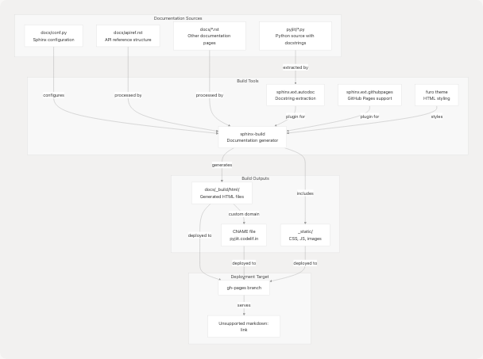
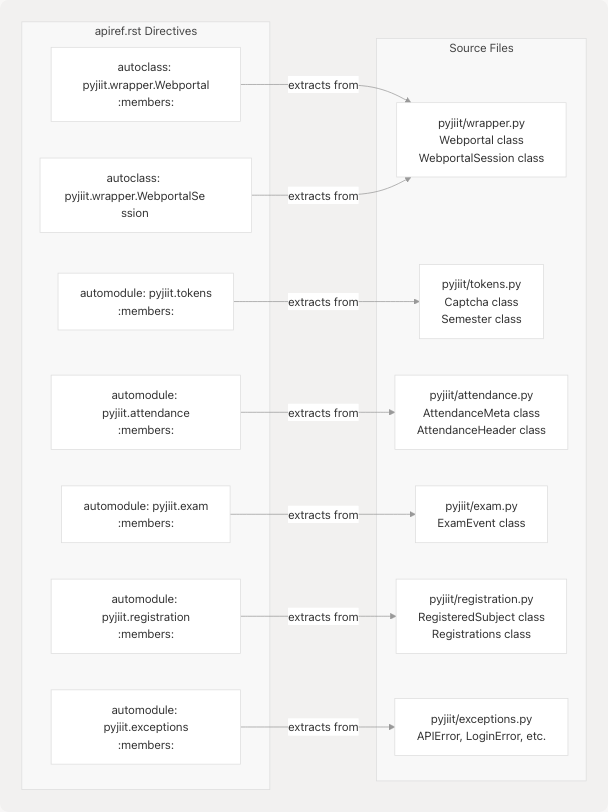

# Documentation System

> Source: https://deepwiki.com/codelif/pyjiit/6-documentation-system

# Documentation System

Relevant source files

* [.github/workflows/documentation.yml](https://github.com/codelif/pyjiit/blob/0fe02955/.github/workflows/documentation.yml)
* [docs/apiref.rst](https://github.com/codelif/pyjiit/blob/0fe02955/docs/apiref.rst)
* [docs/conf.py](https://github.com/codelif/pyjiit/blob/0fe02955/docs/conf.py)
* [docs/requirements.txt](https://github.com/codelif/pyjiit/blob/0fe02955/docs/requirements.txt)

## Purpose and Scope

This document explains the automated documentation system for pyjiit, including how documentation is generated, built, deployed, and maintained. It covers the Sphinx-based documentation infrastructure, the GitHub Actions automation pipeline, and the integration with Python source code through autodoc.

For detailed information about building documentation locally and Sphinx configuration, see [Building Documentation](/codelif/pyjiit/6.1-building-documentation). For information about the automated deployment process to GitHub Pages, see [Documentation Deployment](/codelif/pyjiit/6.2-documentation-deployment). For guidelines on contributing to documentation, see [Contributing to Documentation](/codelif/pyjiit/6.3-contributing-to-documentation).

---

## Overview

The pyjiit documentation system is a fully automated pipeline that generates HTML documentation from reStructuredText (`.rst`) source files and Python docstrings. The system uses **Sphinx** as the documentation generator, **Furo** as the theme, and **GitHub Actions** for continuous integration and deployment. Every push to any branch triggers a documentation build for validation, but only pushes to the `main` branch deploy the built documentation to **GitHub Pages** at `pyjiit.codelif.in`.

The documentation system has three primary components:

| Component | Technology | Purpose |
| --- | --- | --- |
| **Generator** | Sphinx 7.x | Processes `.rst` files and Python docstrings into HTML |
| **Theme** | Furo 2024.8.6 | Provides modern, responsive styling |
| **Deployment** | GitHub Actions + GitHub Pages | Automates build and hosting |

**Sources:** [docs/conf.py](https://github.com/codelif/pyjiit/blob/0fe02955/docs/conf.py) [.github/workflows/documentation.yml](https://github.com/codelif/pyjiit/blob/0fe02955/.github/workflows/documentation.yml) [docs/requirements.txt](https://github.com/codelif/pyjiit/blob/0fe02955/docs/requirements.txt)

---

## Documentation Architecture

The documentation system is organized as a separate subsystem from the core library, with its own dependencies and build process. The following diagram shows the relationship between documentation sources, build tools, and output artifacts.

### System Component Diagram


```

**Sources:** [docs/conf.py1-49](https://github.com/codelif/pyjiit/blob/0fe02955/docs/conf.py#L1-L49) [.github/workflows/documentation.yml51-63](https://github.com/codelif/pyjiit/blob/0fe02955/.github/workflows/documentation.yml#L51-L63)

---

## Build Process

The documentation build process consists of multiple stages: dependency installation, Sphinx execution, and output preparation. The build is orchestrated by **Poetry** to manage dependencies and **sphinx-build** to generate HTML.

### Documentation Build Flow

```

```

**Sources:** [.github/workflows/documentation.yml42-54](https://github.com/codelif/pyjiit/blob/0fe02955/.github/workflows/documentation.yml#L42-L54) [docs/conf.py8-10](https://github.com/codelif/pyjiit/blob/0fe02955/docs/conf.py#L8-L10)

---

## GitHub Actions Workflow

The documentation workflow is defined in `.github/workflows/documentation.yml` and implements a build-and-deploy pipeline with conditional deployment based on the branch.

### Workflow Execution Diagram

```

```

The workflow implements the following key features:

| Feature | Implementation | Purpose |
| --- | --- | --- |
| **Concurrency Control** | `group: docs-${{ github.ref }}`, `cancel-in-progress: true` | Prevents duplicate builds for the same branch |
| **Build Caching** | Caches `~/.cache/pypoetry` and `~/.cache/pip` using `poetry.lock` hash | Speeds up builds by reusing dependencies |
| **Universal Build** | Triggers on all branch pushes and PRs | Validates documentation on every change |
| **Conditional Deploy** | `if: github.ref == 'refs/heads/main' && github.event_name == 'push'` | Only deploys production docs from main branch |
| **Force Orphan** | `force_orphan: true` in deployment | Keeps gh-pages branch clean without history |

**Sources:** [.github/workflows/documentation.yml1-64](https://github.com/codelif/pyjiit/blob/0fe02955/.github/workflows/documentation.yml#L1-L64)

---

## Sphinx Configuration

The documentation system is configured through `docs/conf.py`, which defines project metadata, Sphinx extensions, theme settings, and build options.

### Key Configuration Settings

```
Project Information:
├─ project: "pyjiit"
├─ author: "Harsh Sharma"
├─ release: "0.1.0a8"
└─ copyright: "2025, Harsh Sharma"

Extensions:
├─ sphinx.ext.autodoc     (extracts docstrings from Python code)
└─ sphinx.ext.githubpages (creates .nojekyll file for GitHub Pages)

Theme Configuration:
├─ html_theme: "furo"
├─ html_static_path: ["_static"]
└─ html_theme_options:
   └─ footer_icons: [GitHub link with SVG icon]

Build Settings:
├─ templates_path: ["_templates"]
├─ exclude_patterns: ["_build", "Thumbs.db", ".DS_Store"]
└─ sys.path.insert(0, os.path.abspath(".."))
   (adds parent directory to Python path for autodoc imports)
```

The `sys.path.insert(0, os.path.abspath('..'))` statement at [docs/conf.py10](https://github.com/codelif/pyjiit/blob/0fe02955/docs/conf.py#L10-L10) is critical—it allows Sphinx's autodoc extension to import the `pyjiit` package from the repository root without requiring installation.

**Sources:** [docs/conf.py1-49](https://github.com/codelif/pyjiit/blob/0fe02955/docs/conf.py#L1-L49)

---

## API Documentation Structure

The API reference is structured in `docs/apiref.rst` using Sphinx's `autoclass` and `automodule` directives. These directives automatically extract docstrings from Python source files.

### Autodoc Directive Mapping

```

```

The `:members:` option instructs autodoc to include all public methods, attributes, and nested classes. Docstrings are extracted from:

* Class docstrings (under `class ClassName:`)
* Method docstrings (under `def method_name():`)
* Module docstrings (at the top of `.py` files)

**Sources:** [docs/apiref.rst1-24](https://github.com/codelif/pyjiit/blob/0fe02955/docs/apiref.rst#L1-L24)

---

## Dependency Management

Documentation dependencies are isolated in a Poetry dependency group called `docs`, separate from runtime dependencies. This allows developers to install only documentation tools when needed.

### Documentation Dependencies

| Package | Version | Purpose |
| --- | --- | --- |
| **Sphinx** | (managed by Poetry) | Core documentation generator |
| **Furo** | 2024.8.6 | Modern, mobile-friendly theme |
| **sphinx.ext.autodoc** | (built-in) | Extracts Python docstrings |
| **sphinx.ext.githubpages** | (built-in) | Creates `.nojekyll` file |

Installation command: `poetry install --with docs` ([.github/workflows/documentation.yml49](https://github.com/codelif/pyjiit/blob/0fe02955/.github/workflows/documentation.yml#L49-L49))

The `docs/requirements.txt` file exists as a standalone dependency declaration but is not used by the GitHub Actions workflow—Poetry manages all dependencies through `pyproject.toml`.

**Sources:** [docs/requirements.txt1-2](https://github.com/codelif/pyjiit/blob/0fe02955/docs/requirements.txt#L1-L2) [.github/workflows/documentation.yml45-49](https://github.com/codelif/pyjiit/blob/0fe02955/.github/workflows/documentation.yml#L45-L49)

---

## Custom Domain Configuration

The documentation is served at a custom domain `pyjiit.codelif.in` through a `CNAME` file created during the build process. The workflow creates this file with a single command:

```
```
echo "pyjiit.codelif.in" > docs/_build/html/CNAME
```
```

This file is deployed to the `gh-pages` branch alongside the HTML files. GitHub Pages reads this file to configure the custom domain. The domain must also be configured in the repository settings for the custom domain to work properly.

**Sources:** [.github/workflows/documentation.yml54](https://github.com/codelif/pyjiit/blob/0fe02955/.github/workflows/documentation.yml#L54-L54)

---

## Build Artifacts

The build process generates multiple artifacts in the `docs/_build/html/` directory:

```
docs/_build/html/
├── index.html              (main landing page)
├── apiref.html             (generated API reference)
├── CNAME                   (custom domain configuration)
├── .nojekyll               (disables Jekyll processing on GitHub Pages)
├── _static/                (CSS, JavaScript, fonts from Furo theme)
│   ├── styles/
│   ├── scripts/
│   └── fonts/
├── _sources/               (reStructuredText source files for reference)
└── search.html             (search functionality)

The `force_orphan: true` setting in the deployment action ([.github/workflows/documentation.yml63](https://github.com/codelif/pyjiit/blob/0fe02955/.github/workflows/documentation.yml#L63-L63)) ensures the `gh-pages` branch contains only the latest documentation build without historical commits, keeping the repository size minimal.

**Sources:** [.github/workflows/documentation.yml51-63](https://github.com/codelif/pyjiit/blob/0fe02955/.github/workflows/documentation.yml#L51-L63)

---

## Summary

The pyjiit documentation system is a sophisticated, fully automated pipeline that:

1. **Extracts documentation** from Python source code using Sphinx's autodoc extension
2. **Builds HTML** using the Furo theme for modern, responsive styling
3. **Validates on every push** to any branch via GitHub Actions
4. **Deploys to GitHub Pages** at `pyjiit.codelif.in` only from the `main` branch
5. **Caches dependencies** using Poetry and GitHub Actions cache for fast builds
6. **Maintains a clean deployment** with orphaned `gh-pages` branch commits

This architecture ensures documentation is always synchronized with code changes and accessible to users without manual intervention.