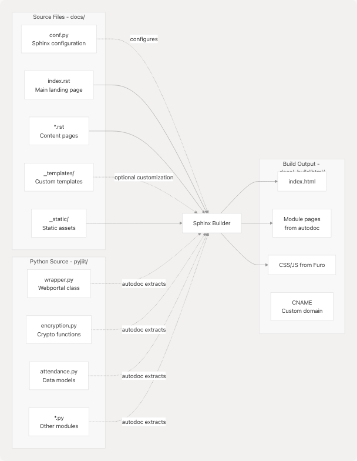

# Building Documentation

Relevant source files

* [.github/workflows/documentation.yml](https://github.com/codelif/pyjiit/blob/0fe02955/.github/workflows/documentation.yml)
* [docs/conf.py](https://github.com/codelif/pyjiit/blob/0fe02955/docs/conf.py)
* [docs/requirements.txt](https://github.com/codelif/pyjiit/blob/0fe02955/docs/requirements.txt)

## Purpose and Scope

This document explains how to build the pyjiit documentation locally using Sphinx. It covers the Sphinx configuration in `docs/conf.py`, the Furo theme setup, required dependencies, and the build process. For information about automated deployment to GitHub Pages, see [Documentation Deployment](/codelif/pyjiit/6.2-documentation-deployment). For guidelines on writing documentation content and using reStructuredText, see [Contributing to Documentation](/codelif/pyjiit/6.3-contributing-to-documentation).

**Sources:** [docs/conf.py1-49](https://github.com/codelif/pyjiit/blob/0fe02955/docs/conf.py#L1-L49)

---

## Sphinx Configuration

The pyjiit documentation uses Sphinx as the documentation generator, configured via `docs/conf.py`. The configuration defines project metadata, enabled extensions, and theme settings.

### Project Metadata

The following project information is defined at the top of the configuration:

| Configuration Key | Value | Purpose |
| --- | --- | --- |
| `project` | `'pyjiit'` | Project name displayed in documentation |
| `copyright` | `'2025, Harsh Sharma'` | Copyright notice |
| `author` | `'Harsh Sharma'` | Author name |
| `release` | `'0.1.0a8'` | Version number shown in docs |

The Python path is modified to include the parent directory (`..`) so that Sphinx can import the `pyjiit` package for autodoc extraction:

```
```
sys.path.insert(0, os.path.abspath('..'))
```
```

**Sources:** [docs/conf.py8-15](https://github.com/codelif/pyjiit/blob/0fe02955/docs/conf.py#L8-L15)

### Enabled Extensions

Two Sphinx extensions are enabled:

| Extension | Purpose |
| --- | --- |
| `sphinx.ext.autodoc` | Automatically extracts documentation from Python docstrings |
| `sphinx.ext.githubpages` | Creates `.nojekyll` file for GitHub Pages compatibility |

The `autodoc` extension allows Sphinx to read Python source files in `pyjiit/*.py` and generate API reference documentation automatically from class and function docstrings.

**Sources:** [docs/conf.py20-23](https://github.com/codelif/pyjiit/blob/0fe02955/docs/conf.py#L20-L23)

### Furo Theme Configuration

The documentation uses the Furo theme, a modern, clean Sphinx theme:

```
```
html_theme = 'furo'
```
```

Theme customization includes a footer icon linking to the GitHub repository. The icon is defined as inline SVG in the `html_theme_options` dictionary with three properties:

* `name`: Display name ("GitHub")
* `url`: Link destination (`https://github.com/codelif/pyjiit`)
* `html`: Inline SVG markup for the GitHub logo

**Sources:** [docs/conf.py33-48](https://github.com/codelif/pyjiit/blob/0fe02955/docs/conf.py#L33-L48)

---

## Documentation Build Process


```

**Sources:** [.github/workflows/documentation.yml42-53](https://github.com/codelif/pyjiit/blob/0fe02955/.github/workflows/documentation.yml#L42-L53) [docs/conf.py1-49](https://github.com/codelif/pyjiit/blob/0fe02955/docs/conf.py#L1-L49)

### Local Build Steps

To build the documentation locally, execute the following commands from the repository root:

1. **Install dependencies with docs group:**

   ```
   ```
   poetry install --with docs
   ```
   ```

   This installs Sphinx, Furo theme, and all pyjiit dependencies.
2. **Run the Sphinx build command:**

   ```
   ```
   poetry run sphinx-build -b html docs docs/_build/html
   ```
   ```

   **Command arguments:**

   * `-b html`: Build HTML output format
   * `docs`: Source directory containing `conf.py` and `.rst` files
   * `docs/_build/html`: Output directory for generated HTML files
3. **View the built documentation:**
   Open `docs/_build/html/index.html` in a web browser.

**Sources:** [.github/workflows/documentation.yml45-53](https://github.com/codelif/pyjiit/blob/0fe02955/.github/workflows/documentation.yml#L45-L53)

### Build Dependencies

Documentation dependencies are managed via Poetry's `docs` dependency group in `pyproject.toml`. The primary dependency is:

| Package | Version | Purpose |
| --- | --- | --- |
| `furo` | `2024.8.6` | Sphinx theme providing modern styling |

Sphinx itself is included as a dependency of the docs group. The `pyjiit` package is installed in editable mode, allowing autodoc to import modules from the local source tree.

**Sources:** [docs/requirements.txt1-2](https://github.com/codelif/pyjiit/blob/0fe02955/docs/requirements.txt#L1-L2)

---

## Documentation File Structure

```

```

**Sources:** [docs/conf.py25-26](https://github.com/codelif/pyjiit/blob/0fe02955/docs/conf.py#L25-L26) [docs/conf.py34](https://github.com/codelif/pyjiit/blob/0fe02955/docs/conf.py#L34-L34)

### Source Directory Layout

The `docs/` directory contains:

| Path | Purpose |
| --- | --- |
| `docs/conf.py` | Sphinx configuration file |
| `docs/*.rst` | reStructuredText content files |
| `docs/_templates/` | Custom Jinja2 templates (if any) |
| `docs/_static/` | Static files like images, CSS overrides |
| `docs/_build/` | Build output directory (excluded from version control) |

### Excluded Patterns

The configuration excludes certain patterns from processing:

```
```
exclude_patterns = ['_build', 'Thumbs.db', '.DS_Store']
```
```

This prevents Sphinx from trying to process build artifacts or OS-specific files.

**Sources:** [docs/conf.py25-26](https://github.com/codelif/pyjiit/blob/0fe02955/docs/conf.py#L25-L26)

---

## Integration with CI/CD

The documentation build process is automated via GitHub Actions. The workflow executes the same build steps locally available:

```

```

**Sources:** [.github/workflows/documentation.yml1-64](https://github.com/codelif/pyjiit/blob/0fe02955/.github/workflows/documentation.yml#L1-L64)

### Workflow Triggers

The documentation workflow (`documentation.yml`) runs on:

| Trigger | Description |
| --- | --- |
| `push` to any branch | Validates documentation builds correctly |
| `pull_request` | Ensures PR changes don't break docs |
| `workflow_dispatch` | Manual trigger via GitHub UI |

**Sources:** [.github/workflows/documentation.yml3-8](https://github.com/codelif/pyjiit/blob/0fe02955/.github/workflows/documentation.yml#L3-L8)

### Caching Strategy

The workflow uses two caching layers to speed up builds:

1. **pip cache** (via `actions/setup-python@v5`):

   * Caches pip's download cache
   * Keyed by `cache: 'pip'` parameter
2. **Poetry cache** (via `actions/cache@v3`):

   * Caches `~/.cache/pypoetry` and `~/.cache/pip`
   * Keyed by hash of `poetry.lock` and `pyproject.toml`
   * Restore keys: `${{ runner.os }}-poetry-`

This ensures dependencies are only re-downloaded when `poetry.lock` or `pyproject.toml` changes.

**Sources:** [.github/workflows/documentation.yml26-40](https://github.com/codelif/pyjiit/blob/0fe02955/.github/workflows/documentation.yml#L26-L40)

### Build Command in CI

The exact command executed in CI is:

```
```
poetry run sphinx-build -b html docs docs/_build/html
```
```

After building, a `CNAME` file is created in the output directory for custom domain support:

```
```
echo "pyjiit.codelif.in" > docs/_build/html/CNAME
```
```

**Sources:** [.github/workflows/documentation.yml51-54](https://github.com/codelif/pyjiit/blob/0fe02955/.github/workflows/documentation.yml#L51-L54)

---

## Autodoc Integration

The `sphinx.ext.autodoc` extension automatically generates API documentation from Python docstrings. This integration requires:

1. **Python path configuration** in `conf.py`:

   ```
   ```
   sys.path.insert(0, os.path.abspath('..'))
   ```
   ```

   This allows Sphinx to import `pyjiit` modules.
2. **Module imports** during build:
   Sphinx imports classes and functions from `pyjiit/wrapper.py`, `pyjiit/encryption.py`, etc., to extract docstrings.
3. **reStructuredText directives** in `.rst` files:

   ```
   ```
   .. autoclass:: pyjiit.Webportal
      :members:
      :undoc-members:
   ```
   ```

The autodoc system reads the actual Python source code, ensuring documentation stays synchronized with implementation.

**Sources:** [docs/conf.py8-23](https://github.com/codelif/pyjiit/blob/0fe02955/docs/conf.py#L8-L23)

---

## Build Output Structure

```


**Sources:** [.github/workflows/documentation.yml51-54](https://github.com/codelif/pyjiit/blob/0fe02955/.github/workflows/documentation.yml#L51-L54) [docs/conf.py22](https://github.com/codelif/pyjiit/blob/0fe02955/docs/conf.py#L22-L22)

### Key Output Files

| File/Directory | Purpose |
| --- | --- |
| `index.html` | Main documentation entry point |
| `*.html` | Generated documentation pages |
| `_static/` | CSS, JavaScript, fonts from Furo theme |
| `_sources/` | Original `.rst` source files |
| `searchindex.js` | Search index for full-text search |
| `objects.inv` | Intersphinx inventory for cross-project linking |
| `.nojekyll` | Tells GitHub Pages not to process with Jekyll |
| `CNAME` | Custom domain configuration (added by CI) |

The `.nojekyll` file is automatically created by the `sphinx.ext.githubpages` extension.

**Sources:** [docs/conf.py22](https://github.com/codelif/pyjiit/blob/0fe02955/docs/conf.py#L22-L22) [.github/workflows/documentation.yml54](https://github.com/codelif/pyjiit/blob/0fe02955/.github/workflows/documentation.yml#L54-L54)