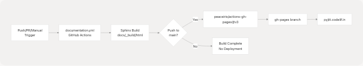
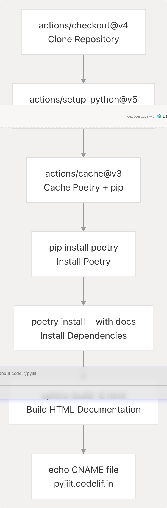

# Documentation Deployment

> Source: https://deepwiki.com/codelif/pyjiit/6.2-documentation-deployment

# Documentation Deployment

Relevant source files

* [.github/workflows/documentation.yml](https://github.com/codelif/pyjiit/blob/0fe02955/.github/workflows/documentation.yml)
* [docs/conf.py](https://github.com/codelif/pyjiit/blob/0fe02955/docs/conf.py)

## Purpose and Scope

This page documents the automated deployment system that publishes the pyjiit documentation to GitHub Pages at **pyjiit.codelif.in**. It covers the GitHub Actions workflow that builds Sphinx documentation and conditionally deploys it to the live site.

For information about building documentation locally or understanding the Sphinx configuration, see [Building Documentation](/codelif/pyjiit/6.1-building-documentation). For guidelines on contributing to the documentation, see [Contributing to Documentation](/codelif/pyjiit/6.3-contributing-to-documentation).

**Sources:** [.github/workflows/documentation.yml1-65](https://github.com/codelif/pyjiit/blob/0fe02955/.github/workflows/documentation.yml#L1-L65)

---

## Deployment Architecture

The documentation deployment system uses a **GitHub Actions workflow** that automatically builds and publishes Sphinx documentation. The workflow is designed to validate documentation on every push and pull request, but only deploy to production when changes are merged to the `main` branch.

### High-Level Deployment Flow


```

**Sources:** [.github/workflows/documentation.yml1-65](https://github.com/codelif/pyjiit/blob/0fe02955/.github/workflows/documentation.yml#L1-L65)

---

## Workflow Configuration

The deployment workflow is defined in `.github/workflows/documentation.yml` and named `"Sphinx: build && deploy docs"`.

### Trigger Conditions

The workflow executes under three conditions:

| Trigger Type | Condition | Purpose |
| --- | --- | --- |
| **Push** | Any branch (`'**'`) | Validate documentation builds on all branches |
| **Pull Request** | All PRs | Ensure PRs don't break documentation |
| **Manual Dispatch** | `workflow_dispatch` | Allow manual rebuilds without commits |

**Sources:** [.github/workflows/documentation.yml3-8](https://github.com/codelif/pyjiit/blob/0fe02955/.github/workflows/documentation.yml#L3-L8)

### Concurrency Control

The workflow implements concurrency control to prevent multiple simultaneous builds:

```
```
concurrency:
  group: docs-${{ github.ref }}
  cancel-in-progress: true
```
```

This configuration ensures that:

* Each branch/PR has its own concurrency group (`docs-${{ github.ref }}`)
* New builds cancel in-progress builds for the same branch
* Resource usage is optimized by preventing redundant builds

**Sources:** [.github/workflows/documentation.yml10-12](https://github.com/codelif/pyjiit/blob/0fe02955/.github/workflows/documentation.yml#L10-L12)

### Permissions

The workflow requires `contents: write` permission to deploy to the `gh-pages` branch:

**Sources:** [.github/workflows/documentation.yml14-15](https://github.com/codelif/pyjiit/blob/0fe02955/.github/workflows/documentation.yml#L14-L15)

---

## Build Process

The build process consists of six sequential steps that prepare the environment, install dependencies, and generate HTML documentation.

### Build Pipeline Diagram

```

```

**Sources:** [.github/workflows/documentation.yml23-54](https://github.com/codelif/pyjiit/blob/0fe02955/.github/workflows/documentation.yml#L23-L54)

### Step-by-Step Breakdown

#### 1. Repository Checkout

Uses `actions/checkout@v4` to clone the repository with full history:

**Sources:** [.github/workflows/documentation.yml23-24](https://github.com/codelif/pyjiit/blob/0fe02955/.github/workflows/documentation.yml#L23-L24)

#### 2. Python Environment Setup

Configures Python 3.12 with pip caching enabled:

```
```
- name: Set up Python
  uses: actions/setup-python@v5
  with:
    python-version: '3.12'
    cache: 'pip'
```
```

**Sources:** [.github/workflows/documentation.yml26-30](https://github.com/codelif/pyjiit/blob/0fe02955/.github/workflows/documentation.yml#L26-L30)

#### 3. Poetry and Dependency Caching

Implements a two-tier caching strategy for Poetry and pip:

```
```
- name: Cache Poetry and pip
  uses: actions/cache@v3
  with:
    path: |
      ~/.cache/pypoetry
      ~/.cache/pip
    key: ${{ runner.os }}-poetry-${{ hashFiles('**/poetry.lock','**/pyproject.toml') }}
    restore-keys: |
      ${{ runner.os }}-poetry-
```
```

| Cache Component | Path | Purpose |
| --- | --- | --- |
| **Poetry cache** | `~/.cache/pypoetry` | Cached package downloads |
| **pip cache** | `~/.cache/pip` | pip wheel cache |
| **Cache key** | `poetry.lock` + `pyproject.toml` hash | Ensures cache invalidation on dependency changes |

**Sources:** [.github/workflows/documentation.yml32-40](https://github.com/codelif/pyjiit/blob/0fe02955/.github/workflows/documentation.yml#L32-L40)

#### 4. Poetry Installation

Installs Poetry using pip:

**Sources:** [.github/workflows/documentation.yml42-43](https://github.com/codelif/pyjiit/blob/0fe02955/.github/workflows/documentation.yml#L42-L43)

#### 5. Project Dependencies Installation

Installs the pyjiit package along with documentation dependencies:

```
```
poetry config virtualenvs.create true
poetry config virtualenvs.in-project false
poetry install --no-interaction --no-ansi --with docs
```
```

The `--with docs` flag includes the `docs` dependency group defined in `pyproject.toml`, which contains:

* `sphinx`
* `furo` (theme)
* Other Sphinx extensions

**Sources:** [.github/workflows/documentation.yml45-49](https://github.com/codelif/pyjiit/blob/0fe02955/.github/workflows/documentation.yml#L45-L49)

#### 6. Sphinx Build and CNAME Creation

Builds the HTML documentation and creates a CNAME file for custom domain configuration:

```
```
poetry run sphinx-build -b html docs docs/_build/html
echo "pyjiit.codelif.in" > docs/_build/html/CNAME
```
```

| Command Component | Purpose |
| --- | --- |
| `poetry run` | Executes within Poetry's virtual environment |
| `sphinx-build` | Sphinx build command |
| `-b html` | HTML builder |
| `docs` | Source directory |
| `docs/_build/html` | Output directory |
| `CNAME` file | Configures GitHub Pages custom domain |

**Sources:** [.github/workflows/documentation.yml51-54](https://github.com/codelif/pyjiit/blob/0fe02955/.github/workflows/documentation.yml#L51-L54)

---

## Deployment to GitHub Pages

The deployment step uses the `peaceiris/actions-gh-pages@v3` action to publish the built documentation to the `gh-pages` branch, but **only when pushing to the `main` branch**.

### Conditional Deployment Logic

```
```
- name: Deploy to GitHub Pages
  uses: peaceiris/actions-gh-pages@v3
  if: ${{ github.event_name == 'push' && github.ref == 'refs/heads/main' }}
```
```

The conditional statement ensures deployment occurs **only when**:

1. The event is a `push` (not a PR or manual dispatch)
2. The target branch is `main` (`refs/heads/main`)

This means:

* ✅ Push to `main` → **Builds and deploys**
* ✅ Push to feature branch → **Builds only (validation)**
* ✅ Pull request → **Builds only (validation)**
* ✅ Manual dispatch → **Builds only** (unless on `main`)

**Sources:** [.github/workflows/documentation.yml56-58](https://github.com/codelif/pyjiit/blob/0fe02955/.github/workflows/documentation.yml#L56-L58)

### Deployment Configuration

The `peaceiris/actions-gh-pages@v3` action is configured with the following parameters:

```
```
with:
  publish_branch: gh-pages
  github_token: ${{ secrets.GITHUB_TOKEN }}
  publish_dir: docs/_build/html
  force_orphan: true
```
```

| Parameter | Value | Purpose |
| --- | --- | --- |
| `publish_branch` | `gh-pages` | Target branch for deployment |
| `github_token` | `${{ secrets.GITHUB_TOKEN }}` | Authentication for pushing to repository |
| `publish_dir` | `docs/_build/html` | Directory containing built HTML files |
| `force_orphan` | `true` | Creates orphan commits (no history) to keep branch clean |

**Sources:** [.github/workflows/documentation.yml59-63](https://github.com/codelif/pyjiit/blob/0fe02955/.github/workflows/documentation.yml#L59-L63)

### GitHub Pages Branch Structure

The `gh-pages` branch contains only the built HTML output:

```
gh-pages/
├── index.html
├── CNAME
├── _static/
├── _sources/
├── genindex.html
└── ... (other Sphinx-generated files)
```

The `force_orphan: true` setting ensures each deployment creates a clean commit with no history, preventing the branch from growing indefinitely.

**Sources:** [.github/workflows/documentation.yml63](https://github.com/codelif/pyjiit/blob/0fe02955/.github/workflows/documentation.yml#L63-L63)

---

## Custom Domain Configuration

The workflow creates a `CNAME` file in the build output to configure the custom domain **pyjiit.codelif.in**.

### CNAME File Creation

During the build step, the CNAME file is created:

```
```
echo "pyjiit.codelif.in" > docs/_build/html/CNAME
```
```

This file is included in the deployment to the `gh-pages` branch, instructing GitHub Pages to serve the site at the custom domain instead of the default `<username>.github.io/<repository>` URL.

**Sources:** [.github/workflows/documentation.yml54](https://github.com/codelif/pyjiit/blob/0fe02955/.github/workflows/documentation.yml#L54-L54)

### DNS Configuration Requirements

For the custom domain to work, DNS records must be configured externally:

* **CNAME record** pointing `pyjiit.codelif.in` to `<username>.github.io`
* Or **A records** pointing to GitHub Pages IP addresses

The CNAME file in the repository only tells GitHub Pages what domain to expect; actual DNS configuration is handled separately.

---

## Workflow Execution Summary

### Complete Workflow Flow

```


**Sources:** [.github/workflows/documentation.yml1-65](https://github.com/codelif/pyjiit/blob/0fe02955/.github/workflows/documentation.yml#L1-L65)

### Build vs Deployment Matrix

| Scenario | Build Executes | Deployment Executes | Result |
| --- | --- | --- | --- |
| Push to `main` | ✅ Yes | ✅ Yes | Live site updated |
| Push to feature branch | ✅ Yes | ❌ No | Validation only |
| Pull request | ✅ Yes | ❌ No | Validation only |
| Manual dispatch on `main` | ✅ Yes | ✅ Yes | Live site updated |
| Manual dispatch on feature | ✅ Yes | ❌ No | Validation only |

**Sources:** [.github/workflows/documentation.yml3-8](https://github.com/codelif/pyjiit/blob/0fe02955/.github/workflows/documentation.yml#L3-L8) [.github/workflows/documentation.yml56-58](https://github.com/codelif/pyjiit/blob/0fe02955/.github/workflows/documentation.yml#L56-L58)

---

## Performance Optimizations

### Caching Strategy

The workflow implements aggressive caching to minimize build times:

1. **pip cache** (via `actions/setup-python@v5`): Caches Python package wheels
2. **Poetry cache** (via `actions/cache@v3`): Caches Poetry's package downloads and virtualenv metadata

Cache invalidation is based on the combined hash of `poetry.lock` and `pyproject.toml`, ensuring:

* Cache hits when dependencies are unchanged
* Automatic cache invalidation when dependencies update

**Sources:** [.github/workflows/documentation.yml30](https://github.com/codelif/pyjiit/blob/0fe02955/.github/workflows/documentation.yml#L30-L30) [.github/workflows/documentation.yml32-40](https://github.com/codelif/pyjiit/blob/0fe02955/.github/workflows/documentation.yml#L32-L40)

### Concurrency Management

The concurrency control prevents resource waste:

```
```
concurrency:
  group: docs-${{ github.ref }}
  cancel-in-progress: true
```
```

Example behavior:

* Developer pushes commit A to branch `feature-docs` → Build starts
* Developer pushes commit B to same branch → Previous build cancels, new build starts
* No unnecessary builds for intermediate commits

**Sources:** [.github/workflows/documentation.yml10-12](https://github.com/codelif/pyjiit/blob/0fe02955/.github/workflows/documentation.yml#L10-L12)

---

## Key Files and Actions Reference

| Component | Path/Name | Purpose |
| --- | --- | --- |
| **Workflow definition** | `.github/workflows/documentation.yml` | Main workflow configuration |
| **Build command** | `poetry run sphinx-build -b html docs docs/_build/html` | Sphinx build invocation |
| **Output directory** | `docs/_build/html` | Generated HTML files |
| **Deployment action** | `peaceiris/actions-gh-pages@v3` | GitHub Pages deployment |
| **Target branch** | `gh-pages` | Deployment branch |
| **Custom domain file** | `docs/_build/html/CNAME` | Domain configuration |
| **Live site** | `pyjiit.codelif.in` | Production URL |

**Sources:** [.github/workflows/documentation.yml1-65](https://github.com/codelif/pyjiit/blob/0fe02955/.github/workflows/documentation.yml#L1-L65) [docs/conf.py1-49](https://github.com/codelif/pyjiit/blob/0fe02955/docs/conf.py#L1-L49)