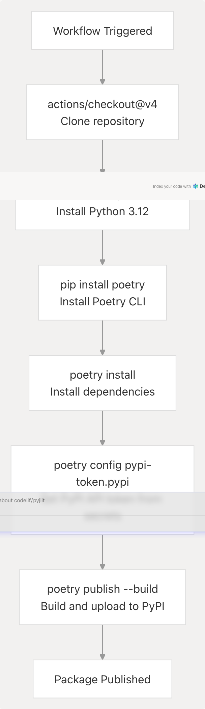

# Deployment and CI/CD

> Source: https://deepwiki.com/codelif/pyjiit/7-deployment-and-cicd

# Deployment and CI/CD

Relevant source files

* [.github/workflows/python-publish.yml](https://github.com/codelif/pyjiit/blob/0fe02955/.github/workflows/python-publish.yml)
* [pyproject.toml](https://github.com/codelif/pyjiit/blob/0fe02955/pyproject.toml)

This document explains how the pyjiit package is built, versioned, and published to the Python Package Index (PyPI). It covers the automated CI/CD workflows using GitHub Actions and the Poetry-based build system.

**Scope**: This page focuses on package deployment to PyPI. For documentation deployment to GitHub Pages, see [Documentation Deployment](/codelif/pyjiit/6.2-documentation-deployment). For local development setup and dependency management, see [Build System and Dependencies](/codelif/pyjiit/5.2-build-system-and-dependencies).

---

## Overview

The pyjiit project uses a streamlined deployment strategy consisting of:

1. **Poetry** as the build backend and dependency manager
2. **GitHub Actions** for automated publishing to PyPI
3. **GitHub Releases** as the primary trigger for deployments
4. **Manual workflow dispatch** as a fallback trigger

The deployment process is fully automated—creating a GitHub release automatically builds and publishes the package to PyPI without manual intervention.

**Sources**: [pyproject.toml1-28](https://github.com/codelif/pyjiit/blob/0fe02955/pyproject.toml#L1-L28) [.github/workflows/python-publish.yml1-29](https://github.com/codelif/pyjiit/blob/0fe02955/.github/workflows/python-publish.yml#L1-L29)

---

## Build System Configuration

The package build system is defined in `pyproject.toml` using modern Python packaging standards (PEP 621). The configuration specifies the build backend as Poetry, which handles dependency resolution, packaging, and publishing.

### Package Metadata

| Field | Value |
| --- | --- |
| Package Name | `pyjiit` |
| Current Version | `0.1.0a8` (alpha release) |
| Minimum Python | `>=3.9` |
| License | MIT License |
| Build Backend | `poetry-core` |

The package metadata is defined in [pyproject.toml1-17](https://github.com/codelif/pyjiit/blob/0fe02955/pyproject.toml#L1-L17)

### Dependencies

The project separates runtime dependencies from development dependencies:

**Runtime Dependencies** (shipped with the package):

* `requests (>=2.32.3,<3.0.0)` - HTTP client for API calls
* `pycryptodome (>=3.22.0,<4.0.0)` - AES encryption implementation

**Documentation Dependencies** (not shipped with the package):

* `sphinx (>=7.4.7)` - Documentation generator
* `furo (^2024.8.6)` - Sphinx theme

Runtime dependencies are defined in [pyproject.toml9-12](https://github.com/codelif/pyjiit/blob/0fe02955/pyproject.toml#L9-L12) Documentation dependencies are in a separate `docs` group at [pyproject.toml19-21](https://github.com/codelif/pyjiit/blob/0fe02955/pyproject.toml#L19-L21) which keeps the production installation lean.

### Build Backend

The build system configuration specifies `poetry-core` as the build backend:

```
```
[build-system]
requires = ["poetry-core"]
build-backend = "poetry.core.masonry.api"
```
```

This allows Poetry to build source distributions (`.tar.gz`) and wheel distributions (`.whl`) that are uploaded to PyPI.

**Sources**: [pyproject.toml9-25](https://github.com/codelif/pyjiit/blob/0fe02955/pyproject.toml#L9-L25)

---

## PyPI Publishing Workflow

The automated publishing workflow is defined in `.github/workflows/python-publish.yml`. This workflow handles the complete build and publish process when triggered.

### Workflow Triggers

The workflow can be triggered by two mechanisms:


```

**Primary Trigger**: GitHub release publication [.github/workflows/python-publish.yml3-5](https://github.com/codelif/pyjiit/blob/0fe02955/.github/workflows/python-publish.yml#L3-L5)

When a release is published on GitHub, the workflow automatically executes. This is the intended production deployment method.

**Secondary Trigger**: Manual workflow dispatch [.github/workflows/python-publish.yml7-8](https://github.com/codelif/pyjiit/blob/0fe02955/.github/workflows/python-publish.yml#L7-L8)

The workflow can be manually triggered from the GitHub Actions UI, useful for hotfixes or testing the deployment process.

**Sources**: [.github/workflows/python-publish.yml3-8](https://github.com/codelif/pyjiit/blob/0fe02955/.github/workflows/python-publish.yml#L3-L8)

### Workflow Permissions

The workflow is granted `contents: write` permission [.github/workflows/python-publish.yml9-10](https://github.com/codelif/pyjiit/blob/0fe02955/.github/workflows/python-publish.yml#L9-L10) which allows it to:

* Read repository contents during checkout
* Write release artifacts if needed

### Workflow Execution Steps

The publishing job runs on `ubuntu-latest` and executes the following steps:

```

```

**Detailed Step Breakdown**:

| Step | Action | File Reference |
| --- | --- | --- |
| 1. Checkout | Uses `actions/checkout@v4` to clone the repository | [.github/workflows/python-publish.yml16](https://github.com/codelif/pyjiit/blob/0fe02955/.github/workflows/python-publish.yml#L16-L16) |
| 2. Setup Python | Uses `actions/setup-python@v5` to install Python 3.12 | [.github/workflows/python-publish.yml17-19](https://github.com/codelif/pyjiit/blob/0fe02955/.github/workflows/python-publish.yml#L17-L19) |
| 3. Install Poetry | Installs Poetry via pip | [.github/workflows/python-publish.yml22](https://github.com/codelif/pyjiit/blob/0fe02955/.github/workflows/python-publish.yml#L22-L22) |
| 4. Install Dependencies | Runs `poetry install` to set up the environment | [.github/workflows/python-publish.yml23](https://github.com/codelif/pyjiit/blob/0fe02955/.github/workflows/python-publish.yml#L23-L23) |
| 5. Configure Token | Sets PyPI authentication token from `secrets.PYPI_API_KEY` | [.github/workflows/python-publish.yml27](https://github.com/codelif/pyjiit/blob/0fe02955/.github/workflows/python-publish.yml#L27-L27) |
| 6. Build & Publish | Executes `poetry publish --build` to build and upload | [.github/workflows/python-publish.yml28](https://github.com/codelif/pyjiit/blob/0fe02955/.github/workflows/python-publish.yml#L28-L28) |

**Sources**: [.github/workflows/python-publish.yml14-28](https://github.com/codelif/pyjiit/blob/0fe02955/.github/workflows/python-publish.yml#L14-L28)

### Authentication and Secrets

The workflow authenticates to PyPI using an API token stored in GitHub Secrets:

* **Secret Name**: `PYPI_API_KEY`
* **Configuration Command**: `poetry config pypi-token.pypi ${{ secrets.PYPI_API_KEY }}`
* **Usage**: [.github/workflows/python-publish.yml27](https://github.com/codelif/pyjiit/blob/0fe02955/.github/workflows/python-publish.yml#L27-L27)

This token must be generated from PyPI's account settings and added to the repository's GitHub Secrets. Poetry reads this configured token when executing `poetry publish`.

**Sources**: [.github/workflows/python-publish.yml27](https://github.com/codelif/pyjiit/blob/0fe02955/.github/workflows/python-publish.yml#L27-L27)

### Build and Upload Process

The `poetry publish --build` command performs two operations:

1. **Build**: Creates distribution packages

   * Source distribution: `pyjiit-{version}.tar.gz`
   * Wheel distribution: `pyjiit-{version}-py3-none-any.whl`
2. **Publish**: Uploads both distributions to PyPI using the configured token

The `--build` flag ensures that the latest code is packaged before upload, preventing accidental publication of stale builds.

**Sources**: [.github/workflows/python-publish.yml28](https://github.com/codelif/pyjiit/blob/0fe02955/.github/workflows/python-publish.yml#L28-L28)

---

## Version Management

Package versioning follows semantic versioning with alpha release indicators:

* **Current Version**: `0.1.0a8` [pyproject.toml3](https://github.com/codelif/pyjiit/blob/0fe02955/pyproject.toml#L3-L3)
* **Format**: `MAJOR.MINOR.PATCH[aN]`
  + `0.1.0` - Major, minor, and patch numbers
  + `a8` - Alpha release number 8

The version is manually updated in `pyproject.toml` before creating a GitHub release. Once the package reaches stability, the `aN` suffix will be removed for the first stable release.

**Sources**: [pyproject.toml3](https://github.com/codelif/pyjiit/blob/0fe02955/pyproject.toml#L3-L3)

---

## Complete CI/CD Pipeline

The following diagram shows the complete deployment pipeline from code changes to PyPI publication:

```


**Pipeline Characteristics**:

* **Trigger Point**: GitHub release creation [.github/workflows/python-publish.yml4-5](https://github.com/codelif/pyjiit/blob/0fe02955/.github/workflows/python-publish.yml#L4-L5)
* **Execution Time**: ~2-3 minutes for checkout, setup, build, and upload
* **Artifacts**: Source and wheel distributions uploaded to PyPI
* **Distribution**: Available globally via `pip install pyjiit` immediately after upload

**Sources**: [.github/workflows/python-publish.yml1-29](https://github.com/codelif/pyjiit/blob/0fe02955/.github/workflows/python-publish.yml#L1-L29) [pyproject.toml1-28](https://github.com/codelif/pyjiit/blob/0fe02955/pyproject.toml#L1-L28)

---

## Release Process

To deploy a new version of pyjiit to PyPI, follow this process:

### Step 1: Update Version

Edit the version field in `pyproject.toml`:

```
```
version = "0.1.0a9"  # Increment as appropriate
```
```

Location: [pyproject.toml3](https://github.com/codelif/pyjiit/blob/0fe02955/pyproject.toml#L3-L3)

### Step 2: Commit and Push

```
```
git add pyproject.toml
git commit -m "Bump version to 0.1.0a9"
git push origin main
```
```

### Step 3: Create GitHub Release

1. Navigate to the repository's Releases page
2. Click "Draft a new release"
3. Create a new tag matching the version (e.g., `v0.1.0a9`)
4. Set the release title and description
5. Click "Publish release"

### Step 4: Automated Deployment

The `python-publish.yml` workflow executes automatically:

* Builds the package using Poetry
* Publishes to PyPI using the configured token
* Package becomes available via `pip install pyjiit` within minutes

### Manual Deployment Alternative

If needed, the workflow can be manually triggered:

1. Navigate to Actions tab in GitHub
2. Select "Build and publish python package" workflow
3. Click "Run workflow"
4. Select the branch/tag to deploy
5. Click "Run workflow" to start

The manual trigger uses [.github/workflows/python-publish.yml7-8](https://github.com/codelif/pyjiit/blob/0fe02955/.github/workflows/python-publish.yml#L7-L8) for execution.

**Sources**: [.github/workflows/python-publish.yml1-29](https://github.com/codelif/pyjiit/blob/0fe02955/.github/workflows/python-publish.yml#L1-L29) [pyproject.toml3](https://github.com/codelif/pyjiit/blob/0fe02955/pyproject.toml#L3-L3)

---

## Workflow Comparison

The pyjiit project has two primary GitHub Actions workflows with different purposes:

| Aspect | Documentation Workflow | Publishing Workflow |
| --- | --- | --- |
| File | `.github/workflows/docs.yml` | `.github/workflows/python-publish.yml` |
| Purpose | Build and deploy Sphinx documentation | Build and publish package to PyPI |
| Trigger | Every push to any branch | GitHub release publication |
| Deployment Condition | Only pushes to `main` deploy | Every trigger deploys |
| Output | HTML documentation to GitHub Pages | Python package to PyPI |
| Dependencies | `poetry install --with docs` | `poetry install` |
| Authentication | GitHub token (automatic) | `PYPI_API_KEY` secret |
| Related Page | [Documentation Deployment](/codelif/pyjiit/6.2-documentation-deployment) | This page |

Both workflows use Poetry for dependency management but serve distinct purposes in the project's deployment pipeline.

**Sources**: [.github/workflows/python-publish.yml1-29](https://github.com/codelif/pyjiit/blob/0fe02955/.github/workflows/python-publish.yml#L1-L29)

---

## Dependency Lock File

While `poetry.lock` is not included in the provided files, it plays a critical role in the deployment process:

* **Purpose**: Locks exact versions of all dependencies and sub-dependencies
* **Generation**: Created/updated by `poetry install` and `poetry update`
* **Usage**: Ensures reproducible builds across different environments
* **CI/CD Impact**: The workflow's `poetry install` command reads `poetry.lock` to install exact versions

The lock file ensures that the package built in CI/CD uses the same dependency versions as local development, preventing "works on my machine" issues.

**Sources**: [.github/workflows/python-publish.yml23](https://github.com/codelif/pyjiit/blob/0fe02955/.github/workflows/python-publish.yml#L23-L23)

---

## Security Considerations

### Token Security

* PyPI API token stored as GitHub Secret `PYPI_API_KEY`
* Token never appears in logs or workflow outputs
* Token scope should be limited to the `pyjiit` package on PyPI

### Permission Model

* Workflow has `contents: write` permission [.github/workflows/python-publish.yml10](https://github.com/codelif/pyjiit/blob/0fe02955/.github/workflows/python-publish.yml#L10-L10)
* Only repository maintainers can create releases that trigger deployment
* Manual workflow dispatch requires repository write access

### Package Integrity

* Published packages are immutable on PyPI (cannot be replaced)
* Each version can only be published once
* Source code is tagged at release time, providing traceability

**Sources**: [.github/workflows/python-publish.yml9-10](https://github.com/codelif/pyjiit/blob/0fe02955/.github/workflows/python-publish.yml#L9-L10) [.github/workflows/python-publish.yml27](https://github.com/codelif/pyjiit/blob/0fe02955/.github/workflows/python-publish.yml#L27-L27)