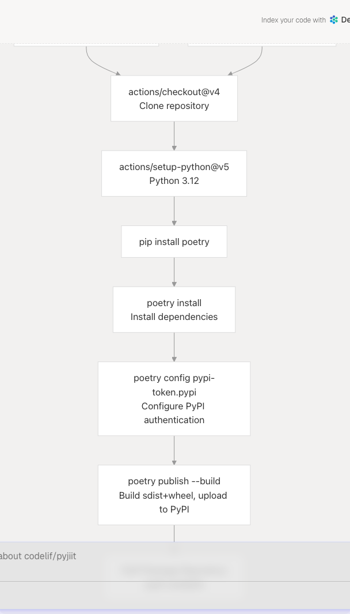
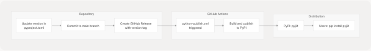

# Publishing to PyPI

> Source: https://deepwiki.com/codelif/pyjiit/7.1-publishing-to-pypi

# Publishing to PyPI

Relevant source files

* [.github/workflows/python-publish.yml](https://github.com/codelif/pyjiit/blob/0fe02955/.github/workflows/python-publish.yml)
* [pyproject.toml](https://github.com/codelif/pyjiit/blob/0fe02955/pyproject.toml)

This document describes the automated process for building and publishing the `pyjiit` package to the Python Package Index (PyPI). It covers the GitHub Actions workflow, package metadata configuration, versioning strategy, and authentication setup.

For information about other CI/CD workflows including documentation deployment, see [GitHub Actions Workflows](/codelif/pyjiit/7.2-github-actions-workflows). For details about the build system and Poetry configuration, see [Build System and Dependencies](/codelif/pyjiit/5.2-build-system-and-dependencies).

## Overview

The `pyjiit` package is automatically published to PyPI through a GitHub Actions workflow defined in [.github/workflows/python-publish.yml1-29](https://github.com/codelif/pyjiit/blob/0fe02955/.github/workflows/python-publish.yml#L1-L29) This workflow uses Poetry as the build backend and package manager, ensuring reproducible builds and consistent dependency resolution.

The publishing process is triggered either by creating a GitHub release or through manual workflow dispatch, providing flexibility for both regular releases and emergency updates.

**Sources:** [.github/workflows/python-publish.yml1-29](https://github.com/codelif/pyjiit/blob/0fe02955/.github/workflows/python-publish.yml#L1-L29) [pyproject.toml1-28](https://github.com/codelif/pyjiit/blob/0fe02955/pyproject.toml#L1-L28)

## Publication Triggers

The workflow can be initiated through two mechanisms:

| Trigger Type | Configuration | Use Case |
| --- | --- | --- |
| **GitHub Release** | `on.release.types: [published]` | Standard release workflow when a new version is tagged |
| **Manual Dispatch** | `on.workflow_dispatch` | Emergency updates or testing publication without creating a release |

The release-based trigger is the recommended approach for production releases, as it creates a permanent record in the repository's release history and allows attaching release notes.

**Sources:** [.github/workflows/python-publish.yml3-8](https://github.com/codelif/pyjiit/blob/0fe02955/.github/workflows/python-publish.yml#L3-L8)

## Workflow Architecture


```

**Workflow Execution Pipeline**

This diagram shows the complete execution path from trigger to publication. The workflow runs on `ubuntu-latest` and executes six distinct steps in sequence.

**Sources:** [.github/workflows/python-publish.yml1-29](https://github.com/codelif/pyjiit/blob/0fe02955/.github/workflows/python-publish.yml#L1-L29)

## Workflow Steps Breakdown

```

```

**Workflow Execution Sequence**

This sequence diagram illustrates the interaction between GitHub Actions, the repository, Poetry, and PyPI during the publication process.

**Sources:** [.github/workflows/python-publish.yml15-28](https://github.com/codelif/pyjiit/blob/0fe02955/.github/workflows/python-publish.yml#L15-L28)

### Step Details

#### 1. Repository Checkout

```
```
- uses: actions/checkout@v4
```
```

Clones the repository at the current commit or tag. For release triggers, this checks out the exact commit tagged for release.

#### 2. Python Environment Setup

```
```
- uses: actions/setup-python@v5
  with:
    python-version: '3.12'
```
```

Installs Python 3.12, the version used for building the package. This ensures consistent build behavior regardless of the runner's default Python version.

#### 3. Dependency Installation

```
```
pip install poetry
poetry install
```
```

Installs Poetry globally, then uses it to install project dependencies defined in [pyproject.toml9-12](https://github.com/codelif/pyjiit/blob/0fe02955/pyproject.toml#L9-L12) and [pyproject.toml19-21](https://github.com/codelif/pyjiit/blob/0fe02955/pyproject.toml#L19-L21) The `poetry install` command respects [poetry.lock](https://github.com/codelif/pyjiit/blob/0fe02955/poetry.lock) to ensure reproducible builds.

#### 4. PyPI Authentication Configuration

```
```
poetry config pypi-token.pypi ${{ secrets.PYPI_API_KEY }}
```
```

Configures Poetry with the PyPI API token stored in GitHub repository secrets. This token authorizes the upload of packages to PyPI under the `pyjiit` package name.

#### 5. Build and Publish

```
```
poetry publish --build
```
```

The `--build` flag instructs Poetry to build distribution artifacts before publishing:

* **Source distribution (sdist)**: A `.tar.gz` archive containing source code
* **Wheel (.whl)**: A binary distribution for faster installation

After building, Poetry uploads both artifacts to PyPI using the configured authentication token.

**Sources:** [.github/workflows/python-publish.yml20-28](https://github.com/codelif/pyjiit/blob/0fe02955/.github/workflows/python-publish.yml#L20-L28)

## Package Metadata Configuration

The package metadata is defined in [pyproject.toml1-17](https://github.com/codelif/pyjiit/blob/0fe02955/pyproject.toml#L1-L17) following the PEP 621 standard for Python project metadata:

| Field | Value | Purpose |
| --- | --- | --- |
| `name` | `"pyjiit"` | Package identifier on PyPI |
| `version` | `"0.1.0a8"` | Current version (alpha pre-release) |
| `description` | `"Python wrapper for JIIT webportal"` | Short package description |
| `authors` | `[{name="Harsh Sharma", email="harsh@codelif.in"}]` | Package maintainer |
| `license` | `"MIT License"` | Open source license |
| `readme` | `"README.rst"` | Long description source (reStructuredText) |
| `requires-python` | `">=3.9"` | Minimum Python version requirement |
| `dependencies` | `["requests", "pycryptodome"]` | Runtime dependencies |

The `project.urls` section defines package homepage and issue tracker links that appear on the PyPI package page.

**Sources:** [pyproject.toml1-17](https://github.com/codelif/pyjiit/blob/0fe02955/pyproject.toml#L1-L17)

## Dependency Management

### Runtime Dependencies

The package has two core runtime dependencies defined in [pyproject.toml9-12](https://github.com/codelif/pyjiit/blob/0fe02955/pyproject.toml#L9-L12):

```
```
dependencies = [
  "requests (>=2.32.3,<3.0.0)",
  "pycryptodome (>=3.22.0,<4.0.0)"
]
```
```

* **requests**: HTTP client library used by the `Webportal` class for API communication
* **pycryptodome**: Cryptographic library used by the encryption module for AES-CBC operations

### Documentation Dependencies

Documentation dependencies are isolated in a Poetry dependency group [pyproject.toml19-21](https://github.com/codelif/pyjiit/blob/0fe02955/pyproject.toml#L19-L21):

```
```
[tool.poetry.group.docs.dependencies]
sphinx = ">=7.4.7"
furo = "^2024.8.6"
```
```

These dependencies are not installed during the publish workflow since they are not needed for building the package. They are only required for building documentation (see [Building Documentation](/codelif/pyjiit/6.1-building-documentation)).

**Sources:** [pyproject.toml9-12](https://github.com/codelif/pyjiit/blob/0fe02955/pyproject.toml#L9-L12) [pyproject.toml19-21](https://github.com/codelif/pyjiit/blob/0fe02955/pyproject.toml#L19-L21)

## Build System Configuration

The build system is configured using PEP 517/518 standards in [pyproject.toml23-25](https://github.com/codelif/pyjiit/blob/0fe02955/pyproject.toml#L23-L25):

```
```
[build-system]
requires = ["poetry-core"]
build-backend = "poetry.core.masonry.api"
```
```

This configuration instructs build tools (including Poetry itself) to use `poetry-core` as the build backend. The `poetry-core` package is a lightweight build backend that implements PEP 517, allowing the package to be built with any PEP 517-compliant tool (not just Poetry).

**Sources:** [pyproject.toml23-25](https://github.com/codelif/pyjiit/blob/0fe02955/pyproject.toml#L23-L25)

## Version Management

The current version is `0.1.0a8` [pyproject.toml3](https://github.com/codelif/pyjiit/blob/0fe02955/pyproject.toml#L3-L3) indicating an alpha pre-release. The versioning scheme follows PEP 440:

* **Major.Minor.Patch**: `0.1.0`
* **Pre-release identifier**: `a8` (alpha release 8)

### Version Update Workflow

To publish a new version:

1. **Update version** in [pyproject.toml3](https://github.com/codelif/pyjiit/blob/0fe02955/pyproject.toml#L3-L3)
2. **Commit the change** to the main branch
3. **Create a GitHub release** with a tag matching the version (e.g., `v0.1.0a9`)
4. **Workflow triggers automatically** and publishes to PyPI

The version in `pyproject.toml` is the single source of truth. Poetry reads this value during `poetry publish --build` and embeds it in the distribution metadata.

**Sources:** [pyproject.toml3](https://github.com/codelif/pyjiit/blob/0fe02955/pyproject.toml#L3-L3)

## Authentication and Secrets

### PyPI API Token

The workflow uses a PyPI API token for authentication, stored as a GitHub repository secret named `PYPI_API_KEY`. This token is referenced in [.github/workflows/python-publish.yml27](https://github.com/codelif/pyjiit/blob/0fe02955/.github/workflows/python-publish.yml#L27-L27):

```
```
poetry config pypi-token.pypi ${{ secrets.PYPI_API_KEY }}
```
```

### Token Setup Requirements

To configure the secret:

1. Generate an API token at <https://pypi.org/manage/account/token/>
2. Set the token scope to the `pyjiit` package (or use a global token for initial setup)
3. Add the token to repository secrets as `PYPI_API_KEY`

The token provides scoped access to upload packages, which is more secure than username/password authentication.

**Sources:** [.github/workflows/python-publish.yml27](https://github.com/codelif/pyjiit/blob/0fe02955/.github/workflows/python-publish.yml#L27-L27)

## Permissions and Security

The workflow requires minimal permissions defined in [.github/workflows/python-publish.yml9-10](https://github.com/codelif/pyjiit/blob/0fe02955/.github/workflows/python-publish.yml#L9-L10):

```
```
permissions:
  contents: write
```
```

The `contents: write` permission allows the workflow to access repository contents. While this permission is broader than necessary for just publishing to PyPI, it may be used for potential future enhancements like creating automated commit tags or updating changelog files.

**Sources:** [.github/workflows/python-publish.yml9-10](https://github.com/codelif/pyjiit/blob/0fe02955/.github/workflows/python-publish.yml#L9-L10)

## Build Artifacts

The `poetry publish --build` command generates two distribution formats:

### Source Distribution (sdist)

* **Format**: `.tar.gz` archive
* **Contents**: Complete source code, `pyproject.toml`, `README.rst`, `LICENSE`
* **Use case**: Installation from source, inspection of package contents
* **Naming**: `pyjiit-<version>.tar.gz` (e.g., `pyjiit-0.1.0a8.tar.gz`)

### Wheel Distribution

* **Format**: `.whl` file (ZIP archive with `.whl` extension)
* **Contents**: Pre-built package files ready for installation
* **Use case**: Fast installation without build step
* **Naming**: `pyjiit-<version>-py3-none-any.whl`

The `py3-none-any` wheel tag indicates:

* `py3`: Compatible with Python 3
* `none`: No ABI-specific code
* `any`: Platform-independent (pure Python)

Both artifacts are uploaded to PyPI and users can install either via `pip install pyjiit`.

**Sources:** [.github/workflows/python-publish.yml28](https://github.com/codelif/pyjiit/blob/0fe02955/.github/workflows/python-publish.yml#L28-L28)

## Verification and Testing

After publication completes, verify the upload:

1. **Check PyPI package page**: <https://pypi.org/project/pyjiit/>
2. **Test installation**: `pip install pyjiit==<version>`
3. **Verify version**: `python -c "import pyjiit; print(pyjiit.__version__)"`

The workflow does not include automated post-publication testing. For pre-release testing, use the manual dispatch trigger to publish to [TestPyPI](https://test.pypi.org/) (requires workflow modification).

**Sources:** [.github/workflows/python-publish.yml1-29](https://github.com/codelif/pyjiit/blob/0fe02955/.github/workflows/python-publish.yml#L1-L29)

## Integration with Release Process

```


**Complete Release to User Installation Flow**

This diagram shows how version updates flow from the repository through the automated pipeline to end users.

**Sources:** [pyproject.toml3](https://github.com/codelif/pyjiit/blob/0fe02955/pyproject.toml#L3-L3) [.github/workflows/python-publish.yml1-29](https://github.com/codelif/pyjiit/blob/0fe02955/.github/workflows/python-publish.yml#L1-L29)