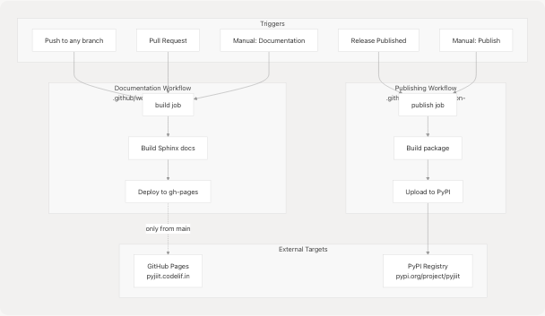
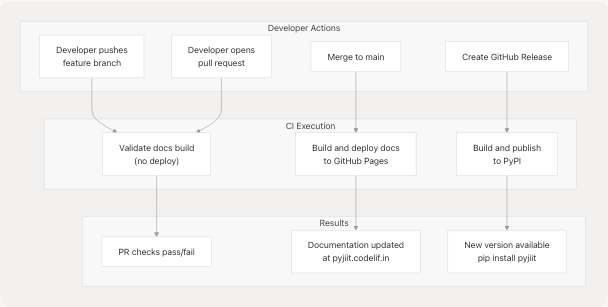

# GitHub Actions Workflows

## Purpose and Scope

This document provides a comprehensive overview of all GitHub Actions workflows configured in the pyjiit repository. It covers the automated CI/CD pipelines that handle documentation builds/deployments and package publishing to PyPI. For detailed information about the PyPI publishing process specifically, see [Publishing to PyPI](7.1-publishing-to-pypi). For documentation-specific deployment details, see [Documentation Deployment](6.2-documentation-deployment).

**Sources:** [.github/workflows/documentation.yml1-65](https://github.com/codelif/pyjiit/blob/0fe02955/.github/workflows/documentation.yml#L1-L65) [.github/workflows/python-publish.yml1-29](https://github.com/codelif/pyjiit/blob/0fe02955/.github/workflows/python-publish.yml#L1-L29)

---

## Workflow Inventory

The repository contains two primary GitHub Actions workflows that automate critical infrastructure tasks:

| Workflow File | Workflow Name | Primary Purpose | Trigger Events | Deploy Target |
| --- | --- | --- | --- | --- |
| `documentation.yml` | "Sphinx: build && deploy docs" | Build Sphinx documentation and deploy to GitHub Pages | Push to any branch, Pull requests, Manual dispatch | GitHub Pages (gh-pages branch) |
| `python-publish.yml` | "Build and publish python package" | Build and publish package to PyPI | Release published, Manual dispatch | PyPI registry |

**Sources:** [.github/workflows/documentation.yml1-8](https://github.com/codelif/pyjiit/blob/0fe02955/.github/workflows/documentation.yml#L1-L8) [.github/workflows/python-publish.yml1-8](https://github.com/codelif/pyjiit/blob/0fe02955/.github/workflows/python-publish.yml#L1-L8)

---

## Documentation Build and Deployment Workflow

### Workflow Overview

The `documentation.yml` workflow is responsible for building Sphinx documentation on every code change and deploying it to GitHub Pages when changes are pushed to the `main` branch. This ensures documentation is always validated on pull requests and automatically updated on the live site.

**Sources:** [.github/workflows/documentation.yml1-65](https://github.com/codelif/pyjiit/blob/0fe02955/.github/workflows/documentation.yml#L1-L65)

### Trigger Configuration

```
on:
  push:
    branches:
      - '**'  # All branches
  pull_request:
  workflow_dispatch:  # Manual triggering
```

The workflow triggers on:

* **Push events** to any branch (`'**'` pattern)
* **Pull request** events (validation only, no deployment)
* **Manual dispatch** via GitHub UI

**Sources:** [.github/workflows/documentation.yml3-8](https://github.com/codelif/pyjiit/blob/0fe02955/.github/workflows/documentation.yml#L3-L8)

### Concurrency Control

The workflow implements concurrency management to prevent resource conflicts:

```
concurrency:
  group: docs-${{ github.ref }}
  cancel-in-progress: true
```

This configuration creates a unique concurrency group per branch/ref and cancels any in-progress runs when a new push occurs. This prevents multiple simultaneous builds for the same branch, saving CI resources.

**Sources:** [.github/workflows/documentation.yml10-12](https://github.com/codelif/pyjiit/blob/0fe02955/.github/workflows/documentation.yml#L10-L12)

### Build Job Steps


**Documentation Build Workflow Execution Flow**

**Sources:** [.github/workflows/documentation.yml22-64](https://github.com/codelif/pyjiit/blob/0fe02955/.github/workflows/documentation.yml#L22-L64)

#### Step-by-Step Breakdown

| Step | Action/Command | Purpose | Configuration Details |
| --- | --- | --- | --- |
| 1 | `actions/checkout@v4` | Clone repository code | Standard checkout with default options |
| 2 | `actions/setup-python@v5` | Install Python 3.12 | Enables pip caching for faster subsequent runs |
| 3 | `actions/cache@v3` | Cache Poetry/pip directories | Cache key: `${{ runner.os }}-poetry-${{ hashFiles('**/poetry.lock','**/pyproject.toml') }}` |
| 4 | `pip install poetry` | Install Poetry package manager | Required for dependency management |
| 5 | `poetry install --no-interaction --no-ansi --with docs` | Install project and docs dependencies | Includes Sphinx, Furo theme, and all runtime dependencies |
| 6 | `sphinx-build -b html docs docs/_build/html` | Build HTML documentation | Uses configuration from `docs/conf.py` |
| 7 | `echo "pyjiit.codelif.in" > docs/_build/html/CNAME` | Create CNAME record | Configures custom domain for GitHub Pages |
| 8 | `peaceiris/actions-gh-pages@v3` | Deploy to GitHub Pages | Only executes if `github.event_name == 'push' && github.ref == 'refs/heads/main'` |

**Sources:** [.github/workflows/documentation.yml23-63](https://github.com/codelif/pyjiit/blob/0fe02955/.github/workflows/documentation.yml#L23-L63)

### Conditional Deployment Logic

The deployment step uses a conditional expression to ensure documentation is only published to GitHub Pages from the `main` branch:

```
if: ${{ github.event_name == 'push' && github.ref == 'refs/heads/main' }}
```

This means:

* **Pull requests**: Documentation is built for validation but not deployed
* **Feature branches**: Documentation is built for validation but not deployed
* **Main branch pushes**: Documentation is built and deployed
* **Manual dispatch**: Depends on which branch it's run from

The deployment action (`peaceiris/actions-gh-pages@v3`) is configured with:

* `publish_branch: gh-pages` - Target branch for deployment
* `github_token: ${{ secrets.GITHUB_TOKEN }}` - Authentication using automatic GitHub token
* `publish_dir: docs/_build/html` - Source directory containing built HTML
* `force_orphan: true` - Creates orphan commits (no history) to keep gh-pages branch clean

**Sources:** [.github/workflows/documentation.yml56-63](https://github.com/codelif/pyjiit/blob/0fe02955/.github/workflows/documentation.yml#L56-L63)

### Caching Strategy

The workflow implements a two-tier caching strategy:


**Two-Tier Caching Strategy for Documentation Builds**

The cache key `${{ runner.os }}-poetry-${{ hashFiles('**/poetry.lock','**/pyproject.toml') }}` ensures:

* Cache invalidation when dependencies change
* Platform-specific caches (Linux, macOS, Windows)
* Consistent builds across different runners

**Sources:** [.github/workflows/documentation.yml26-40](https://github.com/codelif/pyjiit/blob/0fe02955/.github/workflows/documentation.yml#L26-L40)

---

## PyPI Publishing Workflow

### Workflow Overview

The `python-publish.yml` workflow handles building and publishing the pyjiit package to the Python Package Index (PyPI). It is designed to execute only when a new release is published or when manually triggered.

**Sources:** [.github/workflows/python-publish.yml1-29](https://github.com/codelif/pyjiit/blob/0fe02955/.github/workflows/python-publish.yml#L1-L29)

### Trigger Configuration

```
on:
  release:
    types: [ published ]
  workflow_dispatch:
```

The workflow triggers on:

* **Release published** events - Automatic publishing when a GitHub release is created
* **Manual dispatch** - Emergency or ad-hoc publishing via GitHub UI

This trigger strategy ensures that:

* Package versions are tied to GitHub releases
* Publishing is intentional and traceable
* Manual intervention is possible when needed

**Sources:** [.github/workflows/python-publish.yml3-7](https://github.com/codelif/pyjiit/blob/0fe02955/.github/workflows/python-publish.yml#L3-L7)

### Publish Job Steps


**PyPI Publishing Workflow Execution Flow**

**Sources:** [.github/workflows/python-publish.yml14-28](https://github.com/codelif/pyjiit/blob/0fe02955/.github/workflows/python-publish.yml#L14-L28)

#### Publishing Step Details

| Step | Command/Action | Purpose | Notes |
| --- | --- | --- | --- |
| 1 | `actions/checkout@v4` | Clone repository | Fetches code to be packaged |
| 2 | `actions/setup-python@v5` | Install Python 3.12 | Version matches development environment |
| 3 | `pip install poetry` | Install Poetry | Package management and publishing tool |
| 4 | `poetry install` | Install project dependencies | Validates dependency resolution |
| 5 | `poetry config pypi-token.pypi ${{ secrets.PYPI_API_KEY }}` | Configure PyPI authentication | Uses repository secret for token |
| 6 | `poetry publish --build` | Build distributions and publish | Creates wheel and sdist, uploads to PyPI |

The `--build` flag in the publish command combines two operations:

1. `poetry build` - Creates `dist/*.whl` and `dist/*.tar.gz` files
2. `poetry publish` - Uploads distributions to PyPI

**Sources:** [.github/workflows/python-publish.yml15-28](https://github.com/codelif/pyjiit/blob/0fe02955/.github/workflows/python-publish.yml#L15-L28)

### Authentication and Secrets

The workflow uses GitHub Secrets for secure authentication:

* **`PYPI_API_KEY`**: Repository secret containing PyPI API token
  + Configured at: Repository Settings → Secrets and variables → Actions
  + Token scope: Upload permissions for the pyjiit package
  + Referenced in workflow: `${{ secrets.PYPI_API_KEY }}`

The Poetry command `poetry config pypi-token.pypi` sets the authentication token in Poetry's configuration without exposing it in logs.

**Sources:** [.github/workflows/python-publish.yml27](https://github.com/codelif/pyjiit/blob/0fe02955/.github/workflows/python-publish.yml#L27-L27)

---

## Workflow Comparison and Integration



**Integration of Both GitHub Actions Workflows**

**Sources:** [.github/workflows/documentation.yml1-65](https://github.com/codelif/pyjiit/blob/0fe02955/.github/workflows/documentation.yml#L1-L65) [.github/workflows/python-publish.yml1-29](https://github.com/codelif/pyjiit/blob/0fe02955/.github/workflows/python-publish.yml#L1-L29)

### Workflow Characteristics

| Characteristic | Documentation Workflow | Publishing Workflow |
| --- | --- | --- |
| **Frequency** | Every push, every PR | Only on releases |
| **Validation** | Always builds | N/A |
| **Deployment** | Conditional (main branch only) | Always publishes |
| **Target** | GitHub Pages (static site) | PyPI (package registry) |
| **Permissions** | `contents: write` | `contents: write` |
| **Runner** | `ubuntu-latest` | `ubuntu-latest` |
| **Concurrency Control** | Yes (cancel-in-progress) | No |
| **Dependencies** | Poetry + docs group | Poetry (no groups) |

**Sources:** [.github/workflows/documentation.yml1-65](https://github.com/codelif/pyjiit/blob/0fe02955/.github/workflows/documentation.yml#L1-L65) [.github/workflows/python-publish.yml1-29](https://github.com/codelif/pyjiit/blob/0fe02955/.github/workflows/python-publish.yml#L1-L29)

---

## Common Actions and Patterns

### Shared Actions

Both workflows use common GitHub Actions:

| Action | Version | Purpose | Used In |
| --- | --- | --- | --- |
| `actions/checkout` | v4 | Clone repository code | Both workflows |
| `actions/setup-python` | v5 | Install Python interpreter | Both workflows |
| `actions/cache` | v3 | Cache dependencies | Documentation only |

These actions are maintained by GitHub and provide reliable, well-tested functionality for common CI/CD tasks.

**Sources:** [.github/workflows/documentation.yml24-33](https://github.com/codelif/pyjiit/blob/0fe02955/.github/workflows/documentation.yml#L24-L33) [.github/workflows/python-publish.yml16-19](https://github.com/codelif/pyjiit/blob/0fe02955/.github/workflows/python-publish.yml#L16-L19)

### Third-Party Actions

| Action | Version | Purpose | Configuration |
| --- | --- | --- | --- |
| `peaceiris/actions-gh-pages` | v3 | Deploy to GitHub Pages | `publish_branch: gh-pages`, `force_orphan: true` |

This action is specifically designed for GitHub Pages deployment and handles:

* Committing to the target branch
* Handling CNAME files
* Managing orphan commits
* Authentication via GitHub token

**Sources:** [.github/workflows/documentation.yml57-63](https://github.com/codelif/pyjiit/blob/0fe02955/.github/workflows/documentation.yml#L57-L63)

### Poetry Configuration Pattern

Both workflows follow a consistent Poetry setup pattern:

```
pip install poetry        # Install Poetry globally
poetry install           # Install project dependencies
poetry <command>         # Execute Poetry commands
```

This approach:

* Uses Poetry as the single source of truth for dependencies
* Ensures consistent dependency versions via `poetry.lock`
* Separates dependency groups (`--with docs` in documentation workflow)

**Sources:** [.github/workflows/documentation.yml42-49](https://github.com/codelif/pyjiit/blob/0fe02955/.github/workflows/documentation.yml#L42-L49) [.github/workflows/python-publish.yml21-23](https://github.com/codelif/pyjiit/blob/0fe02955/.github/workflows/python-publish.yml#L21-L23)

---

## Permissions and Security

### Permission Model

Both workflows declare `contents: write` permission:

```
permissions:
  contents: write
```

This permission is required for:

* **Documentation workflow**: Writing to the `gh-pages` branch
* **Publishing workflow**: Technically not required (could use `contents: read`), but declared for consistency

**Sources:** [.github/workflows/documentation.yml14-15](https://github.com/codelif/pyjiit/blob/0fe02955/.github/workflows/documentation.yml#L14-L15) [.github/workflows/python-publish.yml9-10](https://github.com/codelif/pyjiit/blob/0fe02955/.github/workflows/python-publish.yml#L9-L10)

### Secret Management

| Secret Name | Type | Purpose | Scope |
| --- | --- | --- | --- |
| `GITHUB_TOKEN` | Automatic | GitHub API authentication | Generated per workflow run |
| `PYPI_API_KEY` | Repository | PyPI upload authentication | Manually configured in repo settings |

The `GITHUB_TOKEN` is automatically provided by GitHub Actions and has permissions limited to the repository. The `PYPI_API_KEY` must be manually created on PyPI and added to the repository's secrets.

**Sources:** [.github/workflows/documentation.yml61](https://github.com/codelif/pyjiit/blob/0fe02955/.github/workflows/documentation.yml#L61-L61) [.github/workflows/python-publish.yml27](https://github.com/codelif/pyjiit/blob/0fe02955/.github/workflows/python-publish.yml#L27-L27)

---

## Workflow Execution Context



**Developer Actions and Corresponding Workflow Executions**

This diagram illustrates the typical development lifecycle and how workflows respond to different events. Documentation is validated on all branches but only deployed from `main`. Package publishing is strictly tied to release events.

**Sources:** [.github/workflows/documentation.yml3-8](https://github.com/codelif/pyjiit/blob/0fe02955/.github/workflows/documentation.yml#L3-L8) [.github/workflows/documentation.yml56-63](https://github.com/codelif/pyjiit/blob/0fe02955/.github/workflows/documentation.yml#L56-L63) [.github/workflows/python-publish.yml3-7](https://github.com/codelif/pyjiit/blob/0fe02955/.github/workflows/python-publish.yml#L3-L7)
